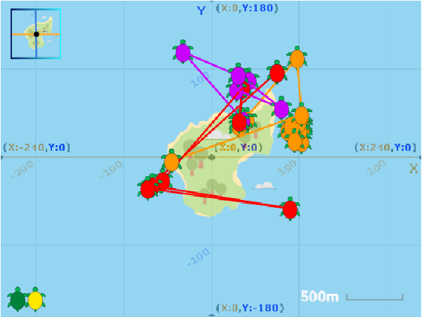

## Introduction

In this project you will use the pen tool and Scratch x and y coordinates to draw the locations visited by green sea turtles over a few days during their nesting time. It's important to understand the movements of these endangered creatures so that they can be protected.

This project is inspired by the work of The Shuttleworth foundation which has tracked the movement of turtles based at the islands of Príncipe and Poilão off the west coast of Africa. Each year turtles return to their nesting grounds and spend time there mating and laying eggs. But where exactly do they go while they are there? The Shuttleworth Foundation which has developed inexpensive electronic tags that can be safely attached to real sea turtles to track their movement. 

Turtle tags provide coordinate numbers that show where a turtle has been. It's much easier for people to understand this data if we draw it on a map.

### What you will make

Click on the green flag and then click on each turtle to see the locations it visited over a few days. You can also click on the button to switch between a Scratch coordinates grid and a map of Poilão island. 

--- no-print ---

<iframe src="https://scratch.mit.edu/projects/428136635/embed" allowtransparency="true" width="485" height="402" frameborder="0" scrolling="no" allowfullscreen></iframe>

--- /no-print ---

--- print-only ---

--- /print-only ---

--- collapse ---
---
title: What you will need
---
### Hardware

+ A computer or tablet capable of running Scratch 3.
+ Ideally, ability to download files to local or shared storage (such as a Downloads directory)

### Software

+ Scratch 3 (either [online](https://scratch.mit.edu/){:target="_blank"} or [offline](https://scratch.mit.edu/download){:target="_blank"})

### Downloads

+ Download the project [starter file](http://rpf.io/p/en/projectName-go){:target="_blank"} if working offline

--- /collapse ---

--- collapse ---
---
title: What you will learn
---

How to:
+ Use x and y coordinates in Scratch
+ Use lists to store and import data
+ Use Scratch to understand a real world environmental topic

--- /collapse ---

--- collapse ---
---
title: Additional information for educators
---

The later steps of this project ask learners to download files that are them imported into Scratch. We recommend that you try this out first using the devices and network that learners will be doing so that you can tell them exactly what to do. Downloading and importing files to Scratch works on desktop and mobile devices and is straightforward but the exact details vary depending on the device, browser and operating system version. 

If you are using iPads then iOS 13 supports local file storage to a Downloads directory. If you are using an older version of iOS then you will need a suitable storage location such as a cloud drive. 

You can download the completed project [here](http://rpf.io/p/en/projectName-get){:target="_blank"}.

If you need to print this project, please use the [printer-friendly version](https://projects.raspberrypi.org/en/projects/projectName/print){:target="_blank"}.

--- /collapse ---
