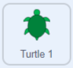

## Using coordinates

In this step, you will learn how to use x and y coordinates in Scratch to move a turtle to specific locations on the Stage. 

--- task ---

If working **online**, open the [starter project](http://rpf.io/p/en/projectName-on){:target="_blank"} in Scratch.
 
If working **offline**, open the project [starter file](http://rpf.io/p/en/projectName-get){:target="_blank"} in the Scratch offline editor. If you need to, you can [download and install Scratch here](https://scratch.mit.edu/download){:target="_blank"}.

When you open the starter project, you will see a grid backdrop and turtle sprites. 

--- /task ---

--- task ---
If you don't see the grid backdrop, you can click on the **grid/map** button in the top left-hand corner of the Stage until you see it: 


--- /task ---

Scratch uses x and y coordinate numbers to indicate locations on the Stage. The x coordinate gives the left–right position, and the y coordinate gives the up–down position. The coodinate of the centre of the Stage is (x=0, y=0). Let's send the **Turtle 1** sprite to the centre of the Stage. 

--- task ---
Select the **Turtle 1** sprite and click on its **Code** tab. Add code to move the turtle to the centre of the Stage when it is clicked:



```blocks3
when this sprite clicked
glide (1) secs to x: (0) y: (0)
```

--- /task ---

--- task ---

Test your code by clicking on your turtle on the Stage. 

--- /task ---

The x coordinate gives a left-to-right position from -240 to 240. Negative x coordinates are to the left of the centre of the Stage, and positive coordinates are to the right. 

--- task ---
Add code to get the turtle to 'swim' to the left and then the right of the Stage:


```blocks3
when this sprite clicked
glide (1) secs to x: (0) y: (0)
+glide (1) secs to x: (-240) y: (0)
+glide (1) secs to x: (240) y: (0)
```

--- /task ---

The y coordinate goes from -180 at the bottom of the Stage, to 180 at the top of the Stage. Negative y coordinates are in the bottom half of the Stage. 

--- task ---
Add code to move the turtle to the top and bottom of the Stage:


```blocks3
when this sprite clicked
glide (1) secs to x: (0) y: (0)
glide (1) secs to x: (-240) y: (0)
glide (1) secs to x: (240) y: (0)
+glide (1) secs to x: (0) y: (180)
+glide (1) secs to x: (0) y: (-180)
```

--- /task ---

--- task ---
Click on your turtle to watch it glide between locations. You can still click on the turtle when it is at the edge of the Stage.
--- /task ---

When the green flag is clicked, the turtles should line up in a row at the bottom of the Stage. You will need to add code to make the green turtle return to its starting position.

--- task ---
Add a green flag `event`{:class="block3events"} block and a `glide`{:class="block3motion"} block to place the turtle at the bottom left of the Stage, when the green flag is clicked:


```blocks3
when green flag clicked
glide (1) secs to x: (-220) y: (-160)
```

Use the grid backdrop to check your understanding of the starting position coordinates.

--- /task ---

--- task ---
Click the green flag to see the turtle move to its starting position.
--- /task ---

--- task ---
Can you predict the route the turtle will take with this code? Use the grid to help you. Think about where the turtle will go, then change the numbers in your `glide`{:class="block3motion"} blocks to use these coordinates to see if you are correct. 


```blocks3
when green flag clicked
+glide (1) secs to x: (100) y: (100)
+glide (1) secs to x: (100) y: (-100)
+glide (1) secs to x: (-100) y: (-100)
+glide (1) secs to x: (-100) y: (100)
+glide (1) secs to x: (100) y: (100)
```

--- /task ---

--- save ---

