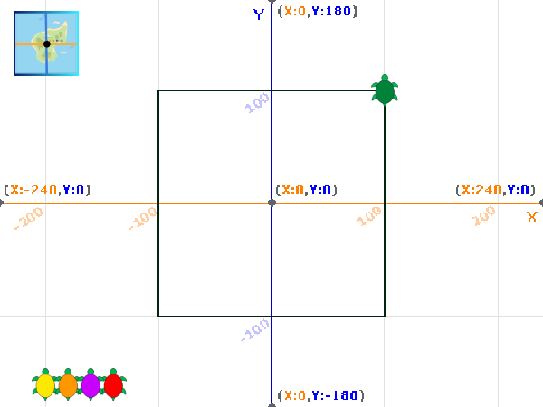

## Drawing the route

In this step you will stamp a marker to represent known locations of a turtle and then use the pen draw a path showing its movement. 

When a tag is placed on a turtle, it uses the Global Positioning System (GPS) to detect its current position from a satellite. This data is stored and can be used to work out the route taken by the turtle. 

The pen extension has already been added to the starter project. 

--- task ---
Select the Turtle 1 sprite and add code to set up the pen:


```blocks3
when green flag clicked
+erase all
+set pen [color v] to (40)
+set pen [brightness v] to (15)
+set pen size to (2)
+pen up
glide (1) secs to x: (-220) y: (-160)
```

The colour `40` matches the colour of Turtle 1's costume.

--- /task ---

--- task ---
Add code to draw the route taken by the turtle using the pen:


```blocks3
when this sprite clicked
+pen up
glide (1) secs to x: (100) y: (100)
+pen down
glide (1) secs to x: (100) y: (-100)
glide (1) secs to x: (-100) y: (-100)
glide (1) secs to x: (-100) y: (100)
glide (1) secs to x: (100) y: (100)
```

--- /task ---

--- task ---
Click the green flag to run the setup code and then click on Turtle 1 on the Stage to see it draw its path.



If your turtle doesn't draw a square then carefully check the coordinates you entered in the previous step. 

--- /task ---

Now add a stamp of the turtle to show the known positions of the turtle. 

--- task ---


```blocks3
when this sprite clicked
pen up
glide (1) secs to x: (100) y: (100)
pen down
+stamp
glide (1) secs to x: (100) y: (-100)
+stamp
glide (1) secs to x: (-100) y: (-100)
+stamp
glide (1) secs to x: (-100) y: (100)
+stamp
glide (1) secs to x: (100) y: (100)
```

--- /task ---

--- task ---
Click the green flag and then click on Turtle 1 to see the turtle draw its route and stamp a marker at each known position.


--- /task ---

--- task ---
Of course turtles don't swim in perfect squares! Try changing the coordinate numbers to get your turtle to swim in a different route.   

--- /task ---

--- save ---
