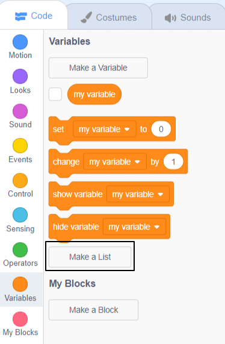

## Lists of coordinates

In this step you will add **lists** of x and y coordinates to the Turtle 2 sprite. This will allow you to draw a longer route without having to write code for each location. 

In previous projects you have used variables to store data. A variable can only store one piece of data at a time. A list also stores data, but it can store lots of pieces in order. 

You are going to create two lists, one for the x coordinates of your turtle and one for the y coordinates. 

--- task ---


Select the yellow Turtle 2 sprite, click on the Code tab and then the `Variables`{:class="block3variables"} section. 


Click on 'Make a List'.



Name the list 'x coords'.

Choose 'For this sprite only' - this will allow each Turtle sprite to have its own coordinates. 

Click 'OK' and the list will appear on the stage.

--- /task ---

--- task ---
Now make a second list called 'y coords'. You must select 'For this sprite only'. 

--- /task ---

You will now have two empty lists on the Stage:


Next you need to add coordinate data to the lists. 

This table gives coordinate positions for your turtle:

<div style="width:200px;">

|:-------:|:--------:|
|x coords | y coords |
|--------:|---------:|
| 189     | 147      |
| 154     | 122      |
| 57      | 140      |
| -58     | 110      |
| -120    | 17       |
|---------|----------|

<br/>
</div>

--- task ---
Click on the '+' at the bottom of the `x coords`{:class="block3variables"} list. 

This will add an entry to the list. Enter the value '189', the first x coordinate in the table. 

Repeat for the rest of the x coordinate values so that your list looks like this:


Be careful to enter the '-' in negative numbers such as '-58'.

--- /task ---

--- task ---
Use the '+' at the bottom of the `y coords`{:class="block3variables"} list to add the y coordinate data for your turtle. 

Your y coordinate list should look like this:


--- /task ---

--- task ---
When you have finished entering the data, you can hide the lists from the stage. Uncheck the box next to the lists in the `Variables`{:class="block3variables"} section:


--- /task ---

Next, you need to write code that it uses the x and y coordinate values from the list to draw the route of Turtle 2. 

The code to set up the pen and starting position has been provided for you. It is the same as for Turtle 1 except that it uses a different pen colour and coordinates. 

You will use `item (1) of [x coords v]`{:class="block3variables"} to get the first item in the x coords list and `item (1) of [y coords v]`{:class="block3variables"} to get the first item in the y coords list. You will find these blocks in the `Variable`{:class="block3variables"} section. Together these values give you the first position for the Turtle 2.

--- task ---
Add code to move the Turtle to its first position when it is clicked. 


```blocks3
when this sprite clicked
pen up
glide (1) secs to x: (item (1) of [x coords v]) y: (item (1) of [y coords v])
```

Make sure you choose the correct list from the drop-down menu to select the `x coords`{:class="block3variables"} and `y coords`{:class="block3variables"} lists. 

--- /task ---

--- task ---
Run your code and click on Turtle 2 (the yellow turtle) to see it move to its starting position.

--- /task ---

Now you need to glide and stamp for each of the coordinates. To do this you will need a variable to keep track of the next item in the list. 

--- task ---
Create a new variable with 'For this sprite only' checked and name it 'location'  :


--- /task ---

--- task --- 
Add a block to set the location to 1 to start at the beginning of the list. Change the `glide to`{:class="block3motion"} block so that it uses the `location`{:class="block3variables"} variable instead of the number 1. 


```blocks3
when this sprite clicked
pen up
+set [location v] to (1)
+glide (1) secs to x: (item (location) of [x coords v]) y: (item (location) of [y coords v])
```

--- /task ---

--- task --- 
Now add a `repeat`{:class="block3control"} loop to loop over the lists of coordinates. There's a block to find out the length of a list which you can use to give the number of times to repeat: 


```blocks3
when this sprite clicked
pen up
set [location v] to (1) 
+repeat (length of [x coords v])
glide (1) secs to x: (item (location) of [x coords v]) y: (item (location) of [y coords v])
+change [location v] by (1)
```

Make sure you drag your `glide`{:class="block3motion"} inside the `repeat`{:class="block3control"}.

Each time round the loop, location will be increased and the `item`{:class="block3variables"} blocks will get the next item from the `x coords`{:class="block3variables"} and `y coords`{:class="block3variables"} lists. 

--- /task ---

--- task ---
Inside the loop, add blocks to put the `pen down`{:class="block3extensions"} and `stamp`{:class="block3extensions"} the sprite:


```blocks3
when this sprite clicked
pen up
set [location v] to (1) 
repeat (length of [x coords v])
glide (1) secs to x: (item (location) of [x coords v]) y: (item (location) of [y coords v])
change [location v] by (1)
+pen down
+stamp

```

--- /task ---

--- task ---
Run your code to see Turtle 2 draw its route using the x and y coordinates from the lists. 

--- /task ---

--- save ---
