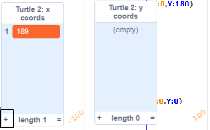
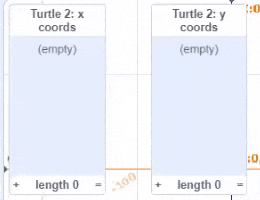
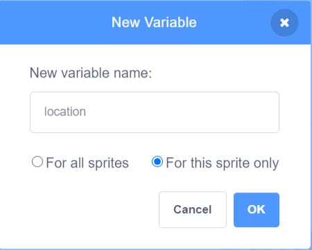

## Lists of coordinates

In this step, you will add **lists** of x and y coordinates to the **Turtle 2** sprite. This allows you to draw a longer route without having to write code for each location. 

In previous projects you have used variables to store data. A variable can only store one piece of data at a time. A list also stores data, but it can store lots of information in order. 

You are going to create two lists, one for the x coordinates of your turtle and one for the y coordinates. Then, you will write code that moves the turtle using the data in the lists. 

### Create lists of x and y coordinates

--- task ---

Select the yellow **Turtle 2** sprite and click on the **Code** tab. This turtle already has code set up for the pen and to move to a starting position. 


 Click on the `Variables`{:class="block3variables"} blocks menu, and then click on **Make a List**.


Name the list `x coords`. Choose **For this sprite only** — this will allow each turtle sprite to have its own coordinates.


Click **OK** and the list will appear on the Stage.

--- no-print ---


--- /no-print ---

--- /task ---

--- task ---

Now click **Make a List** again to make a second list called `y coords`. You must select **For this sprite only**. 


You now have two empty lists on the Stage.


--- /task ---

Next, you need to add coordinate data to the lists. 

This table gives coordinate positions for your turtle:

<div style="width:200px;">

|:-------:|:--------:|
|x coords | y coords |
|--------:|---------:|
| 189     | 147      |
| 154     | 122      |
| 57      | 140      |
| -58     | 110      |
| -120    | 17       |
|---------|----------|

<br/>
</div>

--- task ---

Click on the **+** at the bottom of the `x coords`{:class="block3variables"} list. 

This adds an entry to the list. Enter the value `189`, the first x coordinate in the table. 



Repeat for the rest of the x coordinate values so that your list looks like this:


Be careful to enter the `-` in negative numbers such as `-58`.

--- no-print ---



--- /no-print ---

--- /task ---

--- task ---

Use the **+** at the bottom of the `y coords`{:class="block3variables"} list to add the y coordinate data for your turtle. 

Your lists should look like this:


--- /task ---

--- task ---

When you have finished entering the data, you can hide the lists from the Stage. Uncheck the box next to the lists in the `Variables`{:class="block3variables"} blocks menu.


--- no-print ---


--- /no-print ---

--- /task ---

### Move the turtles using the data in the lists

Next, you need to write code that uses the x and y coordinate values from the lists to draw the route of the **Turtle 2** sprite. 

The code to set up the pen and starting position has been provided for you. It is the same as for the **Turtle 1** sprite, except that it uses a different pen colour and coordinates. 

Use `item 1 of x coords`{:class="block3variables"} block to get the first item in the `x coords`{:class="block3variables"} list, and `item 1 of y coords`{:class="block3variables"} block to get the first item in the `y coords`{:class="block3variables"} list. You can find these blocks in the `Variables`{:class="block3variables"} blocks menu. Together these values give you the first position for the **Turtle 2** sprite.

--- task ---

Add code to move the turtle to its first position when it is clicked. 


```blocks3
when this sprite clicked
glide (1) secs to x: (item (1) of [x coords v]) y: (item (1) of [y coords v])
```

Make sure you choose the correct list from the drop-down menu to select the `x coords`{:class="block3variables"} and `y coords`{:class="block3variables"} lists. 

--- no-print ---


--- /no-print ---

--- /task ---

--- task ---

Run your code and click on the **Turtle 2** sprite (the yellow turtle) to see it move to its starting position.

--- /task ---

Now you need move the turtle through the positions. To do this, you need a variable to keep track of the next item in the list. 

--- task ---

Create a new variable with **For this sprite only** checked and name it `location`.



Uncheck `location`{:class="block3variables"}, so it is not displayed on the Stage.

--- /task ---

--- task --- 

Add a block to set the `location`{:class="block3variables"} to `1` to start at the beginning of the list. Change the `glide`{:class="block3motion"} block so that it uses the `location`{:class="block3variables"} variable instead of the number 1. 


```blocks3
when this sprite clicked
+set [location v] to (1)
+glide (1) secs to x: (item (location) of [x coords v]) y: (item (location) of [y coords v])
```
--- no-print ---


--- /no-print ---

--- /task ---

--- task --- 

Now add a `repeat`{:class="block3control"} loop to loop over the lists of coordinates. There's a block to find out the length of a list which you can use to give the number of times to repeat: 


```blocks3
when this sprite clicked
set [location v] to (1) 
+repeat (length of [x coords v])
glide (1) secs to x: (item (location) of [x coords v]) y: (item (location) of [y coords v])
+change [location v] by (1)
```

Make sure your `glide`{:class="block3motion"} block is inside the `repeat`{:class="block3control"} loop.

--- no-print ---


--- /no-print ---

Each time round the loop, location increases and the `item`{:class="block3variables"} blocks get the next item from the `x coords`{:class="block3variables"} and `y coords`{:class="block3variables"} lists. 

--- /task ---

--- task ---

Inside the loop, add blocks to put the `pen up`{:class="block3extensions"}, `pen down`{:class="block3extensions"}, and `stamp`{:class="block3extensions"} the sprite.


```blocks3
when this sprite clicked
+pen up
set [location v] to (1) 
repeat (length of [x coords v])
glide (1) secs to x: (item (location) of [x coords v]) y: (item (location) of [y coords v])
+pen down
+stamp
change [location v] by (1)
```

--- /task ---

--- task ---

Run your code to see the **Turtle 2** sprite draw its route using the x and y coordinates from the lists. 

Check the boxes next to the `location`{:class="block3variables"} variable, and the `x coords`{:class="block3variables"} and `y coords`{:class="block3variables"} lists; arrange them on the Stage; and then click on the **Turtle 2** sprite to understand how the data is used.


--- /task ---

--- save ---
