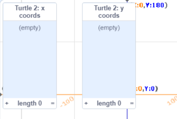

## Lists of coordinates

In this step you will add **lists** of x and y coordinates to the Turtle 2 sprite. This will allow you to draw a longer route without having to write code for each location. 

In previous projects you have used variables to store data. A variable can only store one piece of data at a time. A list also stores data, but it can store lots of pieces in order. 

You are going to create two lists, one for the x coordinates of your turtle and one for the y coordinates. 

--- task ---

Select the Turtle 2 sprite, click on the Code tab and then the Variables section. 

Click on 'Make a List'.


Name the list 'x coords'.

Choose 'For this sprite only' - this will allow each Turtle sprite to have its own coordinates. 

Click 'OK' and the list will appear on the stage.

--- /task ---

--- task ---
Now make a second list called 'y coords'. You must select 'For this sprite only'. 

--- /task ---

You will now have two empty lists on the Stage:



Next you need to add coordinate data to the lists. 

This table gives coordinate positions for your turtle:

--- task ---
Use the '+' at the bottom of the **y coords** list to add the y coordinate data for your turtle. 

Your y coordinate list should look like this:


--- /task ---

Now you need to update your code so that it uses the data in the lists for x and y coordinates. 

--- task ---
Click on the '+' at the bottom of the **x coords** list. 

This will add an entry to the list. Enter the value '174', the first x coordinate in the table. 

Repeat for the rest of the x coordinate values so that your list looks like this:


--- /task ---

Next, you need to write code that it uses the x and y coordinate values from the list to draw the route of Turtle 2. 

You will use `item (1) of [x coords v]` to get the first item in the x coords list and `item (1) of [y coords v]` to get the first item in the y coords list. You will find these blocks in the `Variable` section. Together these values give you the first position for the Turtle 2.

--- task ---

The code to set up the pen has been provided for you. It is the same as for Turtle 1 except that it uses a different pen colour. 

In between the `pen up` and `pen down` blocks, add a `go to` block and 

```blocks3
when green flag clicked
erase all
set pen [color v] to (80)
set pen size to (2)
pen up
+go to x: (item (1) of [x coords v]) y: ( (item (1) of [y coords v]))
pen down
```

Make sure you choose the correct list from the drop-down menu to select the x coordination and y coordinate. 

--- /task ---


--- task ---
Run your code and you should see Turtle 2 move to its starting position.

--- /task ---

Now you need to glide and stamp for each of the coordinates. To do this you will need a variable to keep track of the next item in the list. 

--- task ---
Create a new variable with 'For this sprite only' checked and name it location:


--- /task ---

--- task --- 
Add a block to set the location to 1 to start at the beginning of the list. 

```blocks3
when green flag clicked
erase all
set pen [color v] to (80)
set pen size to (2)
pen up
go to x: (item (1) of [x coords v]) y: (item (1) of [y coords v])
pen down
+set [location v] to (1) 
```


--- /task ---

--- task --- 
Now add a `repeat` loop to loop over the lists of coordinates. There's a block to find out the length of a list which you can use to give the number of times to repeat: 

```blocks3
when green flag clicked
erase all
set pen [color v] to (80)
set pen size to (2)
pen up
go to x: (item (1) of [x coords v]) y: (item (1) of [y coords v])
pen down
set [location v] to (1) 
+repeat (length of [x coords v]
```

--- /task ---

--- task ---
Inside the loop, add the code to glide to the next location, stamp the sprite and then increase the location. Each time round the loop the `item` blocks will get the next entry from the `x coords` and `y coords` lists. 

```blocks3
when green flag clicked
erase all
set pen [color v] to (80)
set pen size to (2)
pen up
go to x: (item (1) of [x coords v]) y: (item (1) of [y coords v])
pen down
set [location v] to (1) 
repeat (length of [x coords v]
+glide to x: (item (location) of [x coords v]) y: (item (location) of [y coords v])
+stamp
+change [location v] by (1)
```

--- /task ---

--- save ---
