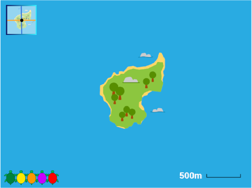

## Real turtle movements

In this step you will switch to using a map backdrop showing the island of Poilão. Coordinate data for a real turtle that was tracked by the Shuttleworth foundation has already been added to Turtle 3. You will copy your code from Turtle 2 to Turtle 3 to find out the route this turtle took.

--- task ---
Click on the 'grid/map' button to switch to the Poilão Island backdrop. 

You will see a map of the area around Poilão Island off the west coast of Africa. This small island measures less than 1km (1000 metres) across. Poilão is an important environmental location for nesting green sea turtles.

The carapace (shell) of an adult green sea turtle is about 1m long. 

--- /task ---

--- task ---
Select Turtle 3 sprite, the orange turtle, and click on the Code tab. 

Open the `Variables`{:class="block3variables"} section and check the boxes next to the `x coords`{:class="block3variables"} and `y coords`{:class="block3variables"} lists to show them on the Stage. 

These lists are 'For this sprite only' and contain different data to the lists you created for Turtle 2.

You can see the x and y coordinates on the Stage. These are based on the real movements of a sea turtle and have been turned into Scratch coordinates that work with the Poilão Island backdrop. 

When you have seen the coordinates you can uncheck the boxes to hide them. 

--- /task ---

It's hard for humans to understand lists of numbers. Now you will copy your code to Turtle 3 to draw and stamp the coordinates to make it easier to see where this turtle went. 

--- task ---

Select Turtle 2 and click on the Code tab. Drag the `when this sprite clicked`{:class="block3events"} block and all the blocks underneath will also move, keep dragging until you are over the Turtle 3 sprite under the stage. The Turtle 3 sprite will do a little wiggle to show that it has been selected and you can stop dragging. 

**Tip:** To drag with a mouse or trackpad, hold down the left mouse button while you move. 

The code will still be available on Turtle 2 but there will also be a copy in Turtle 3's Code tab.

Select Turtle 3 and click on its Code tab to see the copied code. 

**Tip:** You can right-click in the Code area and choose 'Clean up Blocks' to tidy up your code.

--- /task ---

--- task ---
Click Turtle 3, the orange turtle, on the stage to run your code and you will see the route that Turtle 3 took. 

GPS readings are not perfectly accurate, and the turtles can't be tracked when they spend time underwater, but they give a very good idea where the turtles have travelled.

Remember you have one location for the turtle each day so the lines join up the locations, they don't show how the turtle moved between positions (you would need more data for that.)

--- /task ---

--- save ---

