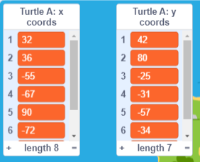

## Importing data from a file

Scratch allows you to import data from a file. This is really useful when you have lots of data that you want to use and it would take too long to type it. 

--- task ---
Select Turtle A, the purple turtle. It has lists that have been created but which don't have any coordinates in them. 

Check the boxes next to Turtle A's `x coords`{:class="block3variables"} and `y coords`{:class="block3variables"} lists to see them on the Stage. 


--- /task ---

We have prepared some more data based on routes that real turtles have taken around Poilão. You can download these data files and import them into your project so you can find out where the turtles went. 

--- task ---

Right-click one of the turtle data links below, your choice, and choose 'Save link as ...' . Save the file on your local computer, a shared network drive or an external drive such as a USB drive. Remember where you saved it and what the file was called. 

[Turtle 21 Data](https://raw.githubusercontent.com/raspberrypilearning/turtle-tracker/draft/en/resources/turtle-21.csv){:target="_blank"}

--- collapse ---
---
title: If you are using an iPad
---

If your iPad is fully up to date then when you click on a link you will be asked whether you want to View or Download. Choose Download. 

Otherwise, using the Safari browser, click on your chosen Turtle link to view the data and then click the share icon and you will see locations where you can save the file. 

--- /collapse ---

--- collapse ---
---
title: If you can't download or import the file
---

If you are unable to to download a file then you can click or tap on one of the turtle files to open it in your browser (choose View on a recent iPad). You can then enter the data into the `x coords`{:class="block3variables"} and `y coords`{:class="block3variables"} lists for Turtle A as you did for Turtle 2. This is easier if you have a partner to read out the numbers. 

--- /collapse ---

--- /task ---

--- task ---
Now go back to Scratch. 


Right click (or tap and hold) on the `Turtle A: x coords`{:class="block3variables"} list on the stage and choose 'import'. 


Select the file that you downloaded, it will be something like 'turtle-5.csv'. 

--- collapse ---
---
title: If you are using an iPad
---

If your iPad is fully up to date then you will be able to choose the '.csv' file from your 'Downloads' folder.

Otherwise, you will be able to navigate to the location where you saved the file such as a cloud drive. 

--- /collapse ---

When you are asked 'which column should be used?', enter the number 1. The x coordinate data is in the first column of the file.


Scratch will load the data from the first column in the file into the Turtle A's x coords list.


Your data will have different numbers if you chose a different turtle. 

--- /task ---

--- task ---
Now repeat the importing of the data for the y coordinates. 

Right click (or tap and hold) on the `Turtle A: y coords`{:class="block3variables"} list and choose import.

Choose the same file as before. 

This time, choose column **2** which contains the y coordinate data for the same turtle. 




--- /task ---

--- task ---
Select Turtle A under the stage and change its name to match the number of the turtle you imported, such as Turtle 21. This will help you remember which turtle data you have used.


--- /task ---

--- task ---
Copy the code from Turtle 3 to your new turtle by dragging it. 

Check that the copied code has appeared it the Code are for your new turtle. If not, try again.
--- /task ---

--- task ---
Click on your turtle, the purple turtle, to find out where this turtle went. 

The path will be different depending on the data that you chose. 

--- /task ---

--- task ---
If you have time you can download more data and follow the journeys of more turtles. You can use Turtle B, the red turtle. If you need more turtles then you can duplicate a turtle and change its costume and pen colour. You can delete the data in the copy using these blocks:

```blocks3
delete all of [x coords v]
delete all of [y coords v]

```

Then you can load new data. 
--- /task ---

--- task ---
Look at the locations visited by your turtles. If you are in a group you could also look at the results for the turtles chosen by others.

Questions to think about:
+ Do all the turtles start at a similar place? Why do you think that is?
+ Are there other locations visited by multiple turtles? Why do you think they would go there?
+ Why do the lines connecting the locations sometimes go across the island? Remember you only have one location per day. How do you think the turtles travelled between the locations?
--- /task ---

--- save ---
