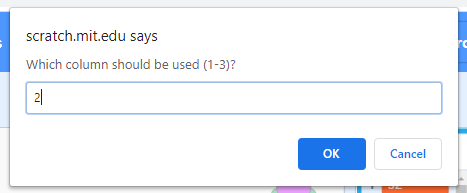
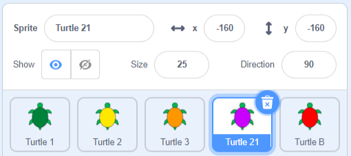

## Import data from a file

Scratch allows you to import data from a file. This is really useful when you have lots of data you want to use that would take too long to type in. 

--- task ---

Select the **Turtle A** sprite, the purple turtle. It has lists that have been created, but don't have any coordinates in them. 

Check the boxes next to the **Turtle A** sprite's `x coords`{:class="block3variables"} and `y coords`{:class="block3variables"} lists to see them on the Stage. 


--- /task ---

We have prepared some more data based on routes that real turtles have taken around Poilão. You can download these data files and import them into your project so you can find out where the turtles went. 

--- task ---
--- no-print ---

Right-click one of the turtle data links below, and choose **Save link as ...** or **Download linked file as ...**

--- /no-print ---

--- print-only ---

Open a new tab in your web browser and type in one of the links below. Most browsers can view the file, you can right-click and choose **Save as ...** to download the file. 

--- /print-only ---

Remember where you save the file and what it is called. 

+ [Turtle 6 Data](http://rpf.io/turtle-6){:target="_blank"}
+ [Turtle 10 Data](http://rpf.io/turtle-10){:target="_blank"}
+ [Turtle 11 Data](http://rpf.io/turtle-11){:target="_blank"}
+ [Turtle 16 Data](http://rpf.io/turtle-16){:target="_blank"}
+ [Turtle 19 Data](http://rpf.io/turtle-19){:target="_blank"} 
+ [Turtle 20 Data](http://rpf.io/turtle-20){:target="_blank"}
+ [Turtle 21 Data](http://rpf.io/turtle-21){:target="_blank"}
+ [Turtle 22 Data](http://rpf.io/turtle-22){:target="_blank"}


--- collapse ---
---
title: If you are using an iPad
---

If your iPad is fully up to date, then when you click on a link you will be asked whether you want to **View** or **Download**. Choose **Download**. 

Otherwise, using the Safari browser, click on your chosen turtle link to view the data, and then click the share icon. You will see the locations where you can save the file. 

--- /collapse ---

--- collapse ---
---
title: If you can't download or import the file
---

If you are unable to download a file, then you can click or tap on one of the turtle files to open it in your browser (choose **View** on a recent iPad). You can then enter the data into the `x coords`{:class="block3variables"} and `y coords`{:class="block3variables"} lists for the **Turtle A** sprite as you did for **Turtle 2**. This is easier if you have a partner to read out the numbers. 

--- /collapse ---

--- /task ---

--- task ---

Now go back to Scratch. 

Right-click (or tap and hold) on the `Turtle A: x coords`{:class="block3variables"} list on the Stage and choose **import**. 


Select the file that you have downloaded, it will be something like `turtle-5.csv`. 

--- collapse ---
---
title: If you are using an iPad
---

If your iPad is fully up to date, then you will be able to choose the `.csv` file from your Downloads folder.

Otherwise, you will be able to navigate to the location where you saved the file, such as a cloud drive. 

--- /collapse ---

When you are asked **Which column should be used?**, enter the number `1`. The x coordinate data is in the first column of the file.


Scratch will load the data from the first column in the file into the `Turtle A: x coords`{:class="block3variables"} list.


--- no-print ---


--- /no-print ---

Your data will have different numbers if you chose a different turtle. 

--- /task ---

--- task ---

Now repeat the importing of the data for the y coordinates. 

Right-click (or tap and hold) on the `Turtle A: y coords`{:class="block3variables"} list and choose **import**.

Choose the same file as before. 

This time, choose column `2` as it contains the y coordinate data for the same turtle. 




--- /task ---

--- task ---

Select the **Turtle A** sprite under the Stage and change its name to match the number of the turtle you imported, for example **Turtle 21**. This will help you remember which turtle data you have used.



--- /task ---

--- task ---

Copy the code from the **Turtle 3** sprite to your new turtle by dragging it. 

Check that the copied code has appeared in the Code area for your new turtle. If not, try again.

--- /task ---

--- task ---

Click on your turtle, the purple turtle, to find out where this turtle went. 

The path will be different depending on the data that you chose. 

--- /task ---

--- task ---

If you have time, you can download more data and follow the journeys of more turtles. You can use the **Turtle B** sprite, the red turtle. If you need more turtles, then you can duplicate a turtle and change its costume and pen colour. Before you import new data, delete the data in the copy using these blocks:

```blocks3
delete all of [x coords v]
delete all of [y coords v]

```

--- /task ---

--- task ---

Look at the locations visited by your turtles. If you are in a group, you could also look at the results for the turtles chosen by others.

Questions to think about:
+ Do all the turtles start at a similar place? Why do you think that is?
+ Are there other locations visited by multiple turtles? Why do you think they would go there?
+ Why do the lines connecting the locations sometimes go across the island? Remember you only have one location per day. How do you think the turtles travelled between the locations?

--- /task ---

--- save ---
