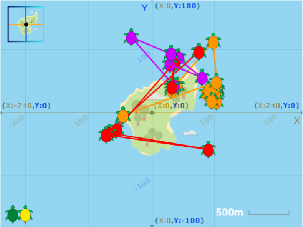

## परिचय

लुप्तप्राय जीवों की गतिविधियों को समझना महत्वपूर्ण है ताकि उन्हें संरक्षित किया जा सके। इस प्रोजेक्ट में, आप `Pen`{:class="block3extensions"} एक्सटेंशन ब्लॉक और Scratch में x और y निर्देशांक का उपयोग करके हरे समुद्री टर्टल द्वारा उनके नीडन के समय के दौरान देखे गए स्थानों को बनाने के लिए उपयोग करेंगे।

यह प्रोजेक्ट द शटलवर्थ फाउंडेशन के काम से प्रेरित है, जिसने अफ्रीका के पश्चिमी तट से प्रिंसिपे और पोइलाओ के द्वीपों पर आधारित टर्टलों की आवाजाही पर नज़र रखी। हर साल टर्टल सहवास करने के लिए अपने नीडन स्थल के लिए लौटते हैं और अंडे देते हैं। लेकिन जब वे वहां होते हैं तो वे वास्तव में कहां जाते हैं? शटलवर्थ फाउंडेशन ने सस्ते इलेक्ट्रॉनिक टैग विकसित किए हैं जिन्हें वास्तविक समुद्री टर्टलों से सुरक्षित रूप से जोड़ा जा सकता है ताकि उनकी गतिविधि को ट्रैक किया जा सके।

टर्टल टैग निर्देशांक संख्या प्रदान करते हैं जो दिखाते हैं कि टर्टल कहाँ रहा है। लोगों के लिए इस डेटा को समझना बहुत आसान है यदि इसे मानचित्र पर बनाया जाता है ।

### आप क्या बनाएँगे

हरे झंडे पर क्लिक करें और फिर प्रत्येक कछुए पर क्लिक करके उन स्थानों को देखें जहां वह पिछले कुछ दिन गए थे । Scratch निर्देशांक ग्रिड और पोइलाओ द्वीप के मानचित्र के बीच स्विच करने के लिए आप ऊपरी बाएं कोने पर **Grid/Map Button** पर भी क्लिक कर सकते हैं।

--- no-print ---

<iframe src="https://scratch.mit.edu/projects/428136635/embed" allowtransparency="true" width="485" height="402" frameborder="0" scrolling="no" allowfullscreen></iframe>

--- /no-print ---

--- print-only ---

--- /print-only ---

--- collapse ---
---
title: आपको किन चीजों की आवश्यकता होगी
---

### हार्डवेयर

+ Scratch 3 चलाने में सक्षम कंप्यूटर या टैबलेट
+ आदर्श रूप से, फ़ाइलों को स्थानीय या साझा स्टोरेज में डाउनलोड करने की क्षमता (जैसे डाउनलोड निर्देशिका)

### सॉफ्टवेयर

+ Scratch 3 (या तो [ऑनलाइन](https://scratch.mit.edu/){:target="_blank"} या [ऑफलाइन](https://scratch.mit.edu/download){:target="_blank"})

### डाउनलोड

+ यदि आप ऑफ़लाइन काम कर रहे हैं, तो [प्रोजेक्ट स्टार्टर और डाटा फाइल](https://rpf.io/p/hi-IN/turtle-tracker-go){:target="_blank"} डाउनलोड करें

--- /collapse ---

--- collapse ---
---
title: आप क्या सीखेंगे
---

+ Scratch में स्प्राइट के निर्देशांक (coordinates) कैसे उपयोग करें
+ डेटा को संग्रहीत और इम्पोर्ट करने के लिए सूचियों का उपयोग कैसे करें
+ वास्तविक दुनिया के पर्यावरण विषय को समझने के लिए Scratch का उपयोग कैसे करें

--- /collapse ---

--- collapse ---
---
title: शिक्षकों के लिए अतिरिक्त जानकारी
---

इस परियोजना के बाद के चरण शिक्षार्थियों को उन फ़ाइलों को डाउनलोड करने के लिए कहते हैं जिन्हें बाद में Scratch में इम्पोर्ट किया जाता है। हम अनुशंसा करते हैं कि आप इसे पहले आज़माएं, और शिक्षार्थियों के समान उपकरणों और नेटवर्क का उपयोग करें, ताकि आप उन्हें बता सकें कि वास्तव में क्या करना है। आप डेस्कटॉप या मोबाइल डिवाइस पर Scratch में फ़ाइलें डाउनलोड और इम्पोर्ट कर सकते हैं। यह सरल है, लेकिन सटीक विवरण डिवाइस, ब्राउज़र और ऑपरेटिंग सिस्टम संस्करण के आधार पर भिन्न होता है।

यदि आप iPads का उपयोग कर रहे हैं, तो iOS 13 डाउनलोड निर्देशिका में स्थानीय फ़ाइल संग्रहण का समर्थन करता है। यदि आप iOS के पुराने संस्करण का उपयोग कर रहे हैं, तो आपको एक उपयुक्त संग्रहण स्थान की आवश्यकता होगी, जैसे कि क्लाउड ड्राइव।

आप [ का उपयोग करके पूरे प्रॉजेक्ट को यहाँ डाउनलोड कर सकते हैं ](https://rpf.io/p/hi-IN/turtle-tracker-get){:target="_blank"}.

अगर आपको इस प्रोजेक्ट को प्रिंट करने की आवश्यकता है, तो कृप्या [प्रिंटर-अनुकूल संस्करण](https://projects.raspberrypi.org/hi-IN/projects/turtle-tracker/print)का उपयोग करें।

--- /collapse ---
