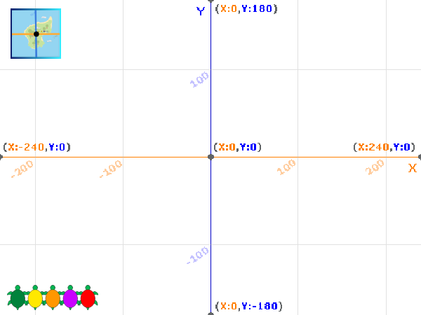

## निर्देशांक का उपयोग करना

इस चरण में, आप सीखेंगे कि मंच पर विशिष्ट स्थानों पर कछुए को स्थानांतरित करने के लिए Scratch में x और y निर्देशांक का उपयोग कैसे करें।

--- task ---

**ऑनलाइन**: Scratch में [स्टार्टर प्रोजेक्ट](http://rpf.io/turtle-tracker-on){:target="_blank"} खोलें

**ऑफ़लाइन:** Scratch के ऑफ़लाइन संपादक में [प्रोजेक्ट स्टार्टर फ़ाइल](http://rpf.io/p/hi-IN/turtle-tracker-get){:target="_blank"} खोलें। यदि आपको ज़रूरत है तो, आप [यहां Scratch डाउनलोड और इंस्टॉल ](https://scratch.mit.edu/download){:target="_blank"} कर सकते हैं

जब आप स्टार्टर प्रोजेक्ट खोलते हैं, तो आपको एक ग्रिड और टर्टल दिखाई देंगे।

--- /task ---

--- task ---

यदि आपको कोई ग्रिड नहीं दिखाई देता है, तो आप मंच के ऊपरी बाएँ हाथ के कोने **Grid/Map Button** पर तब तक क्लिक कर सकते हैं जब तक कि वह आपको दिखने न लगे:



--- /task ---

Scratch Stage पर स्थानों को इंगित करने के लिए x और y निर्देशांक संख्याओं का उपयोग करता है। X निर्देशांक बाएँ-दाएँ स्थिति देता है, और y निर्देशांक ऊपर-नीचे की स्थिति देता है। Stage के केंद्र का निर्देशांक (x=0, y=0) है। आइए **Turtle 1** स्प्राइट को Stage के केंद्र में भेजें।

--- task ---

**Turtle 1** स्प्राइट चुनें और इसके **Code** टैब पर क्लिक करें। क्लिक करने पर टर्टल को Stage के केंद्र में ले जाने के लिए कोड जोड़ें:


```blocks3
when this sprite clicked
glide (1) secs to x: (0) y: (0)
```

--- /task ---

--- task ---

Stage पर अपने टर्टल पर क्लिक करके अपने कोड का परीक्षण करें।

--- /task ---

X निर्देशांक -240 से 240 तक बाएं से दाएं की स्थिति देता है। ऋणात्मक x निर्देशांक Stage के केंद्र के बाईं ओर हैं, और धनात्मक निर्देशांक दाईं ओर हैं।

--- task ---

टर्टल को बाईं ओर तैराने के लिए और फिर Stage के दायीं ओर तैराने के लिए कोड जोड़ें:


```blocks3
when this sprite clicked
glide (1) secs to x: (0) y: (0)
+glide (1) secs to x: (-240) y: (0)
+glide (1) secs to x: (240) y: (0)
```

--- /task ---

y निर्देशांक Stage के निचले भाग में -180 से मंच के शीर्ष पर 180 तक जाता है। ऋणात्मक y निर्देशांक Stage के निचले आधे भाग में हैं।

--- task ---

टर्टल को Stage के ऊपर और नीचे ले जाने के लिए कोड जोड़ें:


```blocks3
when this sprite clicked
glide (1) secs to x: (0) y: (0)
glide (1) secs to x: (-240) y: (0)
glide (1) secs to x: (240) y: (0)
+glide (1) secs to x: (0) y: (180)
+glide (1) secs to x: (0) y: (-180)
```

--- /task ---

--- task ---

अपने टर्टल को जगहों के बीच खिसकते हुए देखने के लिए उस पर क्लिक करें। आप अभी भी टर्टल पर क्लिक कर सकते हैं जब वह Stage के किनारे पर हो।

--- /task ---

जब हरे झंडे पर क्लिक किया जाता है, तो टर्टलों को Stage के निचले भाग में एक पंक्ति में खड़ा हो जाना चाहिए। हरे टर्टल को उसकी प्रारंभिक स्थिति में वापस लाने के लिए आपको कोड जोड़ना होगा।

--- task ---

हरे झंडे पर क्लिक किये जाने पर टर्टल को Stage के नीचे बाईं और रखने के लिए `when green flag clicked`{:class="block3events"} ब्लॉक और एक `glide`{:class="block3motion"} ब्लॉक जोड़ें:


```blocks3
when green flag clicked
glide (1) secs to x: (-220) y: (-160)
```

प्रारंभिक स्थिति निर्देशांक की अपनी समझ की जांच करने के लिए ग्रिड का उपयोग करें।

--- /task ---

--- task ---

टर्टल को उसकी प्रारंभिक स्थिति में ले जाते हुए देखने के लिए हरे झंडे पर क्लिक करें।

--- /task ---

--- task ---

क्या आप अनुमान लगा सकते हैं कि इस कोड के साथ टर्टल कौनसा मार्ग लेगा? आपकी सहायता के लिए ग्रिड का उपयोग करें। इस बारे में सोचें कि टर्टल कहाँ जाएगा, फिर अपने `glide`{:class="block3motion"} ब्लॉक में संख्याओं को बदलकर इन निर्देशांकों का उपयोग करके देखें कि क्या आप सही हैं।


```blocks3
when this sprite clicked
+glide (1) secs to x: (100) y: (100)
+glide (1) secs to x: (100) y: (-100)
+glide (1) secs to x: (-100) y: (-100)
+glide (1) secs to x: (-100) y: (100)
+glide (1) secs to x: (100) y: (100)
```

--- /task ---

--- save ---

