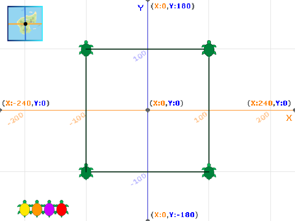

## मार्ग बनायें

टर्टल के संचलन के मार्ग को बनाने के लिए इस चरण में, आप `Pen`{:class="block3extensions"} एक्सटेंशन ब्लॉक का उपयोग करेंगे, और फिर इसके ज्ञात स्थानों का प्रतिनिधित्व करने के लिए एक स्टैम्प जोड़ेंगे।

स्टैम्प स्प्राइट की एक प्रति है, जिस पर मुहर लगाने के बाद आप उसे हिला या हटा नहीं सकते।

जब टर्टल पर एक टैग लगाया जाता है, तो यह उपग्रह से अपनी वर्तमान स्थिति का पता लगाने के लिए ग्लोबल पोजिशनिंग सिस्टम (जीपीएस) का उपयोग करता है। यह डेटा संग्रहीत किया जाता है और टर्टल द्वारा लिए गए मार्ग का पता लगाने के लिए उपयोग किया जा सकता है।

`Pen`{:class="block3extensions"} एक्सटेंशन पहले ही जोड़ा जा चुका है।

--- task ---

**Turtle 1** स्प्राइट चुनें और पेन सेट अप करने के लिए कोड जोड़ें:


```blocks3
when green flag clicked
+erase all
+set pen (color v) to (40)
+set pen (brightness v) to (50)
+set pen size to (2)
+pen up
glide (1) secs to x: (-220) y: (-160)
```

रंग `40` स्प्राइट की पोशाक के रंग से मेल खाता है।

--- /task ---

--- task ---

पेन का उपयोग करके टर्टल द्वारा लिया गया मार्ग बनाने के लिए कोड जोड़ें:


```blocks3
when this sprite clicked
+pen up
glide (1) secs to x: (100) y: (100)
+pen down
glide (1) secs to x: (100) y: (-100)
glide (1) secs to x: (-100) y: (-100)
glide (1) secs to x: (-100) y: (100)
glide (1) secs to x: (100) y: (100)
```

--- /task ---

--- task ---

सेटअप कोड चलाने के लिए हरे झंडे पर क्लिक करें, और फिर Stage पर **Turtle 1** स्प्राइट पर क्लिक करके देखें कि वह अपना पथ कैसे बना रहा है।


यदि आपका टर्टल एक वर्ग नहीं बनाता है, तो पिछले चरण से अपने निर्देशांक की सावधानीपूर्वक जांच करें।

--- /task ---

अब टर्टल की ज्ञात स्थिति देखने के लिए टर्टल का `stamp`{:class="block3extensions"} जोड़ें।

--- task ---


```blocks3
when this sprite clicked
pen up
glide (1) secs to x: (100) y: (100)
pen down
+stamp
glide (1) secs to x: (100) y: (-100)
+stamp
glide (1) secs to x: (-100) y: (-100)
+stamp
glide (1) secs to x: (-100) y: (100)
+stamp
glide (1) secs to x: (100) y: (100)
```

--- /task ---

--- task ---

हरे झंडे पर क्लिक करें, और फिर टर्टल को अपना मार्ग बनाते हुए देखने के लिए **Turtle 1** स्प्राइट पर क्लिक करें और प्रत्येक ज्ञात स्थान पर एक मार्कर पर मुहर लगाएं।



--- /task ---

--- task ---

निश्चित रूप से, कछुए पूर्ण वर्गों में तैरते नहीं हैं! अपने टर्टल को एक अलग मार्ग में तैराने के लिए निर्देशांक संख्याओं को बदलने का प्रयास करें।

--- /task ---

--- save ---
