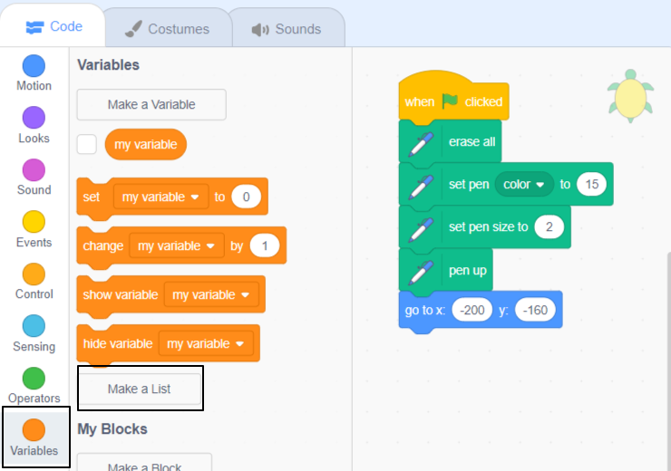
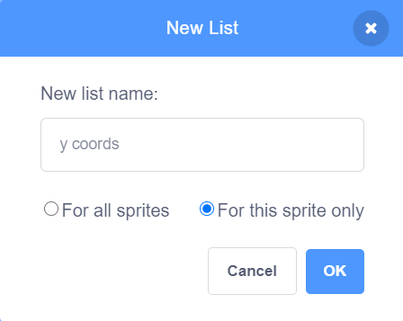
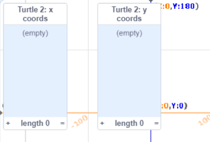
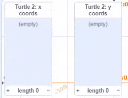
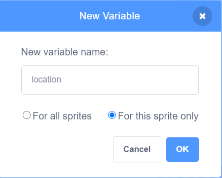
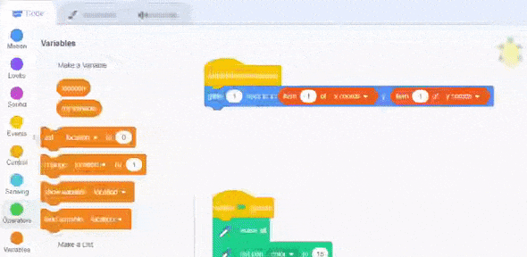
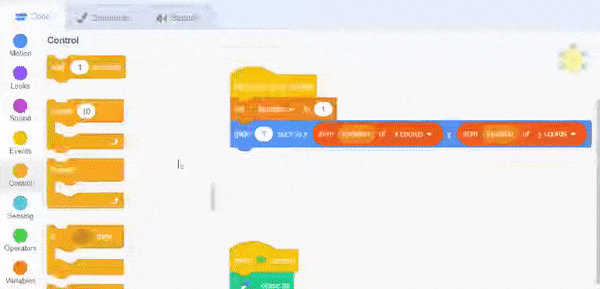

## निर्देशांक की सूची

इस चरण में, आप **Turtle 2** स्प्राइट में x और y निर्देशांक की **lists** जोड़ेंगे। यह आपको प्रत्येक स्थान के लिए कोड लिखे बिना एक लंबा मार्ग बनाने की अनुमति देता है।

पिछली प्रोजेक्ट में आपने डेटा स्टोर करने के लिए वेरिएबल का उपयोग किया है। एक वेरिएबल एक समय में केवल एक डेटा को स्टोर कर सकता है। एक सूची डेटा भी संग्रहीत करती है, लेकिन यह क्रम में बहुत सारी जानकारी संग्रहीत कर सकती है।

आप दो सूचियाँ बनाने जा रहे हैं, एक आपके टर्टल के x निर्देशांक के लिए और एक y निर्देशांक के लिए। फिर, आप कोड लिखेंगे जो सूचियों में डेटा का उपयोग करके टर्टल को चलाता है।

### x और y निर्देशांकों की सूचियाँ बनाएँ

--- task ---

पीले **Turtle 2** स्प्राइट का चयन करें और **Code** टैब पर क्लिक करें। इस टर्टल के पास पहले से ही पेन के लिए और शुरुआती स्थिति में जाने के लिए कोड सेट है।


 `Variables`{:class="block3variables"} ब्लॉक मेन्यू पर क्लिक करें और फिर **Make a List** पर क्लिक करें।



सूची को `x coords` नाम दें। **For this sprite only** चुनें - यह प्रत्येक टर्टल स्प्राइट का अपना निर्देशांक रखने के लिए अनुमति देगा।


**OK** पर क्लिक करें और सूची Stage पर दिखाई देगी।

--- no-print ---


--- /no-print ---

--- /task ---

--- task ---

अब `y coords` नामक एक दूसरी सूची बनाने के लिए फिर से **Make a List** पर क्लिक करें । आपको **For this sprite only** चयन करना होगा।



अब आपके पास Stage पर दो खाली सूचियाँ हैं।



--- /task ---

इसके बाद, आपको सूचियों में निर्देशांक डेटा जोड़ने की आवश्यकता है।

यह तालिका आपके टर्टल के लिए निर्देशांक स्थिति प्रदान करती है:

<div style="width:200px;">

|:-------:|:--------:|
|x coords | y coords |
|--------:|---------:|
| 189     | 147      |
| 154     | 122      |
| 57      | 140      |
| -58     | 110      |
| -120    | 17       |
|---------|----------|

<br/>
</div>

--- task ---

`x`{:class="block3variables"} सूची में सबसे नीचे **+** पर क्लिक करें।

यह सूची में एक प्रविष्टि जोड़ता है। तालिका में पहला x निर्देशांक, `189` दर्ज करें।


शेष x निर्देशांक मानों के लिए दोहराएं ताकि आपकी सूची इस तरह दिखे:


`-` को ऋणात्मक संख्याओं जैसे `-58`में दर्ज करना ध्यान रखें ।

--- no-print ---



--- /no-print ---

--- /task ---

--- task ---

अपने टर्टल के लिए y निर्देशांक डेटा जोड़ने के लिए `y coords`{:class="block3variables"} सूची के नीचे का **+** उपयोग करें।

आपकी सूचियाँ इस तरह दिखनी चाहिए:


--- /task ---

--- task ---

जब आप डेटा दर्ज करना समाप्त कर लें, तो आप मंच से सूचियों को छिपा सकते हैं। `Variables`{:class="block3variables"} ब्लॉक मेन्यू में सूचियों के बगल में स्थित बॉक्स को अनचेक करें।


--- no-print ---


--- /no-print ---

--- /task ---

### सूचियों में डेटा का उपयोग करके टर्टलों को चलाएं

इसके बाद, आपको एक कोड लिखने की ज़रुरत है जो सूचियों से x और y निर्देशांक मानों का उपयोग करता है **Turtle 2** स्प्राइट का पथ बनाने के लिए ।

पेन और स्टार्टिंग पोजीशन को सेट करने के लिए कोड आपके लिए उपलब्ध कराया गया है। यह **Turtle 1** स्प्राइट के समान है, सिवाय इसके कि यह एक अलग पेन रंग और निर्देशांक का उपयोग करता है।

`x coords`{:class="block3variables"} सूची में पहला आइटम प्राप्त करने के लिए `item 1 of x coords`{:class="block3variables"} ब्लॉक का उपयोग करें और `y coords`{:class="block3variables"} सूची में पहला आइटम प्राप्त करने के लिए `item 1 of y coords`{:class="block3variables"} ब्लॉक का उपयोग करें। आप इन ब्लॉकों को `Variables`{:class="block3variables"} ब्लॉक मेन्यू में पा सकते हैं। साथ में ये मान आपको **Turtle 2** स्प्राइट के लिए पहला स्थान देते हैं।

--- task ---

टर्टल को क्लिक करने पर उसकी पहली स्थिति में ले जाने के लिए कोड जोड़ें।


```blocks3
when this sprite clicked
glide (1) secs to x: (item (1) of [x coords v]) y: (item (1) of [y coords v])
```

सुनिश्चित कीजिए कि `x`{:class="block3variables"} और `y coords`{:class="block3variables"} सूचियों का चयन करने के लिए ड्रॉप-डाउन मेनू से सही सूची का चयन किया है।

--- no-print ---


--- /no-print ---

--- /task ---

--- task ---

अपना कोड चलाएँ और **Turtle 2** स्प्राइट (पीला टर्टल) पर क्लिक करके इसे अपनी प्रारंभिक स्थिति में जाते हुए देखें।

--- /task ---

अब आपको टर्टल को विभिन्न स्थितियों में ले जाने की जरूरत है। ऐसा करने के लिए, आपको सूची में अगले आइटम का ट्रैक रखने के लिए एक वेरिएबल की आवश्यकता है।

--- task ---

**For this sprite only** के साथ एक नया वेरिएबल बनाएं और इसे `location` नाम दें।



`location`{:class="block3variables"}, को अनचेक करें, ताकि यह मंच पर प्रदर्शित न हो।

--- /task ---

--- task ---

`location`{:class="block3variables"} को सूची की शुरुआत से शुरू करने के लिए `1` पर सेट करने के लिए एक ब्लॉक जोड़ें। `glide`{:class="block3motion"} ब्लॉक को बदलें ताकि यह संख्या 1 की बजाय `location`{:class="block3variables"} वेरिएबल का उपयोग करे।


```blocks3
when this sprite clicked
+set [location v] to (1)
+glide (1) secs to x: (item (location) of [x coords v]) y: (item (location) of [y coords v])
```
--- no-print ---



--- /no-print ---

--- /task ---

--- task ---

अब `repeat`{:class="block3control"} लूप को निर्देशांक की सूची के ऊपर लूप करने के लिए जोड़ें। एक सूची की लंबाई का पता लगाने के लिए एक ब्लॉक है जिसका उपयोग आप दोहराने के लिए कितनी बार कर सकते हैं:


```blocks3
when this sprite clicked
set [location v] to (1) 
+repeat (length of [x coords v])
glide (1) secs to x: (item (location) of [x coords v]) y: (item (location) of [y coords v])
+change [location v] by (1)
```

सुनिश्चित करें कि आपका `glide`{:class="block3motion"} ब्लॉक `repeat`{:class="block3control"} लूप के अंदर है।

--- no-print ---



--- /no-print ---

हर बार लूप में, स्थान बढ़ता है और `item`{:class="block3variables"} ब्लॉक `x coords`{:class="block3variables"} और `y coords`{:class="block3variables"} सूचियों से अगला आइटम प्राप्त करते हैं।

--- /task ---

--- task ---

लूप के अंदर स्प्राइट डालने के लिए, `pen up`{:class="block3extensions"}, `pen down`{:class="block3extensions"}, और `stamp`{:class="block3extensions"} ब्लॉक जोड़ें।


```blocks3
when this sprite clicked
+pen up
set [location v] to (1) 
repeat (length of [x coords v])
glide (1) secs to x: (item (location) of [x coords v]) y: (item (location) of [y coords v])
+pen down
+stamp
change [location v] by (1)
```

--- /task ---

--- task ---

**Turtle 2** स्प्राइट को सूचियों से x और y निर्देशांक का उपयोग करके अपना मार्ग बनाने के लिए अपना कोड चलाएँ।

`location`{:class="block3variables"} वेरियबल, और `x coords`{:class="block3variables"} और `y coords`{:class="block3variables"} सूचियों के बगल में स्थित बॉक्स चेक करें उन्हें Stage पर व्यवस्थित करें; और फिर डेटा का उपयोग कैसे किया जाता है, यह समझने के **Turtle 2** स्प्राइट पर क्लिक करें।


--- /task ---

--- save ---
