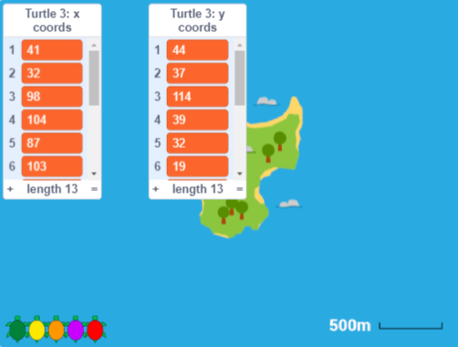
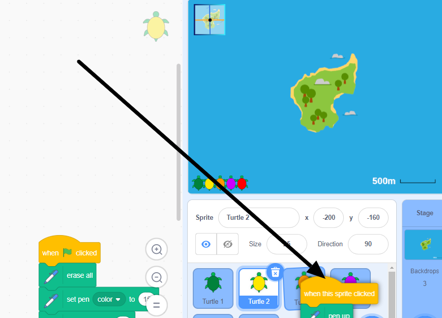

## टर्टल की वास्तविक चाल

इस चरण में, आप मानचित्र की पृष्ठभूमि **Poilão द्वीप** पर स्विच करेंगे। शटलवर्थ फाउंडेशन द्वारा ट्रैक किए गए वास्तविक टर्टल के लिए समन्वय डेटा पहले ही **Turtle 3** स्प्राइट में जोड़ा जा चुका है। अपने कोड को **Turtle 2** स्प्राइट से **Turtle 3** में कॉपी करके देखें कि यह टर्टल किस मार्ग से गया है।

--- task ---

**Grid/Map Button** पर क्लिक करें और आप अफ्रीका के पश्चिमी तट से दूर एक द्वीप पोइलाओ के आसपास के क्षेत्र का एक नक्शा देखेंगे।

यह छोटा द्वीप 1 किमी (1000 मीटर) से भी कम बड़ा है । Poilão हरे समुद्री टर्टलों के नीडन के लिए एक महत्वपूर्ण पर्यावरणीय स्थान है।

एक वयस्क हरे समुद्री टर्टल की पीठ की हड्डी (खोल) लगभग 1 मीटर लम्बी होती है।

--- /task ---

--- task ---

**Turtle 3** स्प्राइट, नारंगी टर्टल चुनें और **Code** टैब पर क्लिक करें।

`Variables`{:class="block3variables"} ब्लॉक मेनू खोलें, और उन्हें Stage पर दिखने के लिए `x`{:class="block3variables"} और `y coords`{:class="block3variables"} सूचियों के आगे वाले बॉक्स चेक करें।

ये सूचियाँ **For this sprite only** हैं, इनमें **Turtle 2** स्प्राइट के लिए बनाई गई सूचियों से अलग-अलग डेटा हैं।

आप Stage पर x और y निर्देशांक देख सकते हैं। ये एक समुद्री कछुए की वास्तविक गतिविधियों पर आधारित हैं और Scratch निर्देशांक में बदल दिए गए हैं जो **Poilão द्वीप** पृष्ठभूमि के साथ काम करते हैं।

जब आप निर्देशांक देख लेते हैं, तो आप उन्हें छिपाने के लिए बॉक्स को अनचेक कर सकते हैं।

--- /task ---

मनुष्यों के लिए संख्याओं की सूची को समझना कठिन है। आपका काम अपने कोड को **Turtle 3** स्प्राइट में कॉपी करना है ताकि निर्देशांकों को बनाया और स्टैम्प किया जा सके ताकि यह देखना आसान हो सके कि यह टर्टल कहां गया।

--- task ---

**Turtle 2** स्प्राइट चुनें और **Code** टैब पर क्लिक करें। `when this sprite clicked`{:class="block3events"} ब्लॉक को खीचें (नीचे के सभी ब्लॉक भी हिलेंगे)। जब तक आप Stage के नीचे स्प्राइट पेन में **Turtle 3** स्प्राइट के ऊपर न आ जाएं, तब तक खींचते रहें। **Turtle 3** स्प्राइट यह दिखाने के लिए कि इसे चुना गया है थोड़ा हिलना-डुलना करेगा और आप खिसकाना बंद कर सकते हैं।

**युक्ति:** माउस या ट्रैकपैड से खींचने के लिए, चलते समय बाईं माउस बटन को दबाए रखें।

कोड अभी भी **Turtle 2** स्प्राइट पर उपलब्ध है, लेकिन एक कॉपी **Turtle 3** स्प्राइट के **Code** टैब में में भी होगी।

**Turtle 3** स्प्राइट का चयन करें, और कॉपी किए गए कोड को देखने के लिए **Code** टैब पर क्लिक करें।

--- no-print ---

--- /no-print ---

**सलाह:** आप Code क्षेत्र में राइट-क्लिक कर सकते हैं और अपने कोड को साफ करने के लिए **Clean up Blocks** का चयन कर सकते हैं।

--- /task ---

--- task ---

**Turtle 3** स्प्राइट, नारंगी टर्टल पर क्लिक करें और देखें कि टर्टल ने क्या रास्ता अपनाया।

जीपीएस रीडिंग पूरी तरह से सटीक नहीं होती हैं, और टर्टलों को पानी के भीतर के समय पर पर ट्रैक नहीं किया जा सकता है, लेकिन वे एक बहुत ही उपयोगी जानकारी देते हैं की टर्टलों ने कहाँ यात्रा की है।

**याद रखें:** आपके पास प्रत्येक दिन के लिए टर्टल के लिए एक जगह है, इसलिए रेखाएं जगहों को जोड़ती हैं, वे यह नहीं दिखाती हैं कि टर्टल जगहों के बीच कैसे चला (आपको उसके लिए अधिक डेटा की आवश्यकता होगी)।

--- /task ---

--- save ---

