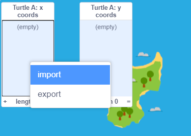

## फ़ाइल से डेटा इम्पोर्ट करें

Scratch आपको फ़ाइल से डेटा इम्पोर्ट करने की अनुमति देता है। यह वास्तव में तब उपयोगी होता है जब आपके पास बहुत सारा डेटा होता है जिसका आप उपयोग करना चाहते हैं जिसे टाइप करने में बहुत अधिक समय लगेगा।

--- task ---

**Turtle A**स्प्राइट, बैंगनी टर्टल चुनें। इसमें सूचियाँ हैं जो बनाई गई हैं, लेकिन उनमें कोई निर्देशांक नहीं है।

**Turtle A** स्प्राइट के `x coords`{:class="block3variables"} और `y coords`{:class="block3variables"} सूचियों को मंच पर देखने के लिए उनके बगल में स्थित बॉक्स को चेक करें।


--- /task ---

हमने उन मार्गों के आधार पर कुछ और डेटा तैयार किया है जो असली टर्टलों ने पोइलो के आसपास ले लिए हैं। आप इन डेटा फ़ाइलों को डाउनलोड कर सकते हैं और उन्हें अपने प्रोजेक्ट में इम्पोर्ट कर सकते हैं ताकि आप पता लगा सकें कि टर्टल कहाँ गए थे।

--- task --- --- no-print ---

नीचे दिए गए टर्टल डेटा लिंक में से किसी एक पर राइट-क्लिक करें, और **Save link as ...** या **Download linked file as ...** का चयन करें

--- /no-print ---

--- print-only ---

अपने वेब ब्राउज़र में एक नया टैब खोलें और नीचे दिए गए लिंक में से एक में टाइप करें। अधिकांश ब्राउज़र फ़ाइल को देख सकते हैं, आप फ़ाइल को डाउनलोड करने के लिए राइट क्लिक करके **Save as ...** का चयन करें।

--- /print-only ---

याद रखें कि आप फ़ाइल को कहाँ सेव करते हैं और इसे क्या कहते हैं।

+ [Turtle 6 Data](http://rpf.io/turtle-6){:target="_blank"}
+ [Turtle 10 Data](http://rpf.io/turtle-10){:target="_blank"}
+ [Turtle 11 Data](http://rpf.io/turtle-11){:target="_blank"}
+ [Turtle 16 Data](http://rpf.io/turtle-16){:target="_blank"}
+ [Turtle 19 Data](http://rpf.io/turtle-19){:target="_blank"}
+ [Turtle 20 Data](http://rpf.io/turtle-20){:target="_blank"}
+ [Turtle 21 Data](http://rpf.io/turtle-21){:target="_blank"}
+ [Turtle 22 Data](http://rpf.io/turtle-22){:target="_blank"}


--- collapse ---
---
title: यदि आप iPad का उपयोग कर रहे हैं
---

अगर आपका आईपैड पूरी तरह से अप टू डेट है, तो जब आप किसी लिंक पर क्लिक करेंगे तो आपसे पूछा जाएगा कि क्या आप **View** या **Download**। **Download** चुनें।

अन्यथा, सफारी ब्राउज़र का उपयोग करके, डेटा देखने के लिए अपने चुने हुए टर्टल लिंक पर क्लिक करें और फिर शेयर आइकन पर क्लिक करें। आप उन स्थानों को देखेंगे जहाँ आप फ़ाइल को सेव कर सकते हैं।

--- /collapse ---

--- collapse ---
---
title: यदि आप फ़ाइल को डाउनलोड या इम्पोर्ट नहीं कर सकते हैं
---

यदि आप किसी फ़ाइल को डाउनलोड करने में असमर्थ हैं, तो आप किसी एक टर्टल फ़ाइल को अपने ब्राउज़र में खोलने के लिए उस पर क्लिक या टैप कर सकते हैं (हाल के iPad पर **View** चुनें) आप `x coords`{:class="block3variables"} और `y coords`{:class="block3variables"} सूचियों में डेटा दर्ज कर सकते हैं **Turtle A** स्प्राइट के लिए जैसा की आपने **Turtle 2** के लिए किया। यदि आपके पास संख्याओं को पढ़ने के लिए एक साथी है तो यह आसान होगा ।

--- /collapse ---

--- /task ---

--- task ---

अब Scratch पर वापस जाएं।

Stage पर `Turtle A: x coords`{:class="block3variables"} सूची पर राइट-क्लिक (या टैप और होल्ड) करें और **import** चुनें।



आपने जो फाइल डाउनलोड की है उसे सेलेक्ट करें, यह कुछ इस तरह होगी `turtle-5.csv`।

--- collapse ---
---
title: यदि आप iPad का उपयोग कर रहे हैं
---

अगर आपका आईपैड पूरी तरह से अप टू डेट है, तो आप अपने डाउनलोड फोल्डर से `.csv` फाइल चुन सकेंगे।

अन्यथा, आप उस स्थान पर नेविगेट करने में सक्षम होंगे जहां आपने फ़ाइल सेव करी थी, जैसे कि क्लाउड ड्राइव।

--- /collapse ---

जब आपसे पूछा जाए कि **Which column should be used?**, संख्या `1` दर्ज करें। X निर्देशांक डेटा फ़ाइल के पहले कॉलम में है।


Scratch फ़ाइल के पहले कॉलम से डेटा को `Turtle A: x coords`{:class="block3variables"} सूची में लोड करेगा।


--- no-print ---


--- /no-print ---

यदि आपने एक अलग टर्टल चुना है तो आपके डेटा में अलग-अलग नंबर होंगे।

--- /task ---

--- task ---

अब y निर्देशांकों के लिए डेटा इम्पोर्ट करना दोहराएँ।

`Turtle A: y coords`{:class="block3variables"} सूची पर राइट-क्लिक (या टैप और होल्ड) करें और **import** चुनें।

पहले की तरह ही फाइल चुनें।

इस बार, कॉलम `2` चुनें क्योंकि इसमें उसी टर्टल के लिए y निर्देशांक डेटा है।


--- /task ---

--- task ---

Stage के नीचे **Turtle A** स्प्राइट का चयन करें और आपके द्वारा इम्पोर्ट किए गए कछुए की संख्या से मेल खाने के लिए उसका नाम बदलें, उदाहरण के लिए **Turtle 21**। इससे आपको यह याद रखने में मदद मिलेगी कि आपने किस टर्टल के डेटा का उपयोग किया है।


--- /task ---

--- task ---

**Turtle 3** स्प्राइट के कोड को खींचकर अपने नए टर्टल पर कॉपी करें।

जांचें कि आपके नए कछुए के लिए Code क्षेत्र में कॉपी किया गया कोड दिखाई दिया है। यदि नहीं, तो पुनः प्रयास करें।

--- /task ---

--- task ---

यह टर्टल कहां गया, यह जानने के लिए अपने टर्टल, बैंगनी टर्टल पर क्लिक करें।

आपके द्वारा चुने गए डेटा के आधार पर पथ भिन्न होगा।

--- /task ---

--- task ---

यदि आपके पास समय है, तो आप अधिक डेटा डाउनलोड कर सकते हैं और अधिक टर्टलों की यात्रा का अनुसरण कर सकते हैं। आप **Turtle B** स्प्राइट, लाल टर्टल का उपयोग कर सकते हैं। यदि आपको अधिक टर्टलों की आवश्यकता है, तो आप एक टर्टल की नकल कर सकते हैं और उसकी पोशाक और कलम का रंग बदल सकते हैं। इससे पहले कि आप नया डेटा इम्पोर्ट करें, इन ब्लॉकों का उपयोग करके कॉपी में मौजूद डेटा को हटा दें:

```blocks3
delete all of [x coords v]
delete all of [y coords v]

```

--- /task ---

--- task ---

अपने टर्टलों द्वारा यात्रा किये गए स्थानों को देखें। यदि आप एक समूह में हैं, तो आप दूसरों द्वारा चुने गए टर्टलों के परिणामों को भी देख सकते हैं।

विचार करने के लिए प्रश्न:
+ क्या सभी कछुए एक ही जगह से शुरू होते हैं? आपको क्या लगता है की ऐसा क्यों होता है?
+ क्या कई टर्टलों द्वारा अन्य स्थानों का दौरा किया गया है? आपको क्या लगता है कि वे वहां क्यों जाएंगे?
+ स्थानों को जोड़ने वाली रेखाएँ कभी-कभी द्वीप के आर-पार क्यों जाती हैं? याद रखें कि आपके पास प्रति दिन केवल एक स्थान है। आपको क्या लगता है कि टर्टलों ने स्थानों के बीच कैसे यात्रा की?

--- /task ---

--- save ---
