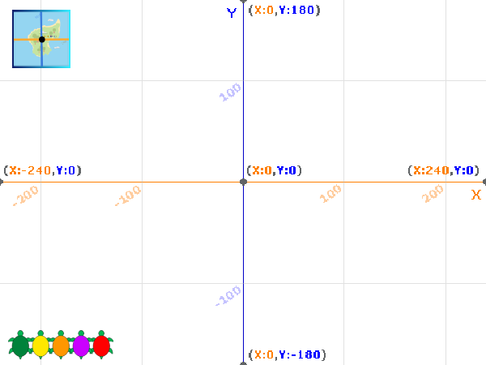

## ನಿರ್ದೇಶಾಂಕಗಳನ್ನು ಉಪಯೋಗಿಸುವುದು

ಈ ಹಂತದಲ್ಲಿ, ನೀವು x ಮತ್ತು y ನಿರ್ದೇಶಾಂಕಗಳನ್ನು Scratch ನಲ್ಲಿ ಆಮೆಯನ್ನು Stage ಮೇಲೆ ನಿರ್ದಿಷ್ಟ ಸ್ಥಳಕ್ಕೆ ಚಲಿಸಲು ಹೇಗೆ ಉಪಯೋಗಿಸುವುದು ಎನ್ನುವುದನ್ನು ಕಲಿಯುವಿರಿ.

--- task ---

**ಆನ್‌ಲೈನ್:** Scratch ನಲ್ಲಿ [ಪ್ರಾರಂಭಿಕ ಪ್ರಾಜೆಕ್ಟ್](http://rpf.io/turtle-tracker-on){:target="_blank"} ತೆರೆಯಿರಿ.

**ಆಫ್‌ಲೈನ್:** Scratch ಆಫ್‌ಲೈನ್‌ ಎಡಿಟರ್‌ನಲ್ಲಿ [ಪ್ರಾಜೆಕ್ಟ್‌ ಪ್ರಾರಂಭಿಕ ಫೈಲ್](http://rpf.io/p/kn-IN/turtle-tracker-get){:target="_blank"} ತೆರೆಯಿರಿ. ನಿಮಗೆ ಬೇಕಾದರೆ, ನೀವು [ಇಲ್ಲಿ Scratch ಡೌನ್‌ಲೋಡ್‌ ಮಾಡಿಕೊಂಡು ಇನ್‌ಸ್ಟಾಲ್‌ ಮಾಡಬಹುದು](https://scratch.mit.edu/download){:target="_blank"}.

ನೀವು ಪ್ರಾರಂಭಿಕ ಪ್ರಾಜೆಕ್ಟ್‌ನ್ನು ತೆರೆದಾಗ, ನೀವು ಗ್ರಿಡ್‌ ಮತ್ತು ಆಮೆಗಳನ್ನು ನೋಡುತ್ತೀರಿ.

--- /task ---

--- task ---

ನಿಮಗೆ ಗ್ರಿಡ್‌ ಕಾಣದಿದ್ದರೆ, ನೀವು ಅದನ್ನು ನೋಡುವವರೆಗೆ Stage‌ ಮೇಲಿನ ಎಡ ಮೂಲೆಯಲ್ಲಿರುವ **Grid/Map Button** ಮೇಲೆ ಕ್ಲಿಕ್‌ ಮಾಡಿ:



--- /task ---

Stage ಮೇಲೆ ಸ್ಥಳಗಳನ್ನು ಸೂಚಿಸಲು Scratch x ಮತ್ತು y ನಿರ್ದೇಶಾಂಕ ಸಂಖ್ಯೆಗಳನ್ನು ಉಪಯೋಗಿಸುತ್ತದೆ. X ನಿರ್ದೇಶಾಂಕ ಎಡ-ಬಲ ಸ್ಥಾನವನ್ನು ಕೊಡುತ್ತದೆ ಮತ್ತು y ನಿರ್ದೇಶಾಂಕ ಮೇಲೆ–ಕೆಳಗಿನ ಸ್ಥಾನ ಕೊಡುತ್ತದೆ. Stage ನ ಮಧ್ಯದ ನಿರ್ದೇಶಾಂಕ (x=0, y=0). ನಾವು **Turtle 1** ಸ್ಪ್ರೈಟ್‌ನ್ನು Stage ಮಧ್ಯಕ್ಕೆ ಕಳಿಸೋಣ.

--- task ---

**Turtle 1** ಸ್ಪ್ರೈಟ್‌ನ್ನು ಆಯ್ಕೆ ಮಾಡಿ ಮತ್ತು ಅದರ **Code** ಟ್ಯಾಬ್‌ ಮೇಲೆ ಕ್ಲಿಕ್‌ ಮಾಡಿ. ಆಮೆಯನ್ನು ಕ್ಲಿಕ್‌ ಮಾಡಿದಾಗ ಅದನ್ನು Stage ನ ಮಧ್ಯಕ್ಕೆ ಚಲಿಸಲು ಕೋಡ್‌ ಸೇರಿಸಿ:


```blocks3
when this sprite clicked
glide (1) secs to x: (0) y: (0)
```

--- /task ---

--- task ---

Stage ಮೇಲಿನ ನಿಮ್ಮ ಆಮೆಯ ಮೇಲೆ ಕ್ಲಿಕ್‌ ಮಾಡಿ ನಿಮ್ಮ ಕೋಡ್‌ ಪರೀಕ್ಷಿಸಿ.

--- /task ---

X ನಿರ್ದೇಶಾಂಕವು ಎಡದಿಂದ ಬಲದ ಸ್ಥಾನವನ್ನು -240 ದಿಂದ 240 ವರೆಗೆ ಕೊಡುತ್ತದೆ. ಋಣಾತ್ಮಕ x ನಿರ್ದೇಶಾಂಕಗಳು Stage ಮಧ್ಯದಿಂದ ಎಡಕ್ಕೆ, ಮತ್ತು ಧನಾತ್ಮಕ ನಿರ್ದೇಶಾಂಕಗಳು ಬಲಕ್ಕೆ.

--- task ---

ಆಮೆಯನ್ನು Stage ನ ಎಡಕ್ಕೆ ಈಜುವಂತೆ ಮಾಡಲು ಮತ್ತು ನಂತರ ಬಲಕ್ಕೆ ಈಜುವಂತೆ ಮಾಡಲು ಕೋಡ್‌ ಸೇರಿಸಿ:


```blocks3
when this sprite clicked
glide (1) secs to x: (0) y: (0)
+glide (1) secs to x: (-240) y: (0)
+glide (1) secs to x: (240) y: (0)
```

--- /task ---

Y ನಿರ್ದೇಶಾಂಕವು Stage ನ ಕೆಳಭಾಗದಲ್ಲಿ -180 ರಿಂದ, ಸ್ಟೇಜ್‌ ಮೇಲ್ಭಾಗದಲ್ಲಿ 180 ರವೆಗೆ ಹೋಗುತ್ತದೆ. ಋಣಾತ್ಮಕ y ನಿರ್ದೇಶಾಂಕಗಳು Stage ನ ಕೇಳ ಅರ್ಧದಲ್ಲಿ ಇರುತ್ತವೆ.

--- task ---

ಆಮೆಯನ್ನು Stage ನ ಮೇಲಕ್ಕೆ ಮತ್ತು ಕೆಳಕ್ಕೆ ಚಲಿಸಲು ಕೋಡ್‌ ಸೇರಿಸಿ:


```blocks3
when this sprite clicked
glide (1) secs to x: (0) y: (0)
glide (1) secs to x: (-240) y: (0)
glide (1) secs to x: (240) y: (0)
+glide (1) secs to x: (0) y: (180)
+glide (1) secs to x: (0) y: (-180)
```

--- /task ---

--- task ---

ಆಮೆಯು ಸ್ಥಳಗಳ ನಡುವೆ ಜಾರುವುದನ್ನು ವೀಕ್ಷಿಸಲು ನಿಮ್ಮ ಆಮೆಯ ಮೇಲೆ ಕ್ಲಿಕ್‌ ಮಾಡಿ. ಆಮೆಯು Stage ಅಂಚಿನಲ್ಲಿರುವಾಗಲೂ ಕೂಡ ನೀವು ಅದರ ಮೇಲೆ ಕ್ಲಿಕ್‌ ಮಾಡಬಹುದು.

--- /task ---

ಹಸಿರು ಬಾವುಟವನ್ನು ಕ್ಲಿಕ್‌ ಮಾಡಿದಾಗ, ಆಮೆಗಳು Stage ಕೇಳಭಾಗದಲ್ಲಿ ಸಾಲಾಗಿ ನಿಲ್ಲಬೇಕು. ಹಸಿರು ಆಮೆ ಅದರ ಪ್ರಾರಂಭಿಕ ಸ್ಥಾನಕ್ಕೆ ಮರಳುವಂತೆ ಮಾಡಲು ನೀವು ಕೋಡ್‌ ಸೇರಿಸಬೇಕು.

--- task ---

ಹಸಿರು ಬಾವುಟವನ್ನು ಕ್ಲಿಕ್‌ ಮಾಡಿದಾಗ, ಆಮೆಯನ್ನು Stage ನ ಕೆಳ ಎಡಭಾಗದಲ್ಲಿ ಇರಿಸಲು `when green flag clicked`{:class="block3events"} ಬ್ಲಾಕ್‌ ಮತ್ತು `glide`{:class="block3motion"} ಬ್ಲಾಕ್‌ ಸೇರಿಸಿ:


```blocks3
when green flag clicked
glide (1) secs to x: (-220) y: (-160)
```

ಪ್ರಾಂಭಿಕ ಸ್ಥಾನದ ನಿರ್ದೇಶಾಂಕಗಳ ಬಗೆಗೆ ನಿಮ್ಮ ತಿಳುವಳಿಕೆಯನ್ನು ಪರಿಶೀಲಿಸಲು ಗ್ರಿಡ್‌ ಉಪಯೋಗಿಸಿ.

--- /task ---

--- task ---

ಆಮೆಯು ಅದರ ಪ್ರಾರಂಭಿಕ ಸ್ಥಾನಕ್ಕೆ ಚಲಿಸುವುದನ್ನು ನೋಡಲು ಹಸಿರು ಬಾವುಟವನ್ನು ಕ್ಲಿಕ್‌ ಮಾಡಿ.

--- /task ---

--- task ---

ಈ ಕೋಡ್‌ನೊಂದಿಗೆ ಆಮೆಯು ಸಾಗುವ ಮಾರ್ಗವನ್ನು ನೀವು ಊಹಿಸಬಲ್ಲಿರಾ? ನಿಮಗೆ ಸಹಾಯ ಮಾಡಲು ಗ್ರಿಡ್ ಉಪಯೋಗಿಸಿ. ಆಮೆಯು ಎಲ್ಲಿಗೆ ಹೋಗುತ್ತದೆ ಎಂಬುವುದರ ಬಗೆಗ ಯೋಚಿಸಿ, ನಂತರ ನೀವು ಸರಿಯಾಗಿ ಯೋಚಿಸಿರುವಿರೇ ಎಂದು ನೋಡಲು ಈ ನಿರ್ದೇಶಾಂಕಗಳನ್ನು ಉಪಯೋಗಿಸಲು ನಿಮ್ಮ `glide`{:class="block3motion"} ಬ್ಲಾಕ್‌ಗಳಲ್ಲಿ ಸಂಖ್ಯೆಗಳನ್ನು ಬದಲಾಯಿಸಿ.


```blocks3
when this sprite clicked
+glide (1) secs to x: (100) y: (100)
+glide (1) secs to x: (100) y: (-100)
+glide (1) secs to x: (-100) y: (-100)
+glide (1) secs to x: (-100) y: (100)
+glide (1) secs to x: (100) y: (100)
```

--- /task ---

--- save ---

