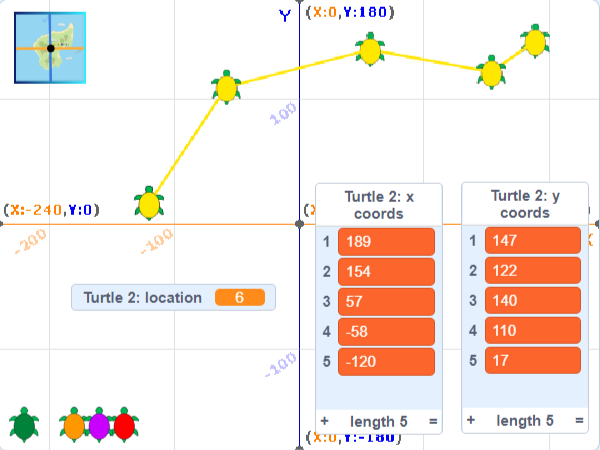

## ನಿರ್ದೇಶಾಂಕಗಳ ಪಟ್ಟಿಗಳು

ಈ ಹಂತದಲ್ಲಿ, ನೀವು **Turtle 2** ಸ್ಪ್ರೈಟ್‌ಗೆ x ಮತ್ತು y ನಿರ್ದೇಶಾಂಕಗಳ **ಪಟ್ಟಿಗಳನ್ನು** ಸೇರಿಸುವಿರಿ. ಪ್ರತಿಯೊಂದು ಸ್ಥಳಕ್ಕೆ ಕೋಡ್‌ ಬರೆಯದೆ ನಿಮಗೆ ಉದ್ದ ಮಾರ್ಗವನ್ನು ಚಿತ್ರಿಸಲು ಇದು ಅನುವುಮಾಡಿಕೊಡುತ್ತದೆ.

ಹಿಂದಿನ ಪ್ರೋಜೆಕ್ಟ್‌ನಲ್ಲಿ ನೀವು ದತ್ತಾಂಶ ಸಂಗ್ರಹಿಸಲು ವೇರಿಯೇಬಲ್‌ಗಳನ್ನು ಉಪಯೋಗಿಸಿದ್ದೀರಿ. ವೇರಿಯೇಬಲ್‌ ಒಮ್ಮೆಗೆ ಒಂದು ತುಣುಕು ದತ್ತಾಂಶವನ್ನು ಮಾತ್ರ ಸಂಗ್ರಹಿಸಬಲ್ಲದು. ಪಟ್ಟಿಯೂ ಸಹ ದತ್ತಾಂಶವನ್ನು ಸಂಗ್ರಹಿಸುತ್ತದೆ, ಆದರೆ ಅದು ತುಂಬಾ ಮಾಹಿತಿಗಳನ್ನು ಕ್ರಮವಾಗಿ ಸಂಗ್ರಹಿಸಬಲ್ಲದು.

ನೀವು ಎರಡು ಪಟ್ಟಿಗಳನ್ನು ರಚಿಸುತ್ತೀರಿ, ಒಂದು ನಿಮ್ಮ ಆಮೆಯ x ನಿರ್ದೇಶಾಂಕಗಳಿಗೆ ಮತ್ತು ಇನ್ನೊಂದು y ನಿರ್ದೇಶಾಂಕಗಳಿಗೆ. ನಂತರ, ನೀವು ಆಮೆಯು ಚಲಿಸುವ ಕೋಡ್‌ನ್ನು ಪಟ್ಟಿಗಳಲ್ಲಿರುವ ದತ್ತಾಂಶ ಉಪಯೋಗಿಸಿ ಬರೆಯುತ್ತೀರಿ.

### X ಮತ್ತು y ನಿರ್ದೇಶಾಂಕಗಳ ಪಟ್ಟಿಗಳನ್ನು ರಚಿಸಿ

--- task ---

ಹಳದಿ **Turtle 2** ಸ್ಪ್ರೈಟ್‌ನ್ನು ಆಯ್ಕೆ ಮಾಡಿಕೊಳ್ಳಿ ಮತ್ತು **Code** ಟ್ಯಾಬ್‌ ಮೇಲೆ ಕ್ಲಿಕ್‌ ಮಾಡಿ. ಈ ಆಮೆಯು ಈಗಾಗಲೇ ಪೆನ್ನಿಗೆ ಮತ್ತು ಪ್ರಾರಂಭಿಕ ಸ್ಥಾನಕ್ಕೆ ಚಲಿಸಲು ಕೋಡ್‌ ಹೊದಾಣಿಕೆ ಹೊಂದಿದೆ.


 `Variables`{:class="block3variables"} ಬ್ಲಾಕ್‌ಗಳ ಮೆನು ಮೇಲೆ ಕ್ಲಿಕ್‌ ಮಾಡಿ, ಮತ್ತು ನಂತರ **Make a List** ಮೇಲೆ ಕ್ಲಿಕ್‌ ಮಾಡಿ.


ಪಟ್ಟಿಯನ್ನು `x coords` ಎಂದು ಹೆಸರಿಸಿ. **For this sprite only** ನ್ನು ಆಯ್ಕೆ ಮಾಡಿಕೊಳ್ಳಿ —ಇದು ಪ್ರತಿಯೊಂದು ಆಮೆಗೆ ತನ್ನದೇ ಆದ ನಿರ್ದೇಶಾಂಕಗಳನ್ನು ಹೊಂದಲು ಅನುವುಮಾಡಿಕೊಡುತ್ತದೆ.


**OK** ಕ್ಲಿಕ್‌ ಮಾಡಿ ಮತ್ತು ಪಟ್ಟಿಯು Stage ಮೇಲೆ ಕಾಣಿಸಿಕೊಳ್ಳುತ್ತದೆ.

--- no-print ---


--- /no-print ---

--- /task ---

--- task ---

`y coords` ಎಂದು ಕರೆಯಲ್ಪಡುವ ಎರಡನೇ ಪಟ್ಟಿಯನ್ನು ಮಾಡಲು ಈಗ ಮತ್ತೆ **Make a List** ಕ್ಲಿಕ್‌ ಮಾಡಿ. ನೀವು **For this sprite only** ಆಯ್ಕೆ ಮಾಡಿಕೊಳ್ಳಲೇ ಬೇಕು.


ನೀವು ಈಗ Stage ಮೇಲೆ ಎರಡು ಖಾಲಿ ಪಟ್ಟಿಗಳನ್ನು ಹೊಂದಿರುವಿರಿ.


--- /task ---

ನಂತರ, ನೀವು ನಿರ್ದೇಶಾಂಕದ ದತ್ತಾಂಶವನ್ನು ಪಟ್ಟಿಗಳಿಗೆ ಸೇರಿಸಬೇಕು.

ಈ ಕೋಷ್ಟಕವು ನಿಮ್ಮ ಆಮೆಗೆ ನಿರ್ದೇಶಾಂಕ ಸ್ಥಾನಗಳನ್ನು ಕೊಡುತ್ತದೆ:

<div style="width:200px;">

|:-------:|:--------:|
|x coords | y coords |
|--------:|---------:|
| 189     | 147      |
| 154     | 122      |
| 57      | 140      |
| -58     | 110      |
| -120    | 17       |
|---------|----------|

<br/>
</div>

--- task ---

`x coords`{:class="block3variables"} ಪಟ್ಟಿಯ ಕೆಳಗೆ **+** ಮೇಲೆ ಕ್ಲಿಕ್‌ ಮಾಡಿ.

ಇದು ಪಟ್ಟಿಗೆ ನಮೂದನ್ನು ಸೇರಿಸುತ್ತದೆ. ಕೋಷ್ಟಕದಲ್ಲಿ ಮೊದಲನೆಯ x ನಿರ್ದೇಶಾಂಕದ ಮೌಲ್ಯ `189` ನಮೂದಿಸಿ.


ಉಳಿದ x ನಿರ್ದೇಶಾಂಕ ಮೌಲ್ಯಗಳಿಗೆ ಪುನರಾವರ್ತಿಸಿ, ಆಗ ನಿಮ್ಮ ಪಟ್ಟಿಯು ಈ ರೀತಿ ಕಾಣುತ್ತದೆ:


`-58` ನಂತಹ ಋಣಾತ್ಮಕ ಸಂಖ್ಯೆಗಳಲ್ಲಿ `-` ನ್ನು ನಮೂದಿಸುವಂತೆ ಎಚ್ಚರವಹಿಸಿ.

--- no-print ---


--- /no-print ---

--- /task ---

--- task ---

ನಿಮ್ಮ ಆಮೆಗೆ y ನಿರ್ದೇಶಾಂಕ ದತ್ತಾಂಶ ಸೇರಿಸಲು **+** ನ್ನು `y coords`{:class="block3variables"} ಪಟ್ಟಿಯ ಕೆಳಗೆ ಉಪಯೋಗಿಸಿ.

ನಿಮ್ಮ ಪಟ್ಟಿಗಳು ಈ ರೀತಿ ಕಾಣಬೇಕು:


--- /task ---

--- task ---

ನೀವು ದತ್ತಾಂಶವನ್ನು ನಮೂದಿಸುವುದನ್ನು ಮುಗಿಸಿದಾಗ, ನೀವು ಪಟ್ಟಿಗಳನ್ನು Stage ಮೇಲಿಂದ ಮರೆಮಾಡಬಹುದು. `Variables`{:class="block3variables"} ಬ್ಲಾಕ್‌ಗಳ ಮೆನುನಲ್ಲಿ ಪಟ್ಟಿಗಳ ಮುಂದಿರುವ ಪೆಟ್ಟಿಗೆಯನ್ನು ಅನ್‌ಚೆಕ್‌ ಮಾಡಿ.


--- no-print ---


--- /no-print ---

--- /task ---

### ಪಟ್ಟಿಗಳಲ್ಲಿರುವ ದತ್ತಾಂಶ ಉಪಯೋಗಿಸಿ ಆಮೆಗಳನ್ನು ಚಲಿಸಿ

ನಂತರ, **Turtle 2** ಸ್ಪ್ರೈಟ್‌ನ ಮಾರ್ಗವನ್ನು ಚಿತ್ರಿಸಲು ಪಟ್ಟಿಯಿಂದ x ಮತ್ತು y ನಿರ್ದೇಶಾಂಕ ಮೌಲ್ಯಗಳನ್ನು ಉಪಯೋಗಿಸುವ ಕೋಡ್‌ನ್ನು ನೀವು ಬರೆಯಬೇಕು.

ಪೆನ್ನನ್ನು ಮತ್ತು ಪ್ರಾರಂಭಿಕ ಸ್ಥಾನವನ್ನು ಹೊಂದಿಸಲು ಕೋಡ್‌ನ್ನು ನಿಮಗೆ ಒದಗಿಸಲಾಗಿದೆ. ಇದು **Turtle 1** ಸ್ಪ್ರೈಟ್‌ನಂತೆಯೇ ಇರುತ್ತದೆ, ಆದರೆ ಇದು ಬೇರೆ ಪೆನ್ನಿನ ಬಣ್ಣವನ್ನು ಮತ್ತು ನಿರ್ದೇಶಾಂಕಗಳನ್ನು ಉಪಯೋಗಿಸುತ್ತದೆ.

`x coords`{:class="block3variables"} ಪಟ್ಟಿಯಲ್ಲಿ ಮೊದಲನೆಯ ನಮೂದನ್ನು ಪಡೆಯಲು `item 1 of x coords`{:class="block3variables"} ಬ್ಲಾಕ್‌ನ್ನು, ಮತ್ತು `y coords`{:class="block3variables"} ಪಟ್ಟಿಯಲ್ಲಿ ಮೊದಲನೆಯ ನಮೂದನ್ನು ಪಡೆಯಲು `item 1 of y coords`{:class="block3variables"} ಬ್ಲಾಕ್‌ ಉಪಯೋಗಿಸಿ. ನೀವು ಈ ಬ್ಲಾಕ್‌ಗಳನ್ನು `Variables`{:class="block3variables"} ಬ್ಲಾಕ್‌ಗ:ಳ ಮೆನುನಲ್ಲಿ ಕಾಣಬಹುದು. ಒಟ್ಟಿಗೆ ಈ ಮೌಲ್ಯಗಳು ನಿಮಗೆ **Turtle 2** ಸ್ಪ್ರೈಟ್‌ನ ಮೊದಲನೆಯ ಸ್ಥಾನವನ್ನು ಕೊಡುತ್ತವೆ.

--- task ---

ಆಮೆಯನ್ನು ಕ್ಲಿಕ್‌ ಮಾಡಿದಾಗ ಅದರ ಮೊದಲನೆಯ ಸ್ಥಾನಕ್ಕೆ ಅದನ್ನು ಚಲಿಸಲು ಕೋಡ್ ಸೇರಿಸಿ.


```blocks3
when this sprite clicked
glide (1) secs to x: (item (1) of [x coords v]) y: (item (1) of [y coords v])
```

`x coords`{:class="block3variables"} ಮತ್ತು `y coords`{:class="block3variables"} ಪಟ್ಟಿಗಳನ್ನು ಆಯ್ಕೆಮಾಡಲು ಡ್ರಾಪ್-ಡೌನ್‌ ಮೆನುನಿಂದ ನೀವು ಸರಿಯಾಧ ಪಟ್ಟಿಯನ್ನು ಆಯ್ಕೆಮಾಡಿರುವುದನ್ನು ಖಚಿತಪಡಿಸಿಕೊಳ್ಳಿ.

--- no-print ---


--- /no-print ---

--- /task ---

--- task ---

ಕೊಡ್‌ ರನ್‌ ಮಾಡಿ ಮತ್ತು **Turtle 2** ಸ್ಪ್ರೈಟ್‌ ( ಹಳದಿ ಆಮೆ) ಅದರ ಪ್ರಾರಂಭಿಕ ಸ್ಥಾನಕ್ಕೆ ಚಲಿಸುವುದನ್ನು ನೋಡಲು ಅದರ ಮೇಲೆ ಕ್ಲಿಕ್ ಮಾಡಿ.

--- /task ---

ನೀವು ಈಗ ಆಮೆಯನ್ನು ಸ್ಥಾನಗಳ ಮೂಲಕ ಚಲಿಸಬೇಕು. ಇದನ್ನು ಮಾಡಲು, ನಿಮಗೆ ಪಟ್ಟಿಯಲ್ಲಿನ ಮುಂದಿನ ನಮೂದು ಪತ್ತೆಮಾಡಲು ಒಂದು ವೇರಿಯೇಬಲ್‌ ಬೇಕು.

--- task ---

**For this sprite only** ಆಯ್ಕೆಯಾಗಿರುವುದರೊಂದಿಗೆ ಹೊಸ ವೇರಿಯೇಬಲ್‌ ರಚಿಸಿ ಮತ್ತು ಅದನ್ನು `location` ಎಂದು ಹೆಸರಿಸಿ.


`location`{:class="block3variables"} ನ್ನು ಅನ್‌ಚೆಕ್‌ ಮಾಡಿ, ಆಗ ಅದು Stage ಮೇಲೆ ಪ್ರದರ್ಶಿತವಾಗುವುದಿಲ್ಲ.

--- /task ---

--- task ---

ಪಟ್ಟಿಯ ಪ್ರಾರಂಭದಲ್ಲಿ ಶುರುಮಾಡಲು `location`{:class="block3variables"} ನ್ನು `1` ಕ್ಕೆ ಹೊಂದಿಸಲು ಬ್ಲಾಕ್‌ ಸೇರಿಸಿ. ಸಂಖ್ಯೆ 1 ರ ಬದಲು `location`{:class="block3variables"} ವೇರಿಯೇಬಲ್‌ನ್ನು ಉಪಯೋಗಿಸುವಂತೆ `glide`{:class="block3motion"} ಬ್ಲಾಕ್‌ನ್ನು ಬದಲಾಯಿಸಿ.


```blocks3
when this sprite clicked
+set [location v] to (1)
+glide (1) secs to x: (item (location) of [x coords v]) y: (item (location) of [y coords v])
```
--- no-print ---


--- /no-print ---

--- /task ---

--- task ---

ನಿರ್ದೇಶಾಂಕಗಳ ಪಟ್ಟಿಗಳನ್ನು ಲೂಪ್‌ ಮಾಡಲು ಈಗ `repeat`{:class="block3control"} ಲೂಪ್‌ ಸೇರಿಸಿ. ಪಟ್ಟಿಯ ಉದ್ದವನ್ನು ಕಂಡುಹಿಡಿಯಲು ಒಂದು ಬ್ಲಾಕ್‌ ಇದೆ, ಅದನ್ನು ನೀವು ಎಷ್ಟು ಬಾರಿ ಪುನರಾವರ್ತನೆಯಾಗಬೇಕು ಎಂದು ಕೊಡಲು ಉಪಯೋಗಿಸಬಹುದು:


```blocks3
when this sprite clicked
set [location v] to (1) 
+repeat (length of [x coords v])
glide (1) secs to x: (item (location) of [x coords v]) y: (item (location) of [y coords v])
+change [location v] by (1)
```

ನಿಮ್ಮ `glide`{:class="block3motion"} ಬ್ಲಾಕ್ `repeat`{:class="block3control"} ಲೂಪ್‌ ಒಳಗೆ ಇರುವುದನ್ನು ಖಚಿತಪಡಿಸಿಕೊಳ್ಳಿ.

--- no-print ---


--- /no-print ---

ಪ್ರತಿಬಾರಿ ಲೂಪ್‌ ಸುತ್ತಿದಾಗ, ಸ್ಥಳ ಹೆಚ್ಚುತ್ತದೆ ಮತ್ತು `item`{:class="block3variables"} ಬ್ಲಾಕ್‌ಗಳು `x coords`{:class="block3variables"} ಮತ್ತು `y coords`{:class="block3variables"} ಪಟ್ಟಿಗಳಿಂದ ಮುಂದಿನ ನಮೂದನ್ನು ಪಡೆಯುತ್ತವೆ.

--- /task ---

--- task ---

ಲೂಪ್‌ ಒಳಗಡೆ, `pen up`{:class="block3extensions"}, `pen down`{:class="block3extensions"} ಮಾಡಲು, ಮತ್ತು ಸ್ಪ್ರೈಟ್‌ನ `stamp`{:class="block3extensions"} ಮಾಡಲು ಬ್ಲಾಕ್‌ಗಳನ್ನು ಸೇರಿಸಿ.


```blocks3
when this sprite clicked
+pen up
set [location v] to (1) 
repeat (length of [x coords v])
glide (1) secs to x: (item (location) of [x coords v]) y: (item (location) of [y coords v])
+pen down
+stamp
change [location v] by (1)
```

--- /task ---

--- task ---

**Turtle 2** ಸ್ಪ್ರೈಟ್‌ ಪಟ್ಟಿಗಳಿಂದ x ಮತ್ತು y ನಿರ್ದೇಶಾಂಕಗಳನ್ನು ಉಪಯೋಗಿಸಿಕೊಂಡು ಅದರ ಮಾರ್ಗವನ್ನು ಚಿತ್ರಿಸುವುದನ್ನು ನೋಡಲು ನಿಮ್ಮ ಕೋಡ್‌ ರನ್‌ ಮಾಡಿ.

`location`{:class="block3variables"} ವೇರಿಯೇಬಲ್‌, ಮತ್ತು `x coords`{:class="block3variables"} ಮತ್ತು `y coords`{:class="block3variables"}ಪಟ್ಟಿಗಳ ಮುಂದಿನ ಪೆಟ್ಟಿಗೆಗಳನ್ನು ಚೆಕ್‌ ಮಾಡಿ; ಅವುಗಳನ್ನು Stage ಮೇಲೆ ಜೋಡಿಸಿ; ಮತ್ತು ನಂತರ ದತ್ತಾಂಶವನ್ನು ಹೇಗೆ ಉಪಯೋಗಿಸಲಾಗಿದೆ ಎಂಬುವುದನ್ನು ಅರ್ಥಮಾಡಿಕೊಳ್ಳಲು **Turtle 2** ಸ್ಪ್ರೈಟ್‌ ಮೇಲೆ ಕ್ಲಿಕ್‌ ಮಾಡಿ.



--- /task ---

--- save ---
