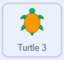

## ನಿಜವಾದ ಆಮೆಯ ಚಲನೆಗಳು

ಈ ಹಂತದಲ್ಲಿ, ನೀವು **Poilão Island** ನಕ್ಷೆ ಹಿನ್ನೆಲೆಗೆ ಬದಲಾಯಿಸುತ್ತೀರಿ. ದಿ ಶಟಲ್‌ವರ್ತ್‌ ಫೌಂಡೇಶನ್‌ ಪತ್ತೆಮಾಡಿದ ನಿಜ ಆಮೆಯ ನಿರ್ದೇಶಾಂಕ ದತ್ತಾಂಶವನ್ನು ಈಗಾಗಲೇ **Turtle 3** ಸ್ಪ್ರೈಟ್‌ಗೆ ಸೇರಿಸಲಾಗಿದೆ. ಈ ಆಮೆಯು ತೆಗೆದುಕೊಂಡ ಮಾರ್ಗವನ್ನು ನೋಡಲು, **Turtle 2** ಸ್ಪ್ರೈಟ್‌ನಿಂದ ನಿಮ್ಮ ಕೋಡ್‌ನ್ನು **Turtle 3** ಗೆ ನಕಲು ಮಾಡಿ.

--- task ---

**Grid/Map Button** ಮೇಲೆ ಕ್ಲಿಕ ಮಾಡಿ ಮತ್ತು ನೀವು ಆಫ್ರಿಕಾದ ಪಶ್ಚಿಮ ಕರಾವಳಿಯ ಒಂದು ದ್ವೀಪ ಪೋಯಲಾವೋದ ಸುತ್ತಮುತ್ತಲಿನ ಪ್ರದೇಶದ ನಕ್ಷೆಯನ್ನು ನೋಡುವಿರಿ.

ಈ ಸಣ್ಣ ದ್ವೀಪವು 1ಕಿಮೀ (1000 ಮೀಟರ್‌ಗಳು) ಗಿಂತ ಕಡಿಮೆ ಅಳತೆ ಹೊಂದಿದೆ. ಪೊಯಲಾವೋ ಹಸಿರು ಸಮುದ್ರ ಆಮೆಗಳು ಗೂಡುಕಟ್ಟಲು ಒಂದು ಪ್ರಮುಖ ಪರಿಸರ ಸ್ಥಳವಾಗಿದೆ.

ಒಂದು ವಯಸ್ಕ ಹಸಿರು ಸಮುದ್ರ ಆಮೆಯ ಬೆನ್ನುಚಿಪ್ಪು (ಚಿಪ್ಪು) ಸುಮಾರು 1ಮೀ ಉದ್ದವಿರುತ್ತದೆ.

--- /task ---

--- task ---

**Turtle 3** ಸ್ಪ್ರೈಟ್‌ ಆಯ್ಕೆಮಾಡಿಕೊಳ್ಳಿ, ಕಿತ್ತಳೆ ಬಣ್ಣದ ಆಮೆ, ಮತ್ತು **Code** ಟ್ಯಾಬ್‌ ಮೇಲೆ ಕ್ಲಿಕ್‌ ಮಾಡಿ.

`Variables`{:class="block3variables"} ಬ್ಲಾಕ್‌ಗಳ ಮೆನು ತೆರೆಯಿರಿ, ಮತ್ತು `x coords`{:class="block3variables"} ಮತ್ತು `y coords`{:class="block3variables"} ಪಟ್ಟಿಗಳನ್ನು Stage ಮೇಲೆ ತೋರಿಸಲು ಅವುಗಳ ಮುಂದಿರುವ ಪೆಟ್ಟಿಗೆಗಳನ್ನು ಚೆಕ್‌ ಮಾಡಿ.

ಈ ಪಟ್ಟಿಗಳು **For this sprite only**, ಅವುಗಳು **Turtle 2** ಸ್ಪ್ರೈಟ್‌ಗೆ ನೀವು ರಚಿಸಿದ ಪಟ್ಟಿಗಳಿಗೆ ಬೇರೆ ಬೇರೆ ದತ್ತಾಂಶವನ್ನು ಒಳಗೊಂಡಿರುತ್ತವೆ.

ನೀವು x ಮತ್ತು y ನಿರ್ದೇಶಾಂಕಗಳನ್ನು Stage ಮೇಲೆ ನೋಡುವಿರಿ. ಇವುಗಳು ಸಮುದ್ರ ಆಮೆಯ ನಿಜವಾದ ಚಲನವಲನವನ್ನು ಅವಲಂಬಿಸಿವೆ ಮತ್ತು ಅವುಗಳನ್ನು **Poilão Island** ಹಿನ್ನೆಲೆಯೊಂದಿಗೆ ಕೆಲಸಮಾಡುವ Scratch ನಿರ್ದೇಶಾಂಕಗಳಾಗಿ ಪರಿವರ್ತನೆ ಮಾಡಲಾಗಿದೆ.

ನೀವು ನಿರ್ದೇಶಾಂಕಗಳನ್ನು ನೋಡಿದ ನಂತರ, ಅವುಗಳನ್ನು ಮರೆಮಾಡಲು ನೀವು ಪೆಟ್ಟಿಗೆಗಳನ್ನು ಅನ್‌ಚೆಕ್‌ ಮಾಡಬಹುದು.

--- /task ---

ಮನುಷ್ಯರಿಗೆ ಸಂಖ್ಯೆಗಳ ಪಟ್ಟಿಗಳನ್ನು ಅರ್ಥಮಾಡಿಕೊಳ್ಳುವುದು ಕಷ್ಟವಾಗುತ್ತದೆ. ಈ ಆಮೆಯು ಎಲ್ಲಿ ಹೋಗಿತ್ತು ಎಂಬುವುದನ್ನು ನೋಡಲು ಸುಲಭವಾಗುವಂತೆ ಮಾಡಲು ನಿಮ್ಮ ಕಾರ್ಯವೆಂದರೆ **Turtle 3** ಸ್ಪ್ರೈಟ್‌ಗೆ ನಿರ್ದೇಶಾಂಕಗಳನ್ನು ಚಿತ್ರಿಸಲು ಮತ್ತು ಸ್ಟಾಂಪ್‌ ಮಾಡಲು ನಿಮ್ಮ ಕೋಡ್‌ನ್ನು ನಕಲು ಮಾಡುವುದು.

--- task ---

**Turtle 2** ಸ್ಪ್ರೈಟ್‌ನ್ನು ಆಯ್ಕೆಮಾಡಿಕೊಳ್ಳಿ ಮತ್ತು **Code** ಟ್ಯಾಬ್‌ ಮೇಲೆ ಕ್ಲಿಕ್‌ ಮಾಡಿ. `when this sprite clicked`{:class="block3events"}ಬ್ಲಾಕ್‌ನ್ನು ಎಳೆಯಿರಿ (ಅದರ ಅಡಿಯಲ್ಲಿರುವ ಎಲ್ಲಾ ಬ್ಲಾಕ್‌ಗಳೂ ಚಲಿಸುತ್ತವೆ). ನೀವು Stage ಕೆಳಗೆ Sprite ಪೇನ್‌ನಲ್ಲಿರುವ **Turtle 3** ಸ್ಪ್ರೈಟ್‌ ಮೇಲ್ಗಡೆಗೆ ತಲುಪುವವರೆಗೂ ಎಳೆಯುತ್ತಲೇ ಇರಿ. ಅದು ಆಯ್ಕೆಯಾಗಿದೆ ಎಂದು ತೋರಿಸಲು **Turtle 3** ಸ್ಪ್ರೈಟ್‌ ಸ್ವಲ್ಪ ಅಲುಗಾಡುತ್ತದೆ ಮತ್ತು ನೀವು ಎಳೆಯುವುದನ್ನು ನಿಲ್ಲಿಸಬಹುದು.

**ಸಲಹೆ:** ಮೌಸ್‌ನಿಂದ ಅಥವಾ ಟ್ರಾಕ್‌ಪ್ಯಾಡ್‌ನಿಂದ ಎಳೆಯಲು, ನೀವು ಚಲಿಸುತ್ತಿರುವಾಗ ಎಡಗಡೆಯ ಮೌಸ್‌ ಬಟನ್‌ನ್ನು ಒತ್ತಿ ಹಿಡಿಯಿರಿ.

ಕೋಡ್‌ ಇನ್ನೂ **Turtle 2** ಸ್ಪ್ರೈಟ್‌ ಮೇಲೆ ದೊರೆಯುತ್ತಿರುತ್ತದೆ, ಆದರೆ **Turtle 3** ಸ್ಪ್ರೈಟ್‌ನ **Code** ಟ್ಯಾಬ್‌ನಲ್ಲಿಯೂ ಒಂದು ನಕಲು ಇರುತ್ತದೆ.

**Turtle 3** ಸ್ಪ್ರೈಟ್‌ ಆಯ್ಕೆ ಮಾಡಿಕೊಳ್ಳಿ, ಮತ್ತು ನಕಲು ಮಾಡಿದ ಕೋಡ್‌ನ್ನು ನೋಡಲು ಅದರ **Code** ಟ್ಯಾಬ್‌ ಮೇಲೆ ಕ್ಲಿಕ್‌ ಮಾಡಿ.

--- no-print ---

--- /no-print ---

**ಸಲಹೆ:** ಕೋಡ್‌ನ್ನು ಅಚ್ಚುಕಟ್ಟಾಗಿ ಮಾಡಲು ನೀವು Code ಪ್ರದೇಶದಲ್ಲಿ ರೈಟ್-ಕ್ಲಿಕ್‌ ಮಾಡಿ **Clean up Blocks** ಆಯ್ದುಕೊಳ್ಳಬಹುದು.

--- /task ---

--- task ---

Stage ಮೇಲಿನ ನಿಮ್ಮ ಕೋಡ್‌ನ್ನು ರನ್‌ ಮಾಡಲು ಮತ್ತು ಆಮೆಯು ತೆಗೆದುಕೊಂಡ ಮಾರ್ಗವನ್ನು ನೋಡಲು **Turtle 3** ಸ್ಪ್ರೈಟ್‌ನ್ನು ಕ್ಲಿಕ್‌ ಮಾಡಿ, ಕಿತ್ತಳೆ ಬಣ್ಣದ ಆಮೆ.

ಜಿಪಿಎಸ್‌ ರೀಡಿಂಗ್‌ಗಳು ಸಂಪೂರ್ಣವಾಗಿ ನಿಖರವಾಗಿರುವುದಿಲ್ಲ, ಮತ್ತು ಆಮೆಗಳು ನೀರಿನಡಿಯಲ್ಲಿ ಕಾಲ ಕಳೆಯುವಾಗ ಅವುಗಳನ್ನು ಅನುಸರಿಸಲು ಆಗುವುದಿಲ್ಲ, ಆದರೆ ಅವುಗಳು ಆಮೆಗಳು ಎಲ್ಲಿ ಚಲಿಸಿದ್ದವು ಎಂಬುವುದರ ಬಗೆಗೆ ಅತ್ಯುತ್ತಮ ಕಲ್ಪನೆ ನೀಡುತ್ತವೆ.

**ನೆನಪಿರಲಿ:** ಆಮೆಗೆ ನೀವು ಪ್ರತಿದಿನಕ್ಕೆ ಒಂದು ಸ್ಥಳ ಹೊಂದಿರುತ್ತೀರಿ, ಅದರಿಂದ ಗೆರೆಗಳು ಸ್ಥಳಗಳನ್ನು ಜೋಡಿಸುತ್ತವೆ, ಅವುಗಳು ಆಮೆಗಳು ಸ್ಥಾನಗಳ ನಡುವೆ ಹೇಗೆ ಚಲಿಸಿದವು ಎಂಬುವುದನ್ನು ತೋರಿಸುವುದಿಲ್ಲ (ಅದಕ್ಕೆ ನಿಮಗೆ ಇನ್ನಷ್ಟು ದತ್ತಾಂಶ ಬೇಕಾಗುತ್ತದೆ).

--- /task ---

--- save ---

