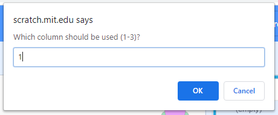

## ಫೈಲ್‌ನಿಂದ ದತ್ತಾಂಶ ಆಮದು ಮಾಡಿಕೊಳ್ಳಿ

Scratch ನಿಮಗೆ ಫೈಲ್‌ನಿಂದ ದತ್ತಾಂಶವನ್ನು ಆಮದು ಮಾಡಿಕೊಳ್ಳಲು ಅನುವುಮಾಡಿಕೊಡುತ್ತದೆ. ನಿಮಗೆ ಟೈಪ್‌ ಮಾಡಲು ತುಂಬಾ ಸಮಯ ತೆಗೆದುಕೊಳ್ಳುವ, ಉಪಯೋಗಿಸಲು ತುಂಬಾ ದ‌ತ್ತಾಂಶಗಳಿದ್ದಾಗ ಇದು ನಿಜವಾಗಿಯೂ ಉಪಯುಕ್ತವಾಗಿರುತ್ತದೆ.

--- task ---

ನೇರಳೆ ಬಣ್ಣದ ಆಮೆ, **Turtle A** ಸ್ಪ್ರೈಟ್‌ ಆಯ್ಕೆ ಮಾಡಿಕೊಳ್ಳಿ. ಇದು ರಚಿಸಿದ ಪಟ್ಟಿಗಳನ್ನು ಹೊಂದಿದೆ, ಆದರೆ ಅವುಗಳು ಯಾವುದೇ ನಿರ್ದೇಶಾಂಕಗಳನ್ನು ಹೊಂದಿಲ್ಲ.

ಅವುಗಳನ್ನು Stage ಮೇಲೆ ನೋಡಲು **Turtle A** ಸ್ಪ್ರೈಟ್‌ನ `x coords`{:class="block3variables"} ಮತ್ತು `y coords`{:class="block3variables"} ಪಟ್ಟಿಗಳ ಮುಂದಿನ ಪೆಟ್ಟಿಗೆಗಳನ್ನು ಚೆಕ್‌ಮಾಡಿ.


--- /task ---

ಪೊಯಲಾವೋದ ಸುತ್ತ ನಿಜವಾದ ಆಮೆಗಳು ತೆಗೆದುಕೊಂಡ ಮಾರ್ಗಗಳನ್ನು ಆಧರಿಸಿ ನಾವು ಇನ್ನಷ್ಟು ದತ್ತಾಂಶ ಸಿದ್ಧಪಡಿಸಿದ್ದೇವೆ. ಆಮೆಗಳು ಎಲ್ಲೆಲ್ಲಿ ಹೋಗಿದ್ದವು ಎಂಬುವುದನ್ನು ಕಂಡುಹಿಡಿಯಲು ನೀವು ಈ ದತ್ತಾಂಶ ಫೈಲ್‌ಗಳನ್ನು ಡೌನ್‌ಲೋಡ್‌ ಮಾಡಿಕೊಂಡು ನಿಮ್ಮ ಪ್ರಾಜೆಕ್ಟ್‌ಗೆ ಆಮದು ಮಾಡಿಕೊಳ್ಳಬಹುದು.

--- task --- --- no-print ---

ಈ ಕೆಳಗಿನ ಆಮೆಯ ದತ್ತಾಂಶ ಲಿಂಕ್‌ಗಳ ಮೇಲೆ ರೈಟ್-ಕ್ಲಿಕ್‌ ಮಾಡಿ, ಮತ್ತು **Save link as ...** ಅಥವಾ **Download linked file as ...** ನ್ನು ಆಯ್ಕೆಮಾಡಿಕೊಳ್ಳಿ

--- /no-print ---

--- print-only ---

ನಿಮ್ಮ ವೆಬ್‌ ಬ್ರೌಸರ್‌ನಲ್ಲಿ ಹೊಸ ಟ್ಯಾಬ್‌ನ್ನು ತೆರೆಯಿರಿ ಮತ್ತು ಈ ಕೆಳಗಿನ ಲಿಂಕ್‌ಗಳಲ್ಲಿ ಒಂದನ್ನು ಟೈಪ್‌ ಮಾಡಿ. ಬಹುತೇಕ ಬ್ರೌಸರ್‌ಗಳಲ್ಲಿ ಫೈಲ್‌ಗಳನ್ನು ನೋಡಬಹುದು, ನೀವು ಫೈಲ್‌ ಡೌನ್‌ಲೋಡ್‌ ಮಾಡಿಕೊಳ್ಳಲು ರೈಟ್-ಕ್ಲಿಕ್‌ ಮಾಡಿ **Save as ...** ಆಯ್ಕೆ ಮಾಡಿಕೊಳ್ಳಬಹುದು.

--- /print-only ---

ನೀವು ಫೈಲ್‌ನ್ನು ಎಲ್ಲಿ ಸೇವ್‌ ಮಾಡಿದ್ದೀರಿ ಮತ್ತು ಅದನ್ನು ಏನೆಂದು ಕರೆಯುತ್ತಾರೆ ಎಂಬುವುದನ್ನು ನೆನಪಿನಲ್ಲಿ ಇಟ್ಟುಕೊಳ್ಳಿ.

+ [Turtle 6 Data](http://rpf.io/turtle-6){:target="_blank"}
+ [Turtle 10 Data](http://rpf.io/turtle-10){:target="_blank"}
+ [Turtle 11 Data](http://rpf.io/turtle-11){:target="_blank"}
+ [Turtle 16 Data](http://rpf.io/turtle-16){:target="_blank"}
+ [Turtle 19 Data](http://rpf.io/turtle-19){:target="_blank"}
+ [Turtle 20 Data](http://rpf.io/turtle-20){:target="_blank"}
+ [Turtle 21 Data](http://rpf.io/turtle-21){:target="_blank"}
+ [Turtle 22 Data](http://rpf.io/turtle-22){:target="_blank"}


--- collapse ---
---
title: ನೀವು ಐಪ್ಯಾಡ್ ಬಳಸುತ್ತಿದ್ದರೆ
---

ನಿಮ್ಮ ಐಪ್ಯಾಡ್‌ ಸಂಪೂರ್ಣವಾಗಿ ನವೀಕೃತವಾಗಿದ್ದರೆ, ಆಗ ನೀವು ಲಿಂಕ್‌ ಮೇಲೆ ಕ್ಲಿಕ್‌ ಮಾಡಿದಾಗ, ನೀವು **View** ಮಾಡಲು ಅಥವಾ **Download** ಮಾಡಲು ಬಯಸುತ್ತೀರಾ ಎಂದು ನಿಮ್ಮನ್ನು ಕೇಳಲಾಗುತ್ತದೆ. **Download** ಆಯ್ಕೆಮಾಡಿಕೊಳ್ಳಿ.

ಇಲ್ಲವಾದರೆ, Safari ಬ್ರೌಸರ್‌ ಬಳಸಿ, ದತ್ತಾಂಶವನ್ನು ನೋಡಲು ನೀಮ್ಮ ಆಯ್ಕೆಯ ಆಮೆಯ ಲಿಂಕ್‌ ಮೇಲೆ ಕ್ಲಿಕ್‌ ಮಾಡಿ, ಮತ್ತು ನಂತರ ಶೇರ್‌ ಐಕಾನ್‌ ಮೇಲೆ ಕ್ಲಿಕ್‌ ಮಾಡಿ. ನೀವು ಫೈಲ್‌ ಸೇವ್‌ ಮಾಡಬಹುದಾದ ಸ್ಥಳಗಳನ್ನು ನೋಡುತ್ತೀರಿ.

--- /collapse ---

--- collapse ---
---
title: ನೀವು ಫೈಲ್‌ನ್ನು ಡೌನ್‌ಲೋಡ್ ಮಾಡಲು ಅಥವಾ ಆಮದು ಮಾಡಲು ಸಾಧ್ಯವಾಗದಿದ್ದರೆ
---

ನಿಮಗೆ ಫೈಲ್‌ ಡೌನ್‌ಲೋಡ್‌ ಮಾಡಲು ಸಾಧ್ಯವಾಗದಿದ್ದರೆ, ಆಗ ನೀವು ನಿಮ್ಮ ಬ್ರೌಸರ್‌ನಲ್ಲಿ ತೆರೆಯಲು ಯಾವುದಾದರೊಂದು ಆಮೆಯ ಫೈಲ್‌ ಮೇಲೆ ಕ್ಲಿಕ್‌ ಅಥವಾ ಟ್ಯಾಪ್‌ ಮಾಡಬಹುದು (ಇತ್ತೀಚಿನ ಐಪ್ಯಾಡ್‌ನಲ್ಲಿ **View** ಆಯ್ಕೆಮಾಡಿ). ನೀವು ನಂತರ ದತ್ತಾಂಶವನ್ನು **Turtle 2** ಗೆ ಮಾಡಿದಂತೆ **Turtle A** ನ `x coords`{:class="block3variables"} ಮತ್ತು `y coords`{:class="block3variables"} ಪಟ್ಟಿಗಳಿಗೆ ಸೇರಿಸಬಹುದು. ನಿಮಗೆ ಸಂಖ್ಯೆಗಳನ್ನು ಓದಲು ಒಬ್ಬ ಜತೆಗಾರ ಇದ್ದರೆ ಇದು ಸುಲಭವಾಗುತ್ತದೆ.

--- /collapse ---

--- /task ---

--- task ---

ಈಗ Scratch ಗೆ ಹಿಂದಿರುಗಿ.

Stage ಮೇಲಿನ `Turtle A: x coords`{:class="block3variables"} ಪಟ್ಟಿಯ ಮೇಲೆ ರೈಟ್-ಕ್ಲಿಕ್‌ ಮಾಡಿ (ಅಥವಾ ಟ್ಯಾಪ್‌ ಮಾಡಿ ಹಿಡಿದುಕೊಳ್ಳಿ) ಮತ್ತು **import** ಆಯ್ಕೆ ಮಾಡಿಕೊಳ್ಳಿ.


ನೀವು ಡೌನ್‌ಲೋಡ್‌ ಮಾಡಿಕೊಂಡ ಫೈಲ್‌ನ್ನು ಆಯ್ಕೆ ಮಾಡಿಕೊಳ್ಳಿ, `turtle-5.csv` ನಂತೆ ಇರುತ್ತದೆ.

--- collapse ---
---
title: ನೀವು ಐಪ್ಯಾಡ್ ಬಳಸುತ್ತಿದ್ದರೆ
---

ನಿಮ್ಮ ಐಪ್ಯಾಡ್ ಸಂಪೂರ್ಣವಾಗಿ ನವೀಕೃತವಾಗಿದ್ದರೆ, ಆಗ ನಿಮ್ಮ ಡೌನ್‌ಲೋಡ್‌ಗಳ ಫೋಲ್ಡರ್‌ನಿಂದ `.csv` ಫೈಲ್‌ನ್ನು ನೀವು ಆಯ್ಕೆಮಾಡಿಕೊಳ್ಳಲು ಸಾಧ್ಯವಾಗುತ್ತದೆ.

ಇಲ್ಲವಾದರೆ, ನೀವು ಫೈಲ್‌ನ್ನು ಸೇವ್‌ ಮಾಡಿದ, ಕ್ಲೌಡ್‌ ಡ್ರೈವ್‌ನಂತಹ ಸ್ಥಳಕ್ಕೆ ನ್ಯಾವಿಗೇಟ್‌ ಮಾಡಲು ನಿಮಗೆ ಸಾಧ್ಯವಾಗುತ್ತದೆ.

--- /collapse ---

ನಿಮ್ಮನ್ನು **Which column should be used?** ಎಂದು ಕೇಳಿದಾಗ, ಸಂಖ್ಯೆ `1` ನ್ನು ನಮೂದಿಸಿ. X ನಿರ್ದೇಶಾಂಕ ದತ್ತಾಂಶವು ಫೈಲಿನ ಮೊದಲನೆಯ ಕಾಲಂನಲ್ಲಿದೆ.



ಫೈಲಿನ ಮೊದಲನೆಯ ಕಾಲಂನಲ್ಲಿರುವ ದತ್ತಾಂಶವನ್ನುScratch `Turtle A: x coords`{:class="block3variables"} ಪಟ್ಟಿಗೆ ಲೋಡ್‌ ಮಾಡುತ್ತದೆ.


--- no-print ---


--- /no-print ---

ನೀವು ಬೇರೆ ಬೇರೆ ಆಮೆಯನ್ನು ಆಯ್ಕೆ ಮಾಡಿದರೆ ನಿಮ್ಮ ದತ್ತಾಂಶವು ಬೇರೆ ಬೇರೆ ಸಂಖ್ಯೆಗಳನ್ನು ಹೊಂದಿರುತ್ತದೆ.

--- /task ---

--- task ---

ಈಗ y ನಿರ್ದೇಶಾಂಕಗಳಿಗೆ ದತ್ತಾಂಶ ಆಮದು ಮಾಡುವುದನ್ನು ಪುನರಾವರ್ತನೆ ಮಾಡಿ.

ವೇದಿಕೆ ಮೇಲಿನ `Turtle A: y coords`{:class="block3variables"} ಪಟ್ಟಿಯ ಮೇಲೆ ರೈಟ್-ಕ್ಲಿಕ್‌ ಮಾಡಿ (ಅಥವಾ ಟ್ಯಾಪ್‌ ಮಾಡಿ ಹಿಡಿದುಕೊಳ್ಳಿ) ಮತ್ತು **import** ಆಯ್ಕೆ ಮಾಡಿಕೊಳ್ಳಿ.

ಮೊದಲಿನಂತೆ ಅದೇ ಫೈಲ್‌ನ್ನು ಆಯ್ದುಕೊಳ್ಳಿ.

ಈ ಬಾರಿ, ಕಾಲಂ `2` ನ್ನು ಆಯ್ಕೆ ಮಾಡಿಕೊಳ್ಳಿ, ಏಕೆಂದರೆ ಅದು ಅದೇ ಆಮೆಯ y ನಿರ್ದೇಶಾಂಕ ದತ್ತಾಂಶ ಹೊಂದಿರುತ್ತದೆ.


--- /task ---

--- task ---

Stage ಕೆಳಗಿರುವ **Turtle A** ಸ್ಪ್ರೈಟ್‌ ಆಯ್ಕೆ ಮಾಡಿಕೊಳ್ಳಿ ಮತ್ತು ಅದರ ಹೆಸರನ್ನು ನೀವು ಆಮದು ಮಾಡಿಕೊಂಡ ಆಮೆಯ ಸಂಖ್ಯೆಗೆ ಹೊಂದಿಸಲು ಬದಲಾಯಿಸಿ, ಉದಾಹರಣೆಗೆ **Turtle 21**. ಇದು ನೀವು ಯಾವ ಆಮೆಯ ದತ್ತಾಂಶ ಉಪಯೋಗಿಸಿದ್ದೀರಿ ಎಂಬುವುದನ್ನು ನೆನಪಿನಲ್ಲಿಟ್ಟುಕೊಳ್ಳು ಸಹಾಯವಾಗುತ್ತದೆ.


--- /task ---

--- task ---

ನಿಮ್ಮ ಹೊಸ ಆಮೆಗೆ ಕೋಡ್‌ನ್ನು **Turtle 3** ಸ್ಪ್ರೈಟ್‌ನಿಂದ ಅದನ್ನು ಎಳೆಯುವ ಮೂಲಕ ನಕಲು ಮಾಡಿ.

ನಕಲು ಮಾಡಿದ ಕೋಡ್‌ ಹೊಸ ಆಮೆಯ Code ಪ್ರದೇಶದಲ್ಲಿ ಕಾಣಿಸುತ್ತಿದೆಯೇ ಎಂದು ಪರಿಶೀಲಿಸಿ. ಇಲ್ಲವಾದಲ್ಲಿ, ಮತ್ತೆ ಪ್ರಯತ್ನಿಸಿ.

--- /task ---

--- task ---

ಈ ಆಮೆಯು ಎಲ್ಲಿ ಹೋಗಿತ್ತು ಎಂಬುವುದನ್ನು ಪತ್ತೆಮಾಡಲು ನಿಮ್ಮ ಆಮೆಯ ಮೇಲೆ ಕ್ಲಿಕ್‌ ಮಾಡಿ, ನೇರಳೆ ಬಣ್ನದ ಆಮೆ.

ನೀವು ಆಯ್ಕೆಮಾಡಿಕೊಂಡ ದತ್ತಾಂಶವನ್ನು ಅವಲಂಬಿಸಿ ಮಾರ್ಗವು ವಿಭಿನ್ನವಾಗಿರುತ್ತದೆ.

--- /task ---

--- task ---

ನಿಮಗೆ ಸಮಯವಿದ್ದರೆ, ನೀವು ಇನ್ನಷ್ಟು ದತ್ತಾಂಶ ಡೌನ್‌ಲೋಡ್‌ ಮಾಡಿಕೊಳ್ಳಬಹುದು ಮತ್ತು ಇನ್ನಷ್ಟು ಆಮೆಗಳ ಪ್ರಯಾಣವನ್ನು ಅನುಸರಿಸಬಹುದು. ನೀವು **Turtle B** ಸ್ಪ್ರೈಟ್, ಕೆಂಪು ಆಮೆಯನ್ನು ಉಪಯೋಗಿಸಬಹುದು. ನಿಮಗೆ ಇನ್ನೂ ಹೆಚ್ಚು ಆಮೆಗಳು ಬೇಕು ಎಂದರೆ, ಆಗ ನೀವು ಆಮೆಯನ್ನು ನಕಲು ಮಾಡಬಹುದು ಮತ್ತು ಅದರ ಉಡುಪು ಮತ್ತು ಪೆನ್ನಿನ ಬಣ್ಣವನ್ನು ಬದಲಾಯಿಸಬಹುದು. ನೀವು ಹೊಸ ದತ್ತಾಂಶವನ್ನು ಆಮದು ಮಾಡಿಕೊಳ್ಳುವ ಮೊದಲು, ಈ ಬ್ಲಾಕ್‌ಗಳನ್ನು ಉಪಯೋಗಿಸಿ ನಕಲಿನಲ್ಲಿರುವ ದತ್ತಾಂಶವನ್ನು ಅಳಿಸಿ:

```blocks3
delete all of [x coords v]
delete all of [y coords v]

```

--- /task ---

--- task ---

ನಿಮ್ಮ ಆಮೆಗಳು ಭೇಟಿ ನೀಡಿದ ಸ್ಥಳಗಳನ್ನು ನೋಡಿ. ನೀವು ಗುಂಪಿನಲ್ಲಿದ್ದರೆ, ನೀವು ಬೇರೆರಯವರು ಆಯ್ಕೆ ಮಾಡಿದ ಆಮೆಗಳ ಫಲಿತಾಂಗಳನ್ನು ಸಹ ನೀವು ನೋಡಬಹುದು.

ಆಲೋಚಿಸಲು ಪ್ರಶ್ನೆಗಳು:
+ ಎಲ್ಲಾ ಆಮೆಗಳೂ ಒಂದೇ ಜಾಗದಿಂದ ಪ್ರಾರಂಭಿಸುತ್ತವೆಯೇ? ಅದು ಏಕೆ ಎಂದು ನಿಮಗನಿಸುತ್ತದೆ?
+ ಅನೇಕ ಆಮೆಗಳಿಂದ ಭೇಟಿ ನೀಡಲ್ಪಟ್ಟ ಇತರೆ ಸ್ಥಳಗಳಿವೆಯೇ? ಅವುಗಳು ಅಲ್ಲಿಗೆ ಏಕೆ ಹೋಗುತ್ತವೆ ಎಂದು ನಿಮಗನಿಸುತ್ತದೆ?
+ ಸ್ಥಳಗಳನ್ನು ಸಂಪರ್ಕಿಸುವ ಗೆರೆಗಳು ಕೆಲವೊಮ್ಮೆ ಏಕೆ ದ್ವೀಪದಾದ್ಯಂತ ಹೋಗುತ್ತವೆ? ನಿಮಗೆ ದಿನಕ್ಕೆ ಒಂದೇ ಸ್ಥಳವಿದೆ ಎಂಬುವುದನ್ನು ನೆನಪಿನಲ್ಲಿಟ್ಟುಕೊಳ್ಳಿ. ಆಮೆಗಳು ಸ್ಥಳಗಳ ನಡುವೆ ಹೇಗೆ ಪ್ರಯಾಣಿಸಿದವು ಎಂದು ನಿಮಗನಿಸುತ್ತದೆ?

--- /task ---

--- save ---
