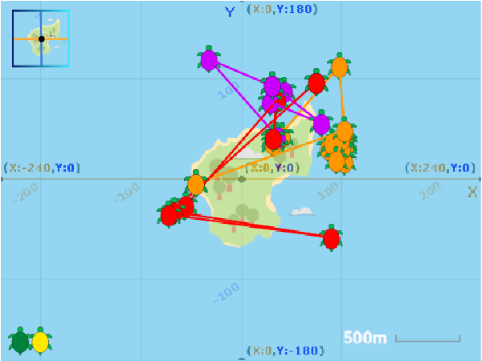

## परिचय

धोक्यात असलेल्या प्राण्यांच्या हालचाली समजून घेणे महत्त्वाचे आहे जेणेकरून त्यांचे संरक्षण करता येईल. हिरव्या समुद्री कासवांनी त्यांच्या निवाऱ्याच्या वेळी भेट दिलेली ठिकाणे काढण्यासाठी तुम्ही या प्रोजेक्टमध्ये, Scratch मधील x आणि y कोऑर्डीनेट्स आणि `Pen`{:class="block3extensions"} एक्सटेंशन ब्लॉक्सचा वापर कराल.

हा प्रोजेक्ट Shuttleworth Foundation च्या कार्यापासून प्रेरित आहे, ज्याने Africa पश्चिम किनार्‍यावरील Príncipe आणि Poilão बेटांवर आधारित कासवांच्या हालचालींचा मागोवा घेतला. प्रत्येक वर्षी कासव सोबती करण्यासाठी आणि अंडी घालण्यासाठी त्यांच्या निवाऱ्यात परत येतात. पण ते तिथे असताना नक्की जातात कुठे? Shuttleworth Foundation ने स्वस्त इलेक्ट्रॉनिक टॅग विकसित केले आहेत जे वास्तविक समुद्री कासवांना सुरक्षितपणे त्यांच्या हालचालीचा मागोवा घेण्यासाठी लावले जाऊ शकतात.

टर्टल टॅग कोऑर्डीनेट संख्या देतात जे कासव कोठे आहे ते दाखवतात. हा डेटा नकाशावर काढल्यास लोकांना तो समजून घेणे फार सोपे जाते.

### तुम्ही काय तयार करणार

हिरव्या झेंड्यावर क्लिक करा आणि त्यानंतर प्रत्येक कासवाने काही दिवसांत भेट दिलेली ठिकाण बघण्यासाठी त्यावर क्लिक करा. Scratch कोऑर्डीनेट्स ग्रीड आणि Poilão बेटाचा नकाशा यांमध्ये स्वीच करण्यासाठी वरच्या डाव्या कोपऱ्यातील **Grid/Map Button** वर सुद्धा तुम्ही क्लिक करू शकता.

--- no-print ---

<iframe src="https://scratch.mit.edu/projects/428136635/embed" allowtransparency="true" width="485" height="402" frameborder="0" scrolling="no" allowfullscreen></iframe>

--- /no-print ---

--- print-only ---

--- /print-only ---

--- collapse ---
---
title: तुम्हाला काय लागणार
---

### हार्डवेअर

+ Scracth 3 चालवण्यास सक्षम असलेले कंप्युटर किंवा टॅबलेट
+ आदर्शपणे, लोकल किंवा शेयर्ड स्टोरेज (जसेकी डाऊनलोड्स डिरेक्टरी) ला डाऊनलोड करण्याची क्षमता

### सॉफ्टवेअर

+ Scratch 3 (एकतर [ऑनलाईन](https://scratch.mit.edu/){:target="_blank"} किंवा [ऑफलाईन](https://scratch.mit.edu/download){:target="_blank"})

### डाउनलोड्स

+ तुम्ही ऑफलाइन काम करत असल्यास, [प्रोजेक्ट स्टार्टर फाइल](https://rpf.io/p/mr-IN/turtle-tracker-go){:target="_blank"} डाऊनलोड करा

--- /collapse ---

--- collapse ---
---
title: आपण काय शिकणार
---

+ Scratch मध्ये x आणि y कोऑर्डीनेटचा वापर कसा करायचा
+ डेटा स्टोअर आणि इंपोर्ट करण्यासाठी लीस्टचा (lists) वापर कसा करायचा
+ वास्तव जगातील पर्यावरण विषय समजून घेण्यासाठी Scratch चा वापर कसा करायचा

--- /collapse ---

--- collapse ---
---
title: शिक्षकांसाठी अतिरिक्त माहिती
---

या प्रोजेक्टच्या पुढील टप्प्यांत विद्यार्थ्यांना Scratch मध्ये नंतर इंपोर्ट केल्या गेलेल्या फाईल्स डाऊनलोड्स करण्यास सांगीतले जाते. तुम्ही हे प्रथम स्वतः करावे, आणि विद्यार्थ्यांप्रमाणेच डिव्हाईस आणि नेटवर्क वापरावे जेणेकरून त्यांना नेमके काय करायचे आहे हे तुम्ही सांगू शकता असे आम्ही सूचवतो. तुम्ही डेस्कटॉप किंवा मोबाइल डिव्हाइसवर Scratch मध्ये फाइल डाउनलोड आणि इंपोर्ट करू शकता. हे सरळ आहे, परंतु अचूक तपशील डिव्हाइस, ब्राउझर आणि ऑपरेटिंग सिस्टम व्हर्जनच्या आधारे बदलतात.

तुम्ही iPads वापरत असल्यास, iOS 13 डाउनलोड डिरेक्टरीत लोकल फाइल स्टोरेजला सपोर्ट करते. तुम्ही iOS चे जुने व्हर्जन वापरत असल्यास, तुम्हाला क्लाउड ड्राइव्ह सारख्या योग्य स्टोरेज स्थानाची आवश्यकता असेल.

तुम्ही [येथे पूर्ण केलेला प्रोजेक्ट शोधू शकता](https://rpf.io/p/mr-IN/turtle-tracker-get){:target="_blank"}.

तुम्हाला हा प्रोजेक्ट प्रिंट करणे आवश्यक असल्यास, कृपया [प्रिंटर अनुकूल आवृत्ती](https://projects.raspberrypi.org/mr-IN/projects/turtle-tracker/print){:target="_blank"} वापरा.

--- /collapse ---
