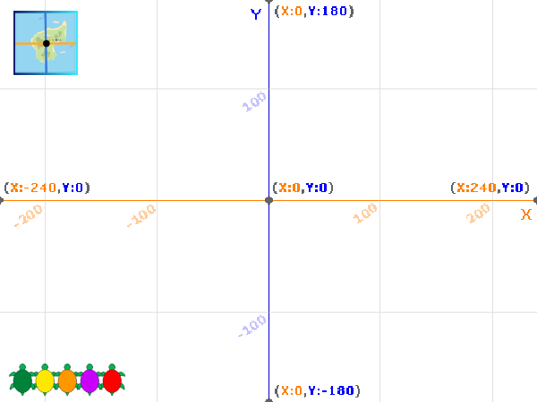

## कोऑर्डिनेट्स वापरून

या टप्प्यात, तुम्ही कासवाला Stage वरील विशीष्ट ठिकाणी हलवण्यासाठी Scratch मधील x आणि y कोऑर्डीनेट्स कसे वापरायचे ते शिकणार आहात.

--- task ---

**ऑनलाईन:** Scratch मधील [starter project](http://rpf.io/turtle-tracker-on){:target="_blank"} उघडा.

**ऑफलाईन:** Scratch ऑफलाईन एडिटरमधील [starter file](http://rpf.io/p/en/turtle-tracker-get){:target="_blank"} उघडा. तुम्हाला आवश्यकता असल्यास, तुम्ही [येथे Scratch डाऊनलोड आणि इंस्टॉल करू शकता](https://scratch.mit.edu/download){:target="_blank"}.

जेव्हा तुम्ही स्टार्टर प्रोजेक्ट उघडता तेव्हा तुम्हाला ग्रिड आणि कासव दिसतील.

--- /task ---

--- task ---

तुम्हाला ग्रिड दिसत नसल्यास, तुम्हाला ती दिसेपर्यंत Stage च्या वरच्या डाव्या कोपऱ्यातील **Grid/Map Button** वर क्लिक करा:



--- /task ---

Stage वरील ठिकाणे दर्शविण्यासाठी Scratch x आणि y कोऑर्डीनेट संख्या वापरतो. x कोऑर्डीनेट डावी-उजवी पोजिशन देतो, आणि y कोऑर्डीनेट वर-खाली पोजिशन देतो. Stage च्या मध्यभागातील कोऑर्डीनेट आहे (x=0, y=0). Stage च्या मध्यभागी **Turtle 1** स्प्राईट पाठवूया.

--- task ---

**Turtle 1** स्प्राईट निवडा आणि त्याच्या **Code** टॅबवर क्लिक करा. क्लिक केल्यावर Stage च्या मध्यभागी कासव हलण्यासाठी कोड जोडा:


```blocks3
when this sprite clicked
glide (1) secs to x: (0) y: (0)
```

--- /task ---

--- task ---

Stage वरील तुमच्या कासवावर क्लिक करून तुमचा कोड तपासा.

--- /task ---

x कोऑर्डीनेट डावीकडून-उजवीकडे -240 पासून 240 पर्यंत पोजिशन देतो. ऋण x कोऑर्डीनेट्स Stage च्या मध्यभागात डावीकडे आहेत, आणि धन कोऑर्डीनेट्स उजवीकडे आहेत.

--- task ---

कासव Stage च्या डावीकडे नंतर उजवीकडे पोहोण्यासाठी कोड जोडा:


```blocks3
when this sprite clicked
glide (1) secs to x: (0) y: (0)
+glide (1) secs to x: (-240) y: (0)
+glide (1) secs to x: (240) y: (0)
```

--- /task ---

y कोऑर्डीनेट Stage च्या खाली -180 पासून Stage च्या वर 180 वर जातो. ऋण y कोऑर्डीनेट्स Stage च्या खालच्या अर्ध्या भागात आहेत.

--- task ---

कासव Stage च्या वर आणि खाली हलण्यासाठी कोड जोडा:


```blocks3
when this sprite clicked
glide (1) secs to x: (0) y: (0)
glide (1) secs to x: (-240) y: (0)
glide (1) secs to x: (240) y: (0)
+glide (1) secs to x: (0) y: (180)
+glide (1) secs to x: (0) y: (-180)
```

--- /task ---

--- task ---

ठिकाणांमध्ये तुमचे कासव सरकतांना बघण्यासाठी त्यावर क्लिक करा. तुम्ही Stage च्या कडेला असतांना कासवावर अजुनही तुम्ही क्लिक करू शकता.

--- /task ---

हिरव्या झेंड्यावर क्लिक केल्यावर, कासव Stage च्या खालील ओळीत असायला हवेत. हिरवा कासव त्याच्या सुरूवात पोजिशन ला असण्यासाठी तुम्ही कोड जोडणे आवश्यक असेल.

--- task ---

हिरव्या झेंड्यावर क्लिक केल्यावर कासव Stage च्या खाली डावीकडे ठेवण्यासाठी `when green flag clicked`{:class="block3events"} ब्लॉक आणि `glide`{:class="block3motion"} ब्लॉक जोडा:


```blocks3
when green flag clicked
glide (1) secs to x: (-220) y: (-160)
```

सुरूवात पोजिशन कोऑर्डीनेट्स बद्दल तुम्हाला काय समजले ते तपासण्यासाठी ग्रिड चा वापर करा.

--- /task ---

--- task ---

कासव त्याच्या सुरूवात स्थितीवर हलतांना बघण्यासाठी हिरव्या झेंड्यावर क्लिक करा.

--- /task ---

--- task ---

तुम्ही या कोड सह कासव घेणार असलेल्या मार्गाचा अंदाज लावू शकता का? तुम्हाला मदत होण्यासाठी ग्रिडचा वापर करा. तुम्ही योग्य आहात का हे बघण्यासाठी या कोऑर्डीनेट्सचा वापर करण्यास कासव कोठे जाईल याचा विचार करा त्यानंतर तुमच्या `glide`{:class="block3motion"} ब्लॉक्स मधील संख्या बदला.


```blocks3
when this sprite clicked
+glide (1) secs to x: (100) y: (100)
+glide (1) secs to x: (100) y: (-100)
+glide (1) secs to x: (-100) y: (-100)
+glide (1) secs to x: (-100) y: (100)
+glide (1) secs to x: (100) y: (100)
```

--- /task ---

--- save ---

