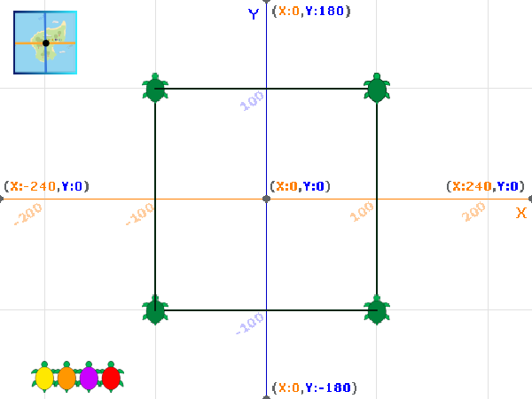

## मार्ग काढा

या टप्प्यात, तुम्ही कासवाची हालचाल दाखवण्यासाठी मार्ग काढण्यास `Pen`{:class="block3extensions"} एक्सटेंशन ब्लॉक्स वापराल, आणि त्यानंतर त्याचे ठिकाण दर्शवण्यासाठी स्टँप जोडाल.

स्टँप हा स्प्राईटची कॉपी आहे, जो तुम्ही हलवू शकत नाही किंवा तुम्ही त्यावर स्टँप केल्यावर तो डिलीट करू शकता.

तुम्ही कासवावर टॅग ठेवल्यावर, तो सॅटेलाईट वरून त्याची सध्याची स्थिती ओळखण्यासाठी Global Positioning System (GPS) चा वापर करतो. हा डेटा स्टोअर केल्या जातो आणि त्याचा कासवाने घेतलेल्या मार्गावर काम करण्यास वापर केला जाऊ शकतो.

`Pen`{:class="block3extensions"} एक्सटेंशन स्टार्टर प्रोजेक्ट मध्ये आधीपासूनच जोडलेले आहे.

--- task ---

**Turtle 1** स्प्राईट निवडा आणि पेन सेट करण्यासाठी कोड जोडा:


```blocks3
when green flag clicked
+erase all
+set pen (color v) to (40)
+set pen (brightness v) to (50)
+set pen size to (2)
+pen up
glide (1) secs to x: (-220) y: (-160)
```

रंग `40` स्प्राईटच्या कॉश्चुमच्या रंगाला जुळतो.

--- /task ---

--- task ---

पेन चा वापर करून कासवाने घेण्याचा मार्ग काढण्यासाठी कोड जोडा:


```blocks3
when this sprite clicked
+pen up
glide (1) secs to x: (100) y: (100)
+pen down
glide (1) secs to x: (100) y: (-100)
glide (1) secs to x: (-100) y: (-100)
glide (1) secs to x: (-100) y: (100)
glide (1) secs to x: (100) y: (100)
```

--- /task ---

--- task ---

कोड सेटअप रन करण्यासाठी हिरव्या झेंड्यावर क्लिक करा आणि Stage वर तो त्याचा मार्ग काढतो हे बघण्यासाठी **Turtle 1** स्प्राईटवर क्लिक करा.


तुमच्या कासवाने चौरस काढला नाही तर, आधीच्या टप्प्यातुन तुमचे कोऑर्डीनेट्स काळजीपूर्वक तपासा.

--- /task ---

आता कासवाची माहिती असलेली पोजिशन दाखवण्यासाठी कासवाचा `stamp`{:class="block3extensions"} जोडा.

--- task ---


```blocks3
when this sprite clicked
pen up
glide (1) secs to x: (100) y: (100)
pen down
+stamp
glide (1) secs to x: (100) y: (-100)
+stamp
glide (1) secs to x: (-100) y: (-100)
+stamp
glide (1) secs to x: (-100) y: (100)
+stamp
glide (1) secs to x: (100) y: (100)
```

--- /task ---

--- task ---

हिरव्या झेंड्यावर क्लिक करा, आणि कासव त्याचा मार्ग काढतो ते बघण्यासाठी आणि प्रत्येक माहिती असलेल्या पोजिशनवर मार्कर स्टँप करण्यासाठी **Turtle 1** स्प्राईटवर क्लिक करा.



--- /task ---

--- task ---

नक्कीच, कासव योग्य चौरसांमध्ये पोहच नाहीत! तुमचा कासव वेगवेगळ्या मार्गाने पोहोण्यासाठी कोऑर्डीनेट संख्या बदलण्याचा प्रयत्न करा.

--- /task ---

--- save ---
