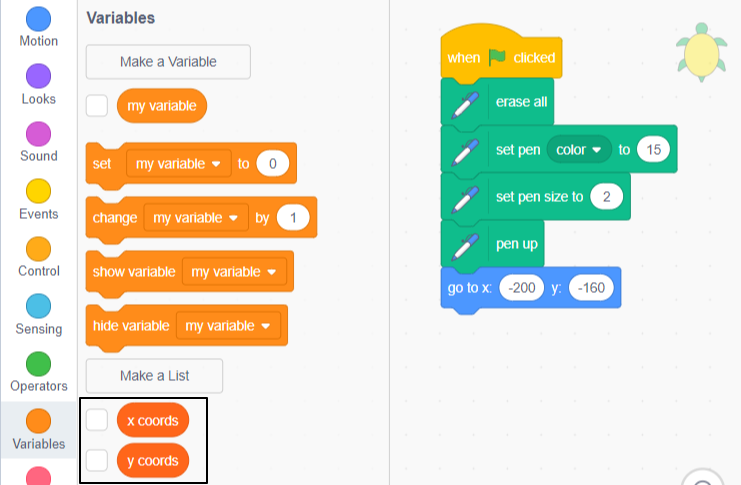
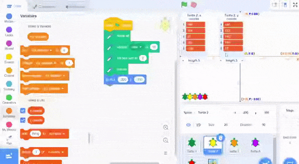
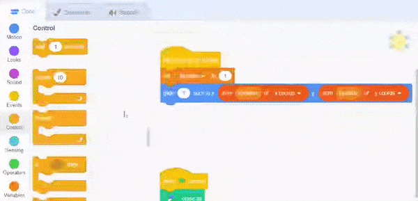

## कोऑर्डिनेट्सची लीस्ट

या टप्प्यात, तुम्ही x आणि y कोऑर्डीनेट्सची **lists** ही **Turtle 2** स्प्राईटला जोडाल. यामुळे तुम्ही प्रत्येक ठिकाणासाठी कोड न लिहीता लांब रस्ता काढू शकाल.

आधीच्या प्रोजेक्ट मध्ये, तुम्ही डेटा स्टोअर करण्यासाठी व्हेरिएबल्स (variables) ला वापर केलात. व्हेरिएबल (variable) एका वेळी एक डेटाच केवळ स्टोअर करू शकतो. लीस्ट डेटा सुद्धा स्टोअर करते, परंतु ती क्रमाने भरपूर माहिती स्टोअर करू शकते.

तुम्ही दोन लीस्ट तयार करत आहात, एक तुमच्या कासवासाठी x कोऑर्डीनेट्स आणि एक y कोऑर्डीनेट्स साठी. त्यानंतर, तुम्ही कोड लिहाल जो लीस्ट मधील डेटाचा वापर करून कासवाची हालचाल करेल.

### x आणि y कोऑर्डीनेट्स ची लीस्ट तयार करा

--- task ---

पिवळा **Turtle 2** स्प्राईट निवडा आणि **Code** टॅबवर क्लिक करा. या कासवाने पेन साठी आधीच कोड सेट केलेला आहे आणि सुरूवात पोजिशनवर हलला आहे.


 `Variables`{:class="block3variables"} ब्लॉक्स मेनूवर क्लिक करा, आणि त्यानंतर **Make a List** वर क्लिक करा.


लीस्टला `x coords` नाव द्या. **For this sprite only** निवडा — यामुळे प्रत्येक कासवाला त्याचे स्वतःचे कोऑर्डीनेट्स असतील.


**OK** वर क्लिक करा आणि Stage वर लीस्ट दिसेल.

--- no-print ---


--- /no-print ---

--- /task ---

--- task ---

आता दुसरी लीस्ट तयार करण्यासाठी पुन्हा **Make a List** वर क्लिक करा ज्याला म्हणतात `y coords`. तुम्ही **For this sprite only** हे निवडायलाच हवे.


तुमच्याकडे आता Stage वर दोन रिकाम्या लीस्ट आहेत.


--- /task ---

पुढे, तुम्हाला लीस्ट साठी कोऑर्डीनेट डेटा जोडण्याची आवश्यकता आहे.

ही सारणी तुमच्या कासवासाठी कोऑर्डीनेट पोजिशन देते:

<div style="width:200px;">

|:-------:|:--------:|
|x coords | y coords |
|--------:|---------:|
| 189     | 147      |
| 154     | 122      |
| 57      | 140      |
| -58     | 110      |
| -120    | 17       |
|---------|----------|

<br/>
</div>

--- task ---

**+** वर क्लिक करा जो `x coords`{:class="block3variables"} लीस्टच्या खाली आहे.

तो लीस्टमध्ये एंट्री जोडतो. सारणी मधील पहिल्या x कोऑर्डीनेट साठी `189` व्हॅल्यू एंटर करा.


उर्वरीत x कोऑर्डीनेट व्हॅल्यू साठी पुन्हा करा जेणेकरून तुमची लीस्ट याप्रमाणे दिसेल:


ऋण संख्यांमध्ये `-` एंटर करतांना काळजी घ्या जसेकी `-58`.

--- no-print ---


--- /no-print ---

--- /task ---

--- task ---

**+** चा `y coords`{:class="block3variables"} लीस्टच्या खाली वापर करा तुमच्या कासवासाठी y कोऑर्डीनेट जोडण्यासाठी.

तुमची लीस्ट याप्रमाणे दिसायला हवी:


--- /task ---

--- task ---

तुम्ही डेटा एंटर करणे संपवल्यानंतर, तुम्ही Stage पासून लीस्ट लपवू शकता. `Variables`{:class="block3variables"} ब्लॉक मेनू मधील लीस्टच्या पुढे असलेला बॉक्स अनचेक करा.



--- no-print ---



--- /no-print ---

--- /task ---

### लीस्ट मधील डेटाचा वापर करून कासव हलवा

पुढे, तुम्हाला **Turtle 2** स्प्राईटचा मार्ग काढण्यासाठी लीस्ट मधील x आणि y कोऑर्डीनेट वापरणारा कोड लिहीण्याची आवश्यकता आहे.

पेन सेट करण्यासाठी कोड आणि सुरूवातीची पोजिशन तुम्हाला देण्यात आली आहे. हे **Turtle 1** स्प्राईट सारखेच आहे, केवळ त्यात वेगवेगळे पेन रंग आणि कोऑर्डीनेट्स वापरले आहे.

`item 1 of x coords`{:class="block3variables"} ब्लॉकचा `x coords`{:class="block3variables"} लीस्ट मध्ये पहिला आयटम मिळण्यासाठी, आणि `item 1 of y coords`{:class="block3variables"} ब्लॉक `y coords`{:class="block3variables"} लीस्ट मध्ये पहिला आयटम मिळण्यासाठी वापर करा. तुम्हाला हे `Variables`{:class="block3variables"} ब्लॉक्स मेनूमध्ये दिसू शकतील. या व्हॅल्यू एकत्रीतपणे तुम्हाला **Turtle 2** स्प्राईटसाठी पहिली पोजिशन देतात.

--- task ---

कासवावर क्लिक केल्यावर तो पहिल्या पोजिशनला हलण्यासाठी कोड जोडा.


```blocks3
when this sprite clicked
glide (1) secs to x: (item (1) of [x coords v]) y: (item (1) of [y coords v])
```

`x coords`{:class="block3variables"} आणि `y coords`{:class="block3variables"} लीस्ट निवडण्यासाठी ड्रॉप-डाऊन मेनू मधून योग्य लीस्ट निवडण्याची खात्री करा.

--- no-print ---


--- /no-print ---

--- /task ---

--- task ---

तुमचा कोड रन करा आणि त्याच्या सुरूवात पोजिशन मधून हलतांना बघण्यासाठी **Turtle 2** स्प्राईट (पिवळा कासव) वर क्लिक करा.

--- /task ---

आता, तुम्हाला पोजिशन मधून कासव हलवण्याची आवश्यकता आहे. हे करण्यासाठी, तुम्हाला लीस्ट मधील पुढील आयटम ट्रॅक करण्यासाठी व्हेरिएबलची आवश्यकता आहे.

--- task ---

**For this sprite only** तपासून नवीन व्हेरिएबल तयार करा आणि त्याला नाव द्या `location`.


`location`{:class="block3variables"} अनचेक करा, जेणेकरून ते Stage वर दिसणार नाही.

--- /task ---

--- task ---

`location`{:class="block3variables"} हे `1` ला लीस्टच्या सुरूवातीला चालू करण्यासाठी सेट करा. `glide`{:class="block3motion"} ब्लॉक बदला जेणेकरून तो `location`{:class="block3variables"} व्हेरिएबलचा संख्या 1 च्या ऐवजी वापर करेल.


```blocks3
when this sprite clicked
+set [location v] to (1)
+glide (1) secs to x: (item (location) of [x coords v]) y: (item (location) of [y coords v])
```
--- no-print ---


--- /no-print ---

--- /task ---

--- task ---

आता कोऑर्डीनेट्सची लीस्ट लूप करण्यासाठी `repeat`{:class="block3control"} लूप जोडा. लीस्ट किती मोठी आहे हे शोधण्यासाठी तेथे ब्लॉक आहे ज्याचा तुम्ही किती वेळी पुन्हा करायचे त्यासाठी वापर करू शकता:


```blocks3
when this sprite clicked
set [location v] to (1) 
+repeat (length of [x coords v])
glide (1) secs to x: (item (location) of [x coords v]) y: (item (location) of [y coords v])
+change [location v] by (1)
```

तुमचा `glide`{:class="block3motion"} ब्लॉक `repeat`{:class="block3control"} लूपच्या आत असल्याची खात्री करा.

--- no-print ---



--- /no-print ---

प्रत्येक वेळी लूप फिरवतांना, ठिकाण आणि `item`{:class="block3variables"} ब्लॉक्स वाढते पुढील आयटम `x coords`{:class="block3variables"} आणि `y coords`{:class="block3variables"} लीस्ट मधून मिळण्यासाठी.

--- /task ---

--- task ---

लूपच्या आत, `pen up`{:class="block3extensions"}, `pen down`{:class="block3extensions"} ठेवण्यासाठी, आणि `stamp`{:class="block3extensions"} स्प्राईट साठी ब्लॉक्स जोडा.


```blocks3
when this sprite clicked
+pen up
set [location v] to (1) 
repeat (length of [x coords v])
glide (1) secs to x: (item (location) of [x coords v]) y: (item (location) of [y coords v])
+pen down
+stamp
change [location v] by (1)
```

--- /task ---

--- task ---

लीस्ट मधून x आणि y कोऑर्डीनेट्स चा वापर करून **Turtle 2** स्प्राईट त्याचा मार्ग कसा काढणे ते बघण्यासाठी तुमचा कोड रन करा.

`location`{:class="block3variables"} व्हेरिएबल, आणि `x coords`{:class="block3variables"} आणि `y coords`{:class="block3variables"} लीस्टच्या पुढे असलेले बॉक्स तपासा; त्यांची Stage वर रचना करा; आणि त्यानंतर डेटा कसा वापरला जातो ते बघण्यासाठी **Turtle 2** स्प्राईटवर क्लिक करा.


--- /task ---

--- save ---
