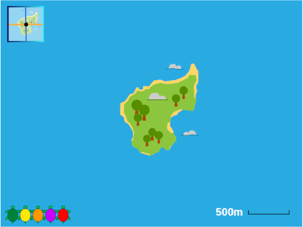
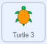
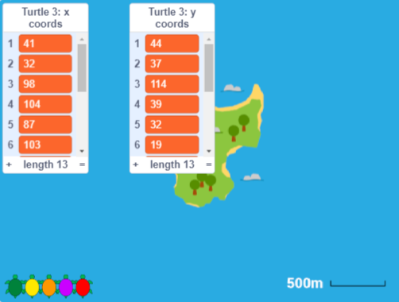
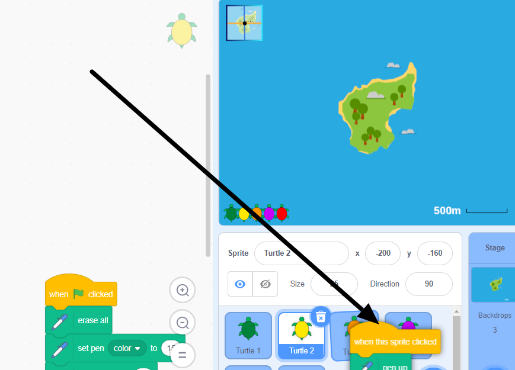

## वास्तविक कासवाच्या हालचाली

या टप्प्यात, तुम्ही मॅप बॅकड्रॉप **Poilão Island** मध्ये बदलाल. Shuttleworth Foundation ने आधीच काढलेला वास्तव कासवासाठीचा कोऑर्डीनेट डेटा **Turtle 3** स्प्राईटला जोडला आहे. तुमचा कोड **Turtle 2** स्प्राईट पासून **Turtle 3** पर्यंत या कासव घेत असलेला मार्ग बघण्यासाठी कॉपी करा.

--- task ---

**Grid/Map Button** वर क्लिक करा आणि तुम्हाला पश्चिम किनाऱ्यावरील पोइलाओ बेटाच्या आसपासच्या भागाचा नकाशा दिसेल.

हे लहान बेट असून त्याचे मोजमाप 1 किमी (1000 मीटर) पेक्षा कमी आहे. पोइलाओ हे हिरव्या समुद्री कासवांच्या निवाऱ्यासाठीचे महत्वाचे पर्यावरणीय ठिकाण आहे.

प्रौढ हिरव्या समुद्री कासवाचे कॅरेपेस (शेल) सुमारे 1 मीटर लांब असते.

--- /task ---

--- task ---

**Turtle 3** स्प्राईट, नारिंगी कासव  निवडा, आणि **Code** टॅबवर क्लिक करा.

`Variables`{:class="block3variables"} ब्लॉक्स मेनू उघडा, आणि `x coords`{:class="block3variables"} आणि `y coords`{:class="block3variables"} लीस्टच्या पुढील बॉक्स Stage वर दाखवण्यासाठी तपासा.

या लीस्ट **For this sprite only** आहेत, त्यामध्ये **Turtle 2** स्प्राईटसाठी तुम्ही तयार केलेल्या लीस्टचा वेगवेगळा डेटा आहे.

तुम्ही Stage वर x आणि y कोऑर्डीनेट्स बघू शकता. हे समुद्री कासवाच्या वास्तव हालचालींवर आधारित आहे आणि Scratch कोऑर्डीनेट्स मध्ये वळले आहे जे **Poilão Island** बॅकड्रॉपसह कार्य करतात.

तुम्ही कोऑर्डीनेट्स बघिल्यावर, तुम्ही बॉक्स त्यांना लपवण्यासाठी अनचेक करू शकता.

--- /task ---

संख्यांची लीस्ट समजून घेणे मानवांसाठी कठीण आहे. तो कासव कुठे गेला ते बघणे सोपे व्हावे यासाठी कोऑर्डीनेट्स काढणे आणि स्टँप करणे यांसाठी **Turtle 3** स्प्राईटला तुमचा कोड कॉपी करणे हे तुमचा कार्य आहे.

--- task ---

**Turtle 2** स्प्राईट निवडा आणि **Code** टॅबवर क्लिक करा. `when this sprite clicked`{:class="block3events"} ब्लॉक ड्रॅग करा (सर्व खालील ब्लॉक्स सुद्धा हलतील). तुम्ही Stage खालील Sprite पेनमधील **Turtle 3** स्प्राईटच्या वर असेपर्यंत ड्रॅग करणे चालू ठेवावे. **Turtle 3** स्प्राईट ते निवडले गेल्याचे दाखवण्यासाठी थोडे वळवळ करेल आणि तुम्ही ड्रॅग करणे थांबवू शकता.

**टीप:** माऊस किंवा ट्रॅपपॅडने ड्रॅग करण्यासाठी, तुम्ही हलवतांना माऊसचे डावे बटन धरून ठेवा.

कोड अजुनही **Turtle 2** स्प्राईटवर उपलब्ध आहे, परंतु **Turtle 3** स्प्राईटच्या**Code** टॅबमध्ये त्याची कॉपी असेल.

**Turtle 3** स्प्राईट निवडा, आणि कॉपी केलेला कोड बघण्यासाठी त्याच्या **Code** टॅबवर क्लिक करा.

--- no-print ---

--- /no-print ---

**टीप:** तुमचा कोड व्यवस्थित करण्यासाठी तुम्ही Code एरियात राईट-क्लिक करू शकता आणि **Clean up Blocks** निवडू शकता.

--- /task ---

--- task ---

तुमचा कोड रन करण्यासाठी आणि कासवाने घेतलेला मार्ग बघण्यासाठी Stage वरील नारिंगी कासव **Turtle 3** स्प्राईटवर क्लिक करा.

GPS रीडींग फार योग्य नसतात, आणि कासवांनी पाण्याखाली वेळ घालवल्यावर त्यांना शोधले जाऊ शकत नाही, परंतु कासव कुठे कुठे गेले ते लक्षात घेण्याची ते उत्तम कल्पना देतात.

**लक्षात ठेवा:** तुमच्याकडे प्रत्येक दिवसासाठी एक ठिकाण आहे, त्यामुळे लाईन्स ठिकाणांना जुळतात, ते पोजिशन दरम्यान कासव कोठे हलतात हे दाखवत नाहीत (त्यासाठी तुम्हाला आणखी डेटाची आवश्यकता असते).

--- /task ---

--- save ---

