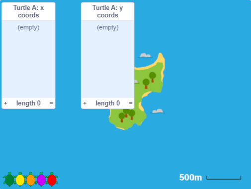
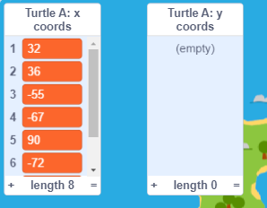

## फाईल मधून डेटा इंपोर्ट करा

Scratch तुम्हाला फाइलमधून डेटा इंपोर्ट करण्याची परवानगी देतो. तुम्‍हाला टाईप करण्‍यासाठी खूप वेळ लागेल असा भरपूर डेटा तुम्‍हाला वापरायचा असेल तेव्हा हे खरोखर उपयोगी आहे.

--- task ---

**Turtle A** स्प्राईट, जांभळा कासव निवडा. त्याला तयार केलेल्या लीस्ट आहेत, परंतु त्यांमध्ये कोऑर्डीनेट्स नाहीत.

**Turtle A** स्प्राईटच्या `x coords`{:class="block3variables"} आणि `y coords`{:class="block3variables"} लीस्टच्या पुढील बॉक्स ते Stage वर बघण्यासाठी तपासा.



--- /task ---

Poilão भोवती वास्तव कासवांनी घेतलेल्या मार्गाच्या आधारे आम्ही काही आणखी डेटा तयार केला आहे. तुम्ही या डेटा फाईल्स डाऊनलोड करू शकता आणि तुमच्या प्रोजेक्ट मध्ये त्या इंपोर्ट करू शकता जेणेकरून तुम्ही कासव कुठे गेला ते शोधू शकता.

--- task --- --- no-print ---

खालीलपैकी एका कासव डेटा लिंकवर राईट-क्लिक करा आणि निवडा **Save link as ...** किंवा **Download linked file as ...**

--- /no-print ---

--- print-only ---

तुमच्या वेब ब्राऊझर मध्ये नवीन टॅब उघडा आणि खालीलपैकी एका लिंकवर क्लिक करा. बहुतेक ब्राऊझर फाईल बघू शकतात, तुम्ही राईट-क्लिक करू शकता आणि फाईल डाऊनलोड करण्यासाठी **Save as ...** निवडू शकता.

--- /print-only ---

तुम्ही फाईल कुठे सेव केली आणि त्याला काय नाव दिले ते आठवा.

+ [Turtle 6 Data](http://rpf.io/turtle-6){:target="_blank"}
+ [Turtle 10 Data](http://rpf.io/turtle-10){:target="_blank"}
+ [Turtle 11 Data](http://rpf.io/turtle-11){:target="_blank"}
+ [Turtle 16 Data](http://rpf.io/turtle-16){:target="_blank"}
+ [Turtle 19 Data](http://rpf.io/turtle-19){:target="_blank"}
+ [Turtle 20 Data](http://rpf.io/turtle-20){:target="_blank"}
+ [Turtle 21 Data](http://rpf.io/turtle-21){:target="_blank"}
+ [Turtle 22 Data](http://rpf.io/turtle-22){:target="_blank"}


--- collapse ---
---
title: तुम्ही iPad वापरत असल्यास
---

तुमचा iPad पूर्ण अप टू डेट असल्यास, तुम्ही लिंकवर क्लिक केल्यावर तुम्हाला **View** करायचे की **Download** करायचे ते विचारले जाईल. **Download** निवडा.

अन्यथा, Safari ब्राऊझरचा वापर करून, डेटा बघण्यासाठी तुमच्या निवडलेल्या turtle लिंकवर क्लिक करा, आणि त्यानंतर share आयकॉनवर क्लिक करा. तुम्ही फाईल सेव करू शकता असे लोकेशन तुम्ही बघाल.

--- /collapse ---

--- collapse ---
---
title: तुम्ही फाईल डाऊनलोड किंवा इंपोर्ट करू शकत नसलात तर
---

तुम्ही फाईल डाऊनलोड करू शकत नसल्यास, turtle फाईल्स पैकी एक तुमच्या ब्राऊझरमध्ये उघडण्यासाठी त्यावर क्लिक किंवा टॅप करा (अलीकडील iPad वर **View** निवडा). तुम्ही त्यानंतर `x coords`{:class="block3variables"} आणि `y coords`{:class="block3variables"} लीस्ट मध्ये डेटा एंटर करू शकता **Turtle A** स्प्राईटला तुम्ही **Turtle 2** साठी केले त्याप्रमाणे. संख्या वाचण्यासाठी तुम्हाला जोडीदार असल्यास हे सोपे जाईल.

--- /collapse ---

--- /task ---

--- task ---

आता Scratch वर परत जा.

Stage वरील `Turtle A: x coords`{:class="block3variables"} लीस्टवर राईट-क्लिक करा (किंवा टॅप किंवा होल्ड करा) आणि **import** निवडा.


तुम्ही डाऊनलोड केलेली फाईल निवडा, ती थोडी `turtle-5.csv` यासारखी असेल.

--- collapse ---
---
title: तुम्ही iPad वापरत असल्यास
---

तुमचा iPad पूर्ण अप टू डेट असल्यास, त्यानंतर तुमच्या Downloads फोल्डर मधून तुम्ही `.csv` फाईल निवडू शकता.

अन्यथा, तुम्ही फाईल सेव केली त्याठिकाणी लोकेशनला तुम्ही नेव्हीगेट होऊ शकाल, जसेकी cloud drive.

--- /collapse ---

तुम्ही जेव्हा विचारता **Which column should be used?**, संख्या `1` एंटर करा. x कोऑर्डीनेट डेटा आता फाईलच्या पहिल्या कॉलम मध्ये आहे.


Scratch फाईल मधील पहिल्या कॉलम मधून `Turtle A: x coords`{:class="block3variables"} लीस्ट मध्ये डेटा लोड करेल.



--- no-print ---


--- /no-print ---

तुम्ही वेगवेगळे कासव निवडल्यास तुमच्या डेटाला वेगवेगळ्या संख्या असतील.

--- /task ---

--- task ---

आता, y कोऑर्डीनेट्स साठी डेटा इंपोर्ट करणे पुन्हा करा.

`Turtle A: y coords`{:class="block3variables"} लास्टवर राईट-क्लिक करा (किंवा टॅप किंवा होल्ड करा) आणि **import** निवडा.

आधीप्रमाणेच तीच फाईल निवडा.

यावेळी, कॉलम `2` निवडा कारण त्यात कासवासाठी y कोऑर्डीनेट आहे.


--- /task ---

--- task ---

Stage अंतर्गत **Turtle A** स्प्राईट निवडा आणि तुम्ही इंपोर्ट केलेल्या संख्येला जुळेल असे त्याचे नाव बदला, उदाहरणार्थ **Turtle 21**. यामुळे तुम्ही कोणता turtle डेटा वापरला ते आठवण्यास मदत होईल.


--- /task ---

--- task ---

तुमच्या नवीन कासवावर **Turtle 3** स्प्राईट मधून कोड ड्रॅग करून कॉपी करा.

तुमच्या नवीन कासवासाठी Code एरियात कॉपी केलेले कोड दिसतो का ते तपासा. नसल्यास, पुन्हा प्रयत्न करा.

--- /task ---

--- task ---

कासव कुठे गेला हे शोधण्यासाठी तुमच्या कासव, जांभळा कासवावर क्लिक करा.

तुम्ही निवडलेल्या डेटाच्या आधारे मार्ग वेगवेगळा असेल.

--- /task ---

--- task ---

तुम्हाला वेळ असल्यास, तुम्ही आणखी डेटा डाऊनलोड करू शकताआणि जास्त कासवांच्या प्रवासाला फॉलो करू शकता. तुम्ही **Turtle B** स्प्राईटचा वापर करू शकता, लाल कासव. तुम्हाला आणखी कासवांची आवश्यकता असल्यास, तुम्ही कासव डुप्लीकेट करू शकता आणि त्याचा कॉश्चुम आणि पेन रंग बदलू शकता. तुम्ही नवीन डेटा इंपोर्ट करण्याआधी, या ब्लॉक्सचा वापर करून कॉपी मधील डेटा डिलीट करा:

```blocks3
delete all of [x coords v]
delete all of [y coords v]

```

--- /task ---

--- task ---

तुमच्या कासवांनी भेट दिलेली ठिकाणे पहा. तुम्ही ग्रुप मध्ये असलात, तर तुम्ही इतरांनी निवडलेल्या कासवांसाठीचे परिणाम सुद्धा बघू शकता.

विचार करण्यासारखे प्रश्न:
+ सर्व कासव एकाच ठिकाणी सुरूवात करतात का? हे का होतंय अस तुम्हाला वाटत?
+ अनेक कासवांनी भेट दिलेली इतर ठिकाणे आहेत का? ते तिथे जातील असे तुम्हाला का वाटते?
+ ठिकाणांना जोडणार्‍या रेषा कधीकधी बेटावर का जातात? लक्षात ठेवा तुमच्याकडे दररोज फक्त एक ठिकाणआहे. कासवांनी ठिकाणांदरम्यान प्रवास कसा केला असे तुम्हाला वाटते?

--- /task ---

--- save ---
