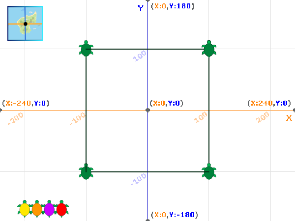

## మార్గాన్ని గీయండి

ఈ దశలో, మీరు తాబేలు కదలికను చూపించడానికి మార్గాన్ని గీయడానికి `Pen`{:class="block3extensions"} పొడిగింపు బ్లాక్‌లను ఉపయోగిస్తారు మరియు దాని తెలిసిన స్థానాలను సూచించడానికి ఒక స్టాంప్‌ను జోడిస్తుంది.

Stamp అనేది sprite యొక్క కాపీ, మీరు స్టాంప్ చేసిన తర్వాత దాన్ని తరలించలేరు లేదా తొలగించలేరు.

తాబేలుపై ట్యాగ్‌ను ఉంచినప్పుడు, అది ఉపగ్రహం నుండి దాని ప్రస్తుత స్థానాన్ని గుర్తించడానికి గ్లోబల్ పొజిషనింగ్ సిస్టమ్ (GPS) ని ఉపయోగిస్తుంది. ఈ డేటా నిల్వ చేయబడుతుంది మరియు తాబేలు తీసుకున్న మార్గాన్ని పని చేసేలా చేయడానికి ఉపయోగించవచ్చు.

`Pen`{:class="block3extensions"} పొడిగింపు ఇప్పటికే స్టార్టర్ ప్రాజెక్ట్‌కి జోడించబడింది.

--- task ---

పెన్ను సెటప్ చేయడానికి **Turtle 1** sprite ని ఎంచుకుని, కోడ్‌ని జోడించండి:


```blocks3
when green flag clicked
+erase all
+set pen (color v) to (40)
+set pen (brightness v) to (50)
+set pen size to (2)
+pen up
glide (1) secs to x: (-220) y: (-160)
```

`40` రంగు sprite costume యొక్క రంగుతో సరిపోలుతుంది.

--- /task ---

--- task ---

పెన్ను ఉపయోగించి తాబేలు తీసుకున్న మార్గాన్ని గీయడానికి కోడ్‌ను జోడించండి:


```blocks3
when this sprite clicked
+pen up
glide (1) secs to x: (100) y: (100)
+pen down
glide (1) secs to x: (100) y: (-100)
glide (1) secs to x: (-100) y: (-100)
glide (1) secs to x: (-100) y: (100)
glide (1) secs to x: (100) y: (100)
```

--- /task ---

--- task ---

సెటప్ కోడ్‌ను అమలు చేయడానికి ఆకుపచ్చ జెండాను క్లిక్ చేసి, ఆపై దాని మార్గాన్ని గీసేందుకు Stage పై ఉన్న **Turtle 1** sprite పై క్లిక్ చేయండి.


మీ తాబేలు చతురస్రాన్ని గీయకపోతే, మునుపటి దశ నుండి మీ కోఆర్డినేట్‌లను జాగ్రత్తగా తనిఖీ చేయండి.

--- /task ---

ఇప్పుడు దాని తెలిసిన స్థానాలను చూపించడానికి తాబేలు యొక్క `stamp`{:class="block3extensions"} ని జోడించండి.

--- task ---


```blocks3
when this sprite clicked
pen up
glide (1) secs to x: (100) y: (100)
pen down
+stamp
glide (1) secs to x: (100) y: (-100)
+stamp
glide (1) secs to x: (-100) y: (-100)
+stamp
glide (1) secs to x: (-100) y: (100)
+stamp
glide (1) secs to x: (100) y: (100)
```

--- /task ---

--- task ---

ఆకుపచ్చ జెండాను క్లిక్ చేసి, ఆపై **Turtle 1** sprite పై క్లిక్ చేసి, తాబేలు దాని మార్గాన్ని గీసి, తెలిసిన ప్రతి స్థానంలో మార్కర్‌ను స్టాంప్ చేయండి.



--- /task ---

--- task ---

అయితే, తాబేళ్లు ఖచ్చితమైన చతురస్రాల్లో ఈత కొట్టవు! మీ తాబేలు వేరే మార్గంలో ఈత కొట్టడానికి కోఆర్డినేట్ నంబర్‌లను మార్చడానికి ప్రయత్నించండి.

--- /task ---

--- save ---
