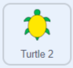
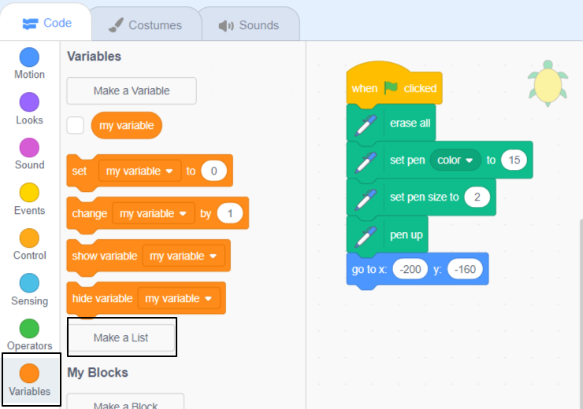
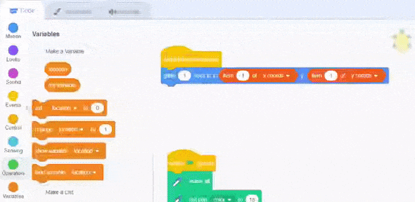

## కోఆర్డినేట్‌ల జాబితాలు

ఈ దశలో, మీరు **Turtle 2** sprite కి x మరియు y కోఆర్డినేట్‌ల **lists** ని జోడిస్తారు. ఇది ప్రతి స్థానానికి కోడ్ రాయాల్సిన అవసరం లేకుండా సుదీర్ఘ మార్గాన్ని గీయడానికి మిమ్మల్ని అనుమతిస్తుంది.

మునుపటి ప్రాజెక్ట్‌లలో మీరు డేటాను నిల్వ చేయడానికి వేరియబుల్‌లను ఉపయోగించారు. ఒక వేరియబుల్ ఒక సమయంలో ఒక డేటా భాగాన్ని మాత్రమే నిల్వ చేయగలదు. జాబితా కూడా డేటాను నిల్వ చేస్తుంది, అయితే ఇది చాలా సమాచారాన్ని ఒక క్రమంలో నిల్వ చేయగలదు.

మీరు రెండు జాబితాలను సృష్టించబోతున్నారు, ఒకటి మీ తాబేలు యొక్క x కోఆర్డినేట్‌ల కోసం మరియు ఒకటి y కోఆర్డినేట్‌ల కోసం. అప్పుడు, మీరు జాబితాలలోని డేటాను ఉపయోగించి తాబేలును కదిలించే కోడ్‌ను వ్రాస్తారు.

### X మరియు y కోఆర్డినేట్‌ల జాబితాలను సృష్టించండి

--- task ---

**Turtle 2** sprite ని ఎంచుకుని, **Code** ట్యాబ్‌పై క్లిక్ చేయండి. ఈ తాబేలు కోసం ఇప్పటికే పెన్ మరియు ప్రారంభ స్థానానికి తరలించడానికి కోడ్‌ సెటప్ చేయబడిఉంది.



`Variables`{:class="block3variables"} బ్లాక్స్ మెనుపై క్లిక్ చేసి, ఆపై **Make a List**పై క్లిక్ చేయండి.



జాబితాకు `x coords` అని పేరు పెట్టండి. **For this sprite only** ని ఎంచుకోండి — ఇది ప్రతి turtle sprite దాని స్వంత కోఆర్డినేట్‌లను కలిగి ఉండటానికి అనుమతిస్తుంది.


**OK** క్లిక్ చేయండి మరియు జాబితా Stage పై కనిపిస్తుంది.

--- no-print ---


--- /no-print ---

--- /task ---

--- task ---

`y coords`అని పిలువబడే రెండవ జాబితాను రూపొందించడానికి ఇప్పుడు **Make a List** ని మళ్లీ క్లిక్ చేయండి. మీరు **For this sprite only** ఎంచుకోవాలి.


మీరు ఇప్పుడు Stage పై రెండు ఖాళీ జాబితాలను కలిగి ఉన్నారు.


--- /task ---

తరువాత, మీరు జాబితాలకు కోఆర్డినేట్ డేటాను జోడించాలి.

ఈ పట్టిక మీ తాబేలు కోసం సమన్వయ స్థానాలను అందిస్తుంది:

<div style="width:200px;">

|:-------:|:--------:|
|x coords | y coords |
|--------:|---------:|
| 189     | 147      |
| 154     | 122      |
| 57      | 140      |
| -58     | 110      |
| -120    | 17       |
|---------|----------|

<br/>
</div>

--- task ---

`x coords`{:class="block3variables"} జాబితా దిగువన ఉన్న **+** పై క్లిక్ చేయండి.

ఇది జాబితాకు ఒక ఎంట్రీని జోడిస్తుంది. పట్టికలో మొదటి x కోఆర్డినేట్ విలువను `189` గా నమోదు చేయండి.


మిగిలిన x కోఆర్డినేట్ విలువల కోసం పునరావృతం చేయండి, తద్వారా మీ జాబితా ఇలా కనిపిస్తుంది:


`-58`వంటి ఋణ సంఖ్యలలో `-` ని నమోదు చేయడంలో జాగ్రత్తగా ఉండండి.

--- no-print ---


--- /no-print ---

--- /task ---

--- task ---

మీ తాబేలు కోసం y కోఆర్డినేట్ డేటాను జోడించడానికి `y coords`{:class="block3variables"} జాబితా దిగువన ఉన్న **+** ని ఉపయోగించండి.

మీ జాబితాలు ఇలా ఉండాలి:


--- /task ---

--- task ---

మీరు డేటాను నమోదు చేయడం పూర్తి చేసిన తర్వాత, మీరు Stage నుండి జాబితాలను దాచవచ్చు. `Variables`{:class="block3variables"} బ్లాక్స్ మెనులో జాబితాల పక్కన ఉన్న బాక్సును అన్ చెక్ చేయండి.


--- no-print ---


--- /no-print ---

--- /task ---

### జాబితాలలోని డేటాను ఉపయోగించి తాబేళ్లను తరలించండి

తర్వాత, మీరు **Turtle 2** sprite యొక్క మార్గాన్ని గీయడానికి జాబితాల నుండి x మరియు y కోఆర్డినేట్ విలువలను ఉపయోగించే కోడ్‌ను వ్రాయాలి.

పెన్ మరియు ప్రారంభ స్థానం సెటప్ చేయడానికి కోడ్ మీ కోసం అందించబడింది. ఇది **Turtle 1** sprite మాదిరిగానే ఉంటుంది, కానీ ఇది వేరే పెన్ కలర్ మరియు కోఆర్డినేట్‌లను ఉపయోగిస్తుంది.

`x coords`{:class="block3variables"} జాబితాలో మొదటి అంశాన్ని పొందడానికి `item 1 of x coords`{:class="block3variables"} బ్లాక్‌ ని ఉపయోగించండి మరియు `y coords`{:class="block3variables"} జాబితాలో మొదటి అంశాన్ని పొందడానికి `item 1 of y coords`{:class="block3variables"} బ్లాక్‌ ని. మీరు ఈ బ్లాక్‌లను `Variables`{:class="block3variables"} బ్లాక్‌ల మెనులో కనుగొనవచ్చు. ఈ విలువలు కలిసి మీకు **Turtle 2** sprite కి మొదటి స్థానాన్ని అందిస్తాయి.

--- task ---

తాబేలు క్లిక్ చేసినప్పుడు దాని మొదటి స్థానానికి తరలించడానికి కోడ్‌ను జోడించండి.


```blocks3
when this sprite clicked
glide (1) secs to x: (item (1) of [x coords v]) y: (item (1) of [y coords v])
```

`x coords`{:class="block3variables"} మరియు `y coords`{:class="block3variables"} జాబితాలను ఎంచుకోవడానికి మీరు డ్రాప్-డౌన్ మెను నుండి సరైన జాబితాను ఎంచుకున్నారని నిర్ధారించుకోండి.

--- no-print ---


--- /no-print ---

--- /task ---

--- task ---

మీ కోడ్‌ని అమలు చేసి, **Turtle 2** sprite (పసుపు తాబేలు) దాని ప్రారంభ స్థానానికి వెళ్లడాన్ని చూడటానికి దానిపై క్లిక్ చేయండి.

--- /task ---

ఇప్పుడు మీరు తాబేలును స్థానాల ద్వారా తరలించాలి. దీన్ని చేయడానికి, జాబితాలోని తదుపరి అంశాన్ని ట్రాక్ చేయడానికి మీకు వేరియబుల్ అవసరం.

--- task ---

**For this sprite only** తో కొత్త వేరియబుల్ ను సృష్టించండి మరియు దానికి `location` అని పేరు పెట్టండి.


`location`{:class="block3variables"} ను అన్ చెక్ చేయండి, తద్వారా ఇది Stage పై చూపబడదు.

--- /task ---

--- task ---

జాబితా ప్రారంభంలో ఆరంభించడానికి `location`{:class="block3variables"}ని `1` కి సెట్ చేయడానికి ఒక బ్లాక్‌ని జోడించండి. `glide`{:class="block3motion"} బ్లాక్‌ని మార్చండి, తద్వారా ఇది సంఖ్య 1కి బదులుగా `location`{:class="block3variables"} వేరియబుల్‌ని ఉపయోగిస్తుంది.


```blocks3
when this sprite clicked
+set [location v] to (1)
+glide (1) secs to x: (item (location) of [x coords v]) y: (item (location) of [y coords v])
```
--- no-print ---



--- /no-print ---

--- /task ---

--- task ---

ఇప్పుడు కోఆర్డినేట్‌ల జాబితాలను లూప్ చేయడానికి `repeat`{:class="block3control"} లూప్‌ను జోడించండి. జాబితా యొక్క పొడవును కనుగొనడానికి ఒక బ్లాక్ ఉంది, దాన్ని మీరు అన్నిసార్లు పునరావృతం చేయడానికి ఉపయోగించవచ్చు:


```blocks3
when this sprite clicked
set [location v] to (1) 
+repeat (length of [x coords v])
glide (1) secs to x: (item (location) of [x coords v]) y: (item (location) of [y coords v])
+change [location v] by (1)
```

మీ `glide`{:class="block3motion"} బ్లాక్ `repeat`{:class="block3control"} లూప్ లోపల ఉందని నిర్ధారించుకోండి.

--- no-print ---


--- /no-print ---

ఒక లూప్‌ చుట్టిన ప్రతిసారి, స్థానం పెరుగుతుంది మరియు `item`{:class="block3variables"} బ్లాక్‌లు, `x coords`{:class="block3variables"} మరియు `y coords`{:class="block3variables"} జాబితాల నుండి తదుపరి అంశాన్ని పొందుతాయి.

--- /task ---

--- task ---

లూప్ లోపల sprite ను ఉంచడానికి, `pen up`{:class="block3extensions"}, `pen down`{:class="block3extensions"} మరియు `stamp`{:class="block3extensions"} బ్లాక్‌లను జోడించండి.


```blocks3
when this sprite clicked
+pen up
set [location v] to (1) 
repeat (length of [x coords v])
glide (1) secs to x: (item (location) of [x coords v]) y: (item (location) of [y coords v])
+pen down
+stamp
change [location v] by (1)
```

--- /task ---

--- task ---

జాబితాల నుండి x మరియు y కోఆర్డినేట్‌లను ఉపయోగించి **Turtle 2** sprite దాని మార్గాన్ని గీయడం చూడటానికి మీ కోడ్‌ని అమలు చేయండి.

`location`{:class="block3variables"} వేరియబుల్ పక్కన ఉన్న బాక్సులను చెక్ చేయండి మరియు `x coords`{:class="block3variables"} మరియు `y coords`{:class="block3variables"} జాబితాలను తనిఖీ చేయండి; వాటిని Stage పై అమర్చండి; ఆపై డేటా ఎలా ఉపయోగించబడుతుందో అర్థం చేసుకోవడానికి **Turtle 2** sprite పై క్లిక్ చేయండి.


--- /task ---

--- save ---
