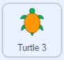
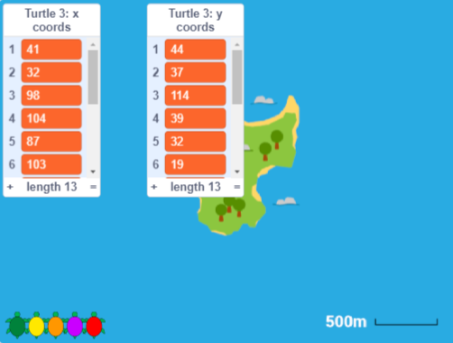
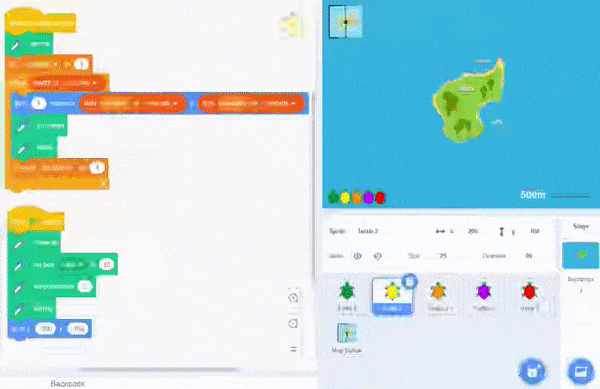

## తాబేలు నిజమైన కదలికలు

ఈ దశలో, మీరు మ్యాప్ బ్యాక్‌డ్రాప్ **Poilão Island**కి మారతారు. Shuttleworth Foundation ద్వారా ట్రాక్ చేయబడిన నిజమైన తాబేలు కోసం కోఆర్డినేట్ డేటా ఇప్పటికే **Turtle 3** sprite కి జోడించబడింది. ఈ తాబేలు ప్రయాణించిన మార్గాన్ని చూడటానికి మీ కోడ్‌ను **Turtle 2** sprite నుండి **Turtle 3** కి కాపీ చేయండి.

--- task ---

**Grid/Map Button** పై క్లిక్ చేయండి మరియు మీరు ఆఫ్రికాలోని పశ్చిమ తీరంలో ఉన్న Poilão ద్వీపం చుట్టూ ఉన్న ప్రాంతం యొక్క మ్యాప్‌ను చూస్తారు.

ఈ చిన్న ద్వీపం అంతటా 1కిమీ (1000 మీటర్లు) కంటే తక్కువగా ఉంటుంది. ఆకుపచ్చ సముద్ర తాబేళ్లను గూడు కట్టుకోవడానికి Poilão ఒక ముఖ్యమైన పర్యావరణ ప్రదేశం.

పెద్ద ఆకుపచ్చ సముద్రపు తాబేలు యొక్క కారపేస్ (షెల్) సుమారు 1మీ పొడవు ఉంటుంది.

--- /task ---

--- task ---

**Turtle 3** sprite, నారింజ తాబేలు, ను ఎంచుకుని, **Code** ట్యాబ్‌పై క్లిక్ చేయండి.

`Variables`{:class="block3variables"} బ్లాక్‌ల మెనుని తెరిచి, `x coords`{:class="block3variables"} మరియు `y coords`{:class="block3variables"} జాబితాల పక్కన ఉన్న బాక్సులను చెక్ చేయండి. వాటిని Stage పై చూపించండి.

ఈ జాబితాలు **For this sprite only**, మీరు **Turtle 2** sprite కోసం సృష్టించిన జాబితాలకు విభిన్న డేటాను కలిగి ఉంటాయి.

మీరు Stage పై x మరియు y కోఆర్డినేట్‌లను చూడవచ్చు. ఇవి సముద్రపు తాబేలు యొక్క నిజమైన కదలికలపై ఆధారపడి ఉంటాయి మరియు **Poilão Island** బ్యాక్‌డ్రాప్‌తో పనిచేసే Scratch కోఆర్డినేట్‌లుగా మార్చబడ్డాయి.

మీరు కోఆర్డినేట్‌లను చూసినప్పుడు, వాటిని దాచడానికి మీరు పెట్టెలను అన్ ఛెక్ వేయవచ్చు.

--- /task ---

సంఖ్యల జాబితాలను అర్థం చేసుకోవడం మానవులకు కష్టం. ఈ తాబేలు ఎక్కడికి వెళ్లిందో సులభంగా చూడడానికి కోఆర్డినేట్‌లను గీయడానికి మరియు స్టాంప్ చేయడానికి మీ కోడ్‌ను **Turtle 3** sprite కి కాపీ చేయడం మీ పని.

--- task ---

**Turtle 2** sprite ని ఎంచుకుని, **Code** ట్యాబ్‌పై క్లిక్ చేయండి. `when this sprite clicked`{:class="block3events"} బ్లాకును డ్రాగ్ చేయండి (కింద ఉన్న అన్ని బ్లాక్‌లు కూడా కదులుతాయి). Stage కింద ఉన్న sprite పేన్‌లో **Turtle 3** sprite ను అధిగమించే వరకు డ్రాగ్ చేస్తూ ఉండండి. **Turtle 3** sprite ఎంపిక చేయబడిందని చూపించడానికి అది కొద్దిగా సైగ చేస్తుంది మరియు మీరు లాగడం ఆపివేయవచ్చు.

**చిట్కా:** మౌస్ లేదా ట్రాక్‌ప్యాడ్‌తో డ్రాగ్ చేయడానికి, మీరు కదిలేటప్పుడు ఎడమ మౌస్ బటన్‌ను నొక్కి పట్టుకోండి.

కోడ్ ఇప్పటికీ **Turtle 2** sprite లోఅందుబాటులో ఉంది, అయితే **Turtle 3** sprite యొక్క **Code** ట్యాబ్‌లో కూడా కాపీ ఉంటుంది.

**Turtle 3** sprite ని ఎంచుకుని, కాపీ చేసిన కోడ్‌ని చూడటానికి దాని **Code** ట్యాబ్‌పై క్లిక్ చేయండి.

--- no-print ---

--- /no-print ---

**చిట్కా:** మీరు కోడ్ ప్రాంతంలో రైట్-క్లిక్ చేసి, మీ కోడ్‌ను చక్కబెట్టడానికి **Clean up Blocks** ని ఎంచుకోవచ్చు.

--- /task ---

--- task ---

మీ కోడ్‌ని అమలు చేయడానికి Stage పై ఉన్న **Turtle 3** sprite, నారింజ రంగు తాబేలును క్లిక్ చేయండి మరియు తాబేలు ప్రయాణించిన మార్గాన్ని చూడండి.

GPS రీడింగ్‌లు ఖచ్చితమైనవి కావు మరియు తాబేళ్లు నీటి అడుగున గడిపినప్పుడు వాటిని ట్రాక్ చేయడం సాధ్యం కాదు, కానీ తాబేళ్లు ఎక్కడికి ప్రయాణించాయో దాని గురించి చాలా మంచి అవగాహనను అందిస్తాయి.

**గుర్తుంచుకోండి:** మీరు ప్రతి రోజు తాబేలు కోసం ఒక స్థానాన్ని కలిగి ఉంటారు, కాబట్టి రేఖలు, స్థానాలను కలుపుతాయి, తాబేలు స్థానాల మధ్య ఎలా కదిలిందో అవి చూపించవు (దాని కోసం మీకు మరింత డేటా అవసరం).

--- /task ---

--- save ---

