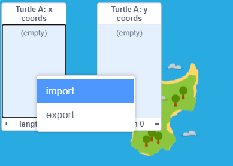
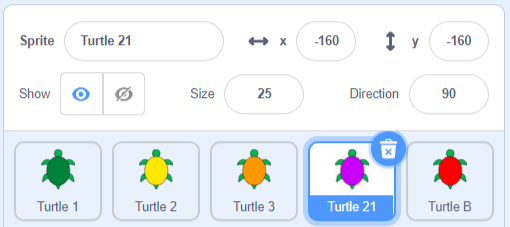

## ఫైల్ నుండి డేటాను ఇంపోర్ట్ చేయండి

ఫైల్ నుండి డేటాను దిగుమతి చేసుకోవడానికి Scratch మిమ్మల్ని అనుమతిస్తుంది. టైప్ చేయడానికి చాలా సమయం పట్టే డేటా మీ వద్ద ఉన్నప్పుడు మీకు కావల్సినపుడు ఇది నిజంగా ఉపయోగకరంగా ఉంటుంది.

--- task ---

**Turtle A** sprite, ఊదా రంగు తాబేలును ఎంచుకోండి. ఇది సృష్టించబడిన జాబితాలను కలిగి ఉంది, కానీ వాటిలో ఏ కోఆర్డినేట్‌లు లేవు.

**Turtle A** sprite యొక్క `x coords`{:class="block3variables"} మరియు `y coords`{:class="block3variables"} లను Stage పై చూడటానికి జాబితాల పక్కన ఉన్న బాక్సులను చెక్ చేయండి.


--- /task ---

Poilão చుట్టూ నిజమైన తాబేళ్లు ప్రయాణించిన మార్గాల ఆధారంగా మేము మరికొంత డేటాను సిద్ధం చేసాము. మీరు ఈ డేటా ఫైల్‌లను డౌన్‌లోడ్ చేసుకోవచ్చు మరియు వాటిని మీ ప్రాజెక్ట్‌లోకి ఇంపోర్ట్ చేసుకోవచ్చు, తద్వారా తాబేళ్లు ఎక్కడికి వెళ్లాయో మీరు కనుగొనవచ్చు.

--- task --- --- no-print ---

దిగువన ఉన్న తాబేలు డేటా లింక్‌లలో ఒకదానిపై రైట్-క్లిక్ చేసి, **Save link as ...** లేదా **Download linked file as...** ను ఎంచుకోండి

--- /no-print ---

--- print-only ---

మీ వెబ్ బ్రౌజర్‌లో కొత్త ట్యాబ్‌ని తెరిచి, దిగువ లింక్‌లలో ఒకదానిని టైప్ చేయండి. చాలా బ్రౌజర్‌లు ఫైల్‌ను వీక్షించగలవు, మీరు ఫైల్‌ను డౌన్‌లోడ్ చేయడానికి రైట్-క్లిక్ చేసి, **Save as...** ని ఎంచుకోవచ్చు.

--- /print-only ---

మీరు ఫైల్‌ను ఎక్కడ సేవ్ చేస్తారో మరియు దానిని ఏమని పిలుస్తారో గుర్తుంచుకోండి.

+ [Turtle 6 Data](http://rpf.io/turtle-6){:target="_blank"}
+ [Turtle 10 Data](http://rpf.io/turtle-10){:target="_blank"}
+ [Turtle 11 Data](http://rpf.io/turtle-11){:target="_blank"}
+ [Turtle 16 Data](http://rpf.io/turtle-16){:target="_blank"}
+ [Turtle 19 Data](http://rpf.io/turtle-19){:target="_blank"}
+ [Turtle 20 Data](http://rpf.io/turtle-20){:target="_blank"}
+ [Turtle 21 Data](http://rpf.io/turtle-21){:target="_blank"}
+ [Turtle 22 Data](http://rpf.io/turtle-22){:target="_blank"}


--- collapse ---
---
title: మీరు ఐప్యాడ్‌ని ఉపయోగిస్తుంటే
---

మీ ఐప్యాడ్ పూర్తిగా అప్ టు డేట్ ఉంటే, మీరు లింక్‌పై క్లిక్ చేసినప్పుడు మీరు **View** లేదా **Download**చేయాలనుకుంటున్నారా అని సూచనను పొందుతారు. **Download** ని ఎంచుకోండి.

లేకపోతే, Safari బ్రౌజర్‌ని ఉపయోగించి, డేటాను వీక్షించడానికి మీరు ఎంచుకున్న తాబేలు లింక్‌పై క్లిక్ చేసి, ఆపై షేర్ చిహ్నాన్ని క్లిక్ చేయండి. మీరు ఫైల్‌ను సేవ్ చేయగల స్థానాలను చూస్తారు.

--- /collapse ---

--- collapse ---
---
title: మీరు ఫైల్‌ను డౌన్‌లోడ్ చేయలేకపోతే లేదా ఇంపోర్ట్ చేసుకోలేకపోతే
---

మీరు ఫైల్‌ను డౌన్‌లోడ్ చేయలేకపోతే, దాన్ని మీ బ్రౌజర్‌లో తెరవడానికి మీరు తాబేలు ఫైల్‌లలో ఒకదానిపై క్లిక్ చేయవచ్చు లేదా టాప్ చేయవచ్చు (ఇటీవలి ఐప్యాడ్‌ లలో **View** ని ఎంచుకోండి). మీరు **Turtle 2** కోసం చేసినట్లుగా మీరు **Turtle A** sprite కోసం `x coords`{:class="block3variables"} మరియు `y coords`{:class="block3variables"} జాబితాలలోకి డేటాను నమోదు చేయవచ్చు. సంఖ్యలను చదవడానికి మీకు భాగస్వామి ఉంటే ఇది సులభం.

--- /collapse ---

--- /task ---

--- task ---

ఇప్పుడు Scratch కి తిరిగి వెళ్లండి.

Stage పై `Turtle A: x coords`{:class="block3variables"} జాబితాపై రైట్-క్లిక్ (లేదా నొక్కి పట్టుకోండి) మరియు **import**ని ఎంచుకోండి.



మీరు డౌన్‌లోడ్ చేసిన ఫైల్‌ను ఎంచుకోండి, అది `turtle-5.csv`లాగా ఉంటుంది.

--- collapse ---
---
title: మీరు ఐప్యాడ్‌ని ఉపయోగిస్తుంటే
---

మీ iPad పూర్తిగా అప్ టు డేట్ ఉంటే, మీరు మీ డౌన్‌లోడ్‌ల ఫోల్డర్ నుండి `.csv` ఫైల్‌ని ఎంచుకోగలుగుతారు.

లేకపోతే, మీరు క్లౌడ్ డ్రైవ్ వంటి ఫైల్‌ను సేవ్ చేసిన స్థానానికి నావిగేట్ చేయగలుగుతారు.

--- /collapse ---

**Which column should be used?** అని మిమ్మల్ని అడిగినప్పుడు, `1`సంఖ్యను నమోదు చేయండి. x కోఆర్డినేట్ డేటా ఫైల్ మొదటి నిలువు వరుసలో ఉంది.


Scratch, ఫైల్‌లోని మొదటి నిలువు వరుస నుండి డేటాను `Turtle A: x coords`{:class="block3variables"} జాబితాలోకి లోడ్ చేస్తుంది.


--- no-print ---


--- /no-print ---

మీరు వేరొక తాబేలును ఎంచుకుంటే మీ డేటా వేర్వేరు సంఖ్యలను కలిగి ఉంటుంది.

--- /task ---

--- task ---

ఇప్పుడు y కోఆర్డినేట్‌ల కోసం డేటా ఇంపోర్ట్ ని పునరావృతం చేయండి.

`Turtle A: y coords`{:class="block3variables"} జాబితాపై రైట్-క్లిక్ (లేదా నొక్కి పట్టుకోండి) మరియు **import**ని ఎంచుకోండి.

మునుపటి ఫైల్‌ను ఎంచుకోండి.

ఈసారి, అదే తాబేలు కోసం y కోఆర్డినేట్ డేటాను కలిగి ఉన్నందున నిలువు వరుస `2` ని ఎంచుకోండి.


--- /task ---

--- task ---

Stage కింద **Turtle A** sprite ని ఎంచుకుని, మీరు ఇంపోర్ట్ చేసుకున్న తాబేలు సంఖ్యతో సరిపోల్చడానికి దాని పేరును మార్చండి, ఉదాహరణకు **Turtle 21**. మీరు ఏ తాబేలు డేటాను ఉపయోగించారో గుర్తుంచుకోవడానికి ఇది మీకు సహాయం చేస్తుంది.



--- /task ---

--- task ---

**Turtle 3** sprite నుండి కోడ్‌ను డ్రాగ్ చేయడం ద్వారా మీ కొత్త తాబేలుకు కాపీ చేయండి.

మీ కొత్త తాబేలు కోసం Code ప్రాంతంలో కాపీ చేయబడిన కోడ్ కనిపించిందో లేదో తనిఖీ చేయండి. కాకపోతే, మళ్లీ ప్రయత్నించండి.

--- /task ---

--- task ---

ఈ తాబేలు ఎక్కడికి వెళ్లిందో తెలుసుకోవడానికి మీ తాబేలు, ఊదా రంగు తాబేలుపై క్లిక్ చేయండి.

మీరు ఎంచుకున్న డేటాపై ఆధారపడి మార్గం భిన్నంగా ఉంటుంది.

--- /task ---

--- task ---

మీకు సమయం ఉంటే, మీరు మరింత డేటాను డౌన్‌లోడ్ చేసుకోవచ్చు మరియు మరిన్ని తాబేళ్ల ప్రయాణాలను అనుసరించవచ్చు. మీరు **Turtle B** sprite, ఎరుపు తాబేలును ఉపయోగించవచ్చు. మీకు మరిన్ని తాబేళ్లు అవసరమైతే, మీరు తాబేలును డుప్లికేట్ చేసి, దాని costume మరియు పెన్ రంగును మార్చవచ్చు. మీరు కొత్త డేటాను ఇంపోర్ట్ చేసుకునే ముందు, ఈ బ్లాక్‌లను ఉపయోగించి కాపీలోని డేటాను తొలగించండి:

```blocks3
delete all of [x coords v]
delete all of [y coords v]

```

--- /task ---

--- task ---

మీ తాబేళ్లు సందర్శించిన స్థానాలను చూడండి. మీరు సమూహంలో ఉన్నట్లయితే, ఇతరులు ఎంచుకున్న తాబేళ్ల ఫలితాలను కూడా చూడవచ్చు.

ఆలోచించవలసిన ప్రశ్నలు:
+ తాబేళ్లన్నీ ఒకే చోట ప్రారంభమవుతాయా? అది ఎందుకు అని మీరు అనుకుంటున్నారు?
+ అనేక తాబేళ్లు సందర్శించే ఇతర ప్రదేశాలు ఉన్నాయా? వారు అక్కడికి ఎందుకు వెళతారని మీరు అనుకుంటున్నారు?
+ లొకేషన్‌లను కలిపే లైన్‌లు కొన్నిసార్లు ద్వీపం అంతటా ఎందుకు వెళ్తాయి? మీరు రోజుకు ఒక స్థానాన్ని మాత్రమే కలిగి ఉన్నారని గుర్తుంచుకోండి. తాబేళ్లు స్థానాల మధ్య ఎలా ప్రయాణించాయని మీరు అనుకుంటున్నారు?

--- /task ---

--- save ---
